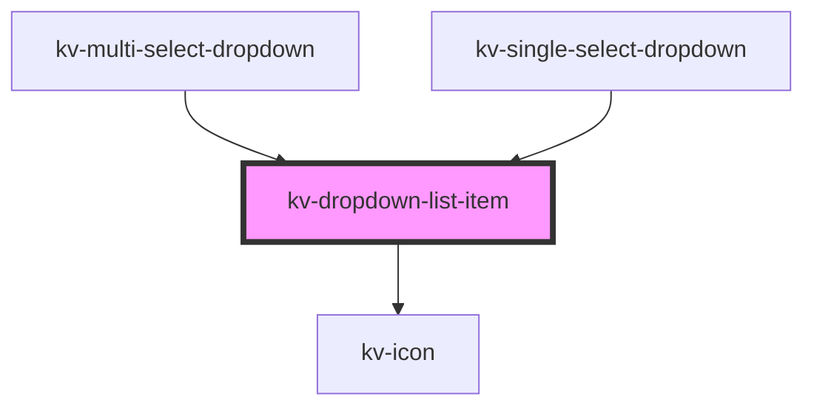

# *<kv-dropdown-list-item>*


<!-- Auto Generated Below -->


## Usage

### Angular / javascript

```html
<!-- With all properties (only label and value are mandatory) -->
<kv-dropdown-list-item
	label="Option 1"
	value="option1"
	selected=true
	togglable=false>
</kv-dropdown-list-item>
```


### React

```tsx
import React from 'react';
import { KvDropdownListItem } from '@kelvininc/react-ui-components';
export const KvDropdownListItemExample: React.FC = () => (
  <>
	{/*-- With all properties (only label and value are mandatory) --*/}
	<KvDropdownListItem
		label="Option 1"
		link="option1"
		selected={false}
		togglable={true}
		>
	</KvDropdownListItem>
  </>
);
```


### Stencil

```tsx
import { Component, h } from '@stencil/core';
@Component({
  tag: 'kv-dropdown-list-item-example',
  styleUrl: 'kv-dropdown-list-item-example.css',
  shadow: true,
})
export class KvDropdownListItemExample {
  render() {
    return (
		<KvDropdownListItem
			label="Option 1"
			link="option1"
			selected={false}
			togglable={true}
		>
	</KvDropdownListItem>
	);
  }
}
```


## Properties

| Property             | Attribute   | Description                                 | Type      | Default     |
| -------------------- | ----------- | ------------------------------------------- | --------- | ----------- |
| `label` _(required)_ | `label`     | (required) The text to display on the item  | `string`  | `undefined` |
| `selected`           | `selected`  | (optional) If `true` the item is selected   | `boolean` | `false`     |
| `togglable`          | `togglable` | (optional)  If `true` the item is togglable | `boolean` | `false`     |
| `value` _(required)_ | `value`     | (required) The item value                   | `string`  | `undefined` |


## Events

| Event          | Description                              | Type                  |
| -------------- | ---------------------------------------- | --------------------- |
| `itemSelected` | Emitted when the user clicks on the item | `CustomEvent<string>` |


## CSS Custom Properties

| Name                                        | Description                                        |
| ------------------------------------------- | -------------------------------------------------- |
| `--dropdown-item-background-color`          | Dropdown list item background color.               |
| `--dropdown-item-background-color-hover`    | Dropdown list item background color when hovered.  |
| `--dropdown-item-background-color-selected` | Dropdown list item background color when selected. |
| `--dropdown-item-height`                    | Dropdown list item height.                         |
| `--dropdown-item-label-color`               | Dropdown list item label color.                    |
| `--dropdown-item-label-color-selected`      | Dropdown list item label color when selected.      |
| `--dropdown-item-transition-duration`       | Dropdown list item transition time.                |


## Dependencies

### Used by

 - [kv-multi-select-dropdown](../multi-select-dropdown)
 - [kv-single-select-dropdown](../single-select-dropdown)

### Depends on

- [kv-icon](../icon)

### Graph


----------------------------------------------


