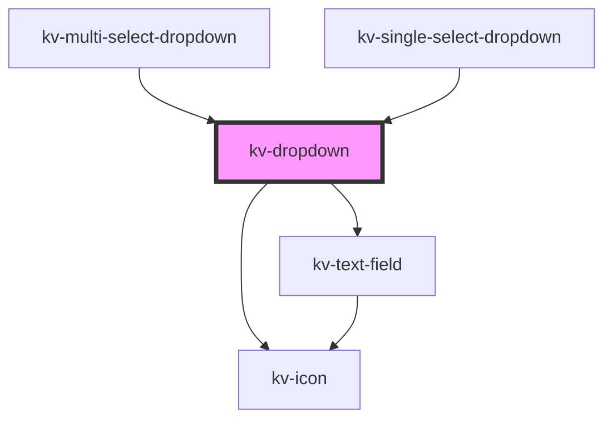

# *<kv-dropdown>*


<!-- Auto Generated Below -->


## Usage

### Angular / javascript

```html
<kv-dropdown label="Options" icon="kv-layer" required=true>
	<kv-dropdown-list searchable=true selectionClearable=true>
		<kv-dropdown-list-item
			label="Option 1"
			value="option1"
			togglable=true>
		</kv-dropdown-list-item>
		...
		<kv-dropdown-list-item
			label="Option 3"
			value="option3"
			togglable=true>
		</kv-dropdown-list-item>
	</kv-dropdown-list>
</kv-dropdown>
```


### React

```tsx
import React from 'react';
import { KvDropdown } from '@kelvininc/react-ui-components';

export const KvDropdownExample: React.FC = () => (
  <>
	<KvDropdown label="Options" icon="kv-layer" required={true}>
		<KvDropdownList searchable={true} selectionClearable={true}>
			<KvDropdownListItem
				label="Option 1"
				value="option1"
				togglable={true}>
			</KvDropdownListItem>
			...
			<KvDropdownListItem
				label="Option 3"
				value="option3"
				togglable={true}>
			</KvDropdownListItem>
		</KvDropdownList>
	</KvDropdown>
  </>
);
```


### Stencil

```tsx
import { Component, h } from '@stencil/core';
@Component({
  tag: 'kv-dropdown-example',
  styleUrl: 'kv-dropdown-example.css',
  shadow: true,
})
export class KvDropdownExample {
  render() {
    return (
		<KvDropdown label="Options" icon="kv-layer" required={true}>
			<KvDropdownList searchable={true} selectionClearable={true}>
				<KvDropdownListItem
					label="Option 1"
					value="option1"
					togglable={true}>
				</KvDropdownListItem>
				...
				<KvDropdownListItem
					label="Option 3"
					value="option3"
					togglable={true}>
				</KvDropdownListItem>
			</KvDropdownList>
		</KvDropdown>
	)
  }
}
```


## Properties

| Property      | Attribute     | Description                                                       | Type                                                                          | Default                        |
| ------------- | ------------- | ----------------------------------------------------------------- | ----------------------------------------------------------------------------- | ------------------------------ |
| `disabled`    | `disabled`    | (optional) If `true` the dropdown is disabled                     | `boolean`                                                                     | `undefined`                    |
| `errorState`  | `error-state` | (required) The error state for the dropdown                       | `EValidationState.Invalid \| EValidationState.None \| EValidationState.Valid` | `EValidationState.None`        |
| `helpText`    | `help-text`   | (optional) The text to display as help text                       | `string`                                                                      | `undefined`                    |
| `icon`        | `icon`        | (optional) The icon to display on the dropdown                    | `EIconName \| EOtherIconName`                                                 | `undefined`                    |
| `isOpen`      | `is-open`     | (optional) If `true` the list is opened                           | `boolean`                                                                     | `false`                        |
| `label`       | `label`       | (optional) The text to display on the dropdown label              | `string`                                                                      | `undefined`                    |
| `loading`     | `loading`     | (optional) If `true` the dropdown is loading                      | `boolean`                                                                     | `false`                        |
| `placeholder` | `placeholder` | (optional) The text to display as the dropdown placeholder        | `string`                                                                      | `DROPDOWN_DEFAULT_PLACEHOLDER` |
| `required`    | `required`    | (optional) If `true` the dropdown requires a value to be selected | `boolean`                                                                     | `undefined`                    |
| `value`       | `value`       | (optional) The text to display on the dropdown                    | `string`                                                                      | `undefined`                    |


## Events

| Event             | Description                                   | Type                   |
| ----------------- | --------------------------------------------- | ---------------------- |
| `openStateChange` | Emitted when the dropdown opens state changes | `CustomEvent<boolean>` |


## Dependencies

### Used by

 - [kv-multi-select-dropdown](../multi-select-dropdown)
 - [kv-single-select-dropdown](../single-select-dropdown)

### Depends on

- [kv-text-field](../text-field)
- [kv-icon](../icon)

### Graph


----------------------------------------------


