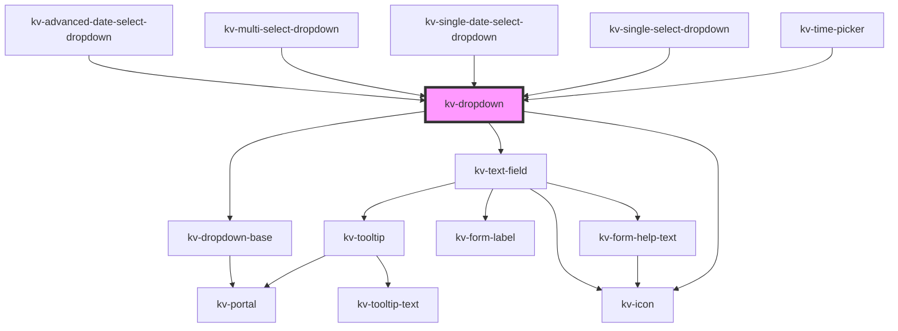

# _<kv-dropdown>_

<!-- Auto Generated Below -->


## Usage

### Angular / javascript

```html
<kv-dropdown label="Options" icon="kv-layer" required=true>
	<kv-select searchable=true selectionClearable=true>
		<kv-select-option
			label="Option 1"
			value="option1"
			togglable=true>
		</kv-select-option>
		...
		<kv-select-option
			label="Option 3"
			value="option3"
			togglable=true>
		</kv-select-option>
	</kv-select>
</kv-dropdown>
```


### React

```tsx
import React from 'react';
import { KvDropdown } from '@kelvininc/react-ui-components';

export const KvDropdownExample: React.FC = () => (
  <>
	<KvDropdown label="Options" icon="kv-layer" required={true}>
		<KvSelect searchable={true} selectionClearable={true}>
			<KvSelectOption
				label="Option 1"
				value="option1"
				togglable={true}>
			</KvSelectOption>
			...
			<KvSelectOption
				label="Option 3"
				value="option3"
				togglable={true}>
			</KvSelectOption>
		</KvSelect>
	</KvDropdown>
  </>
);
```


### Stencil

```tsx
import { Component, h } from '@stencil/core';
@Component({
  tag: 'kv-dropdown-example',
  styleUrl: 'kv-dropdown-example.css',
  shadow: true,
})
export class KvDropdownExample {
  render() {
    return (
		<KvDropdown label="Options" icon="kv-layer" required={true}>
			<KvSelect searchable={true} selectionClearable={true}>
				<KvSelectOption
					label="Option 1"
					value="option1"
					togglable={true}>
				</KvSelectOption>
				...
				<KvSelectOption
					label="Option 3"
					value="option3"
					togglable={true}>
				</KvSelectOption>
			</KvSelect>
		</KvDropdown>
	)
  }
}
```


## Properties

| Property            | Attribute             | Description                                                                                      | Type                                                                                                                                                                                                                                                                                                                                                                                                                                                                                                                                                                                         | Default                            |
| ------------------- | --------------------- | ------------------------------------------------------------------------------------------------ | -------------------------------------------------------------------------------------------------------------------------------------------------------------------------------------------------------------------------------------------------------------------------------------------------------------------------------------------------------------------------------------------------------------------------------------------------------------------------------------------------------------------------------------------------------------------------------------------- | ---------------------------------- |
| `actionElement`     | --                    | (optional) A reference to the dropdown action element                                            | `HTMLElement`                                                                                                                                                                                                                                                                                                                                                                                                                                                                                                                                                                                | `null`                             |
| `clickOutsideClose` | `click-outside-close` | (optional) If `false` clicking outside the dropdown will not trigger state change. Default: true | `boolean`                                                                                                                                                                                                                                                                                                                                                                                                                                                                                                                                                                                    | `true`                             |
| `disabled`          | `disabled`            | (optional) If `true` clicking on the action will not open the dropdown list. Default: false      | `boolean`                                                                                                                                                                                                                                                                                                                                                                                                                                                                                                                                                                                    | `false`                            |
| `inputConfig`       | --                    | (optional) The text field options                                                                | `{ type?: EInputFieldType; label?: string; icon?: EIconName \| EOtherIconName; inputName?: string; examples?: string[]; placeholder?: string; maxLength?: number; minLength?: number; max?: string \| number; min?: string \| number; step?: string \| number; size?: EComponentSize; disabled?: boolean; required?: boolean; loading?: boolean; state?: EValidationState; helpText?: string \| string[]; value?: string \| number; readonly?: boolean; forcedFocus?: boolean; highlighted?: boolean; tooltipConfig?: Partial<ITooltip>; useInputMask?: boolean; inputMaskRegex?: string; }` | `{}`                               |
| `isOpen`            | `is-open`             | (optional) If `true` the list is opened                                                          | `boolean`                                                                                                                                                                                                                                                                                                                                                                                                                                                                                                                                                                                    | `false`                            |
| `listElement`       | --                    | (optional) A reference to the dropdown list element                                              | `HTMLElement`                                                                                                                                                                                                                                                                                                                                                                                                                                                                                                                                                                                | `null`                             |
| `options`           | --                    | (optional) The dropdown position config options                                                  | `{ placement?: Placement; strategy?: Strategy; middleware?: (false \| { name: string; options?: any; fn: (state: { platform: Platform; placement: Placement; strategy: Strategy; x: number; y: number; initialPlacement: Placement; middlewareData: MiddlewareData; rects: ElementRects; elements: Elements; }) => Promisable<MiddlewareReturn>; })[]; platform?: Platform; }`                                                                                                                                                                                                               | `DEFAULT_DROPDOWN_POSITION_CONFIG` |
| `zIndex`            | `z-index`             | (optional) the dropdown list z-index (default: 9004)                                             | `number`                                                                                                                                                                                                                                                                                                                                                                                                                                                                                                                                                                                     | `undefined`                        |


## Events

| Event             | Description                                   | Type                   |
| ----------------- | --------------------------------------------- | ---------------------- |
| `openStateChange` | Emitted when the dropdown opens state changes | `CustomEvent<boolean>` |


## Methods

### `onToggleOpenState() => Promise<void>`

Toggles the dropdown open state

#### Returns

Type: `Promise<void>`


## Dependencies

### Used by

 - [kv-advanced-date-select-dropdown](../advanced-date-select-dropdown)
 - [kv-multi-select-dropdown](../multi-select-dropdown)
 - [kv-single-date-select-dropdown](../single-date-select-dropdown)
 - [kv-single-select-dropdown](../single-select-dropdown)
 - [kv-time-picker](../time-picker)

### Depends on

- [kv-dropdown-base](../dropdown-base)
- [kv-text-field](../text-field)
- [kv-icon](../icon)

### Graph


----------------------------------------------


