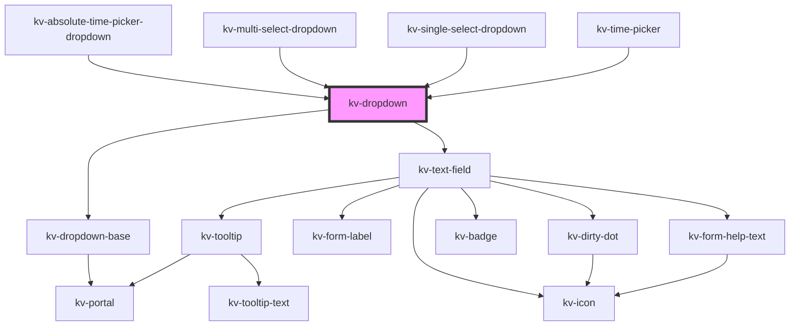

# _<kv-dropdown>_

<!-- Auto Generated Below -->


## Usage

### Javascript

```html
<kv-dropdown label="Options" icon="kv-layer" required=true>
	<kv-select searchable=true selectionClearable=true>
		<kv-select-option
			label="Option 1"
			value="option1"
			togglable=true>
		</kv-select-option>
		...
		<kv-select-option
			label="Option 3"
			value="option3"
			togglable=true>
		</kv-select-option>
	</kv-select>
</kv-dropdown>
```


### React

```tsx
import React from 'react';
import { KvDropdown } from '@kelvininc/react-ui-components/client';

export const KvDropdownExample: React.FC = () => (
  <>
	<KvDropdown label="Options" icon="kv-layer" required={true}>
		<KvSelect searchable={true} selectionClearable={true}>
			<KvSelectOption
				label="Option 1"
				value="option1"
				togglable={true}>
			</KvSelectOption>
			...
			<KvSelectOption
				label="Option 3"
				value="option3"
				togglable={true}>
			</KvSelectOption>
		</KvSelect>
	</KvDropdown>
  </>
);
```


### Stencil

```tsx
import { Component, h } from '@stencil/core';
@Component({
  tag: 'kv-dropdown-example',
  styleUrl: 'kv-dropdown-example.css',
  shadow: true,
})
export class KvDropdownExample {
  render() {
    return (
		<KvDropdown label="Options" icon="kv-layer" required={true}>
			<KvSelect searchable={true} selectionClearable={true}>
				<KvSelectOption
					label="Option 1"
					value="option1"
					togglable={true}>
				</KvSelectOption>
				...
				<KvSelectOption
					label="Option 3"
					value="option3"
					togglable={true}>
				</KvSelectOption>
			</KvSelect>
		</KvDropdown>
	)
  }
}
```


## Properties

| Property            | Attribute             | Description                                                                                      | Type                                                                                                                                                                                                                                                                                                                                                                                                                                                                                                                                                                                                                                                                                                                                                                                                                                                                                                                                                                                                                                                                                                                                                                             | Default                    |
| ------------------- | --------------------- | ------------------------------------------------------------------------------------------------ | -------------------------------------------------------------------------------------------------------------------------------------------------------------------------------------------------------------------------------------------------------------------------------------------------------------------------------------------------------------------------------------------------------------------------------------------------------------------------------------------------------------------------------------------------------------------------------------------------------------------------------------------------------------------------------------------------------------------------------------------------------------------------------------------------------------------------------------------------------------------------------------------------------------------------------------------------------------------------------------------------------------------------------------------------------------------------------------------------------------------------------------------------------------------------------- | -------------------------- |
| `actionElement`     | `action-element`      | (optional) A reference to the dropdown action element                                            | `HTMLElement \| undefined`                                                                                                                                                                                                                                                                                                                                                                                                                                                                                                                                                                                                                                                                                                                                                                                                                                                                                                                                                                                                                                                                                                                                                       | `undefined`                |
| `clickOutsideClose` | `click-outside-close` | (optional) If `false` clicking outside the dropdown will not trigger state change. Default: true | `boolean \| undefined`                                                                                                                                                                                                                                                                                                                                                                                                                                                                                                                                                                                                                                                                                                                                                                                                                                                                                                                                                                                                                                                                                                                                                           | `true`                     |
| `disabled`          | `disabled`            | (optional) If `true` clicking on the action will not open the dropdown list. Default: false      | `boolean \| undefined`                                                                                                                                                                                                                                                                                                                                                                                                                                                                                                                                                                                                                                                                                                                                                                                                                                                                                                                                                                                                                                                                                                                                                           | `false`                    |
| `inputConfig`       | `input-config`        | (optional) The text field options                                                                | `undefined \| { type?: EInputFieldType \| undefined; label?: string \| undefined; icon?: EIconName \| undefined; actionIcon?: EIconName \| undefined; inputName?: string \| undefined; examples?: string[] \| undefined; placeholder?: string \| undefined; maxLength?: number \| undefined; minLength?: number \| undefined; max?: string \| number \| undefined; min?: string \| number \| undefined; step?: string \| number \| undefined; size?: EComponentSize \| undefined; inputDisabled?: boolean \| undefined; inputRequired?: boolean \| undefined; loading?: boolean \| undefined; state?: EValidationState \| undefined; helpText?: string \| string[] \| undefined; value?: string \| number \| null \| undefined; valuePrefix?: string \| undefined; badge?: string \| undefined; inputReadonly?: boolean \| undefined; forcedFocus?: boolean \| undefined; tooltipConfig?: Partial<ITooltip> \| undefined; useInputMask?: boolean \| undefined; inputMaskRegex?: string \| undefined; fitContent?: boolean \| undefined; customStyle?: { [key: string]: string \| undefined; } \| undefined; isDirty?: boolean \| undefined; hideBadge?: boolean \| undefined; }` | `{}`                       |
| `isOpen`            | `is-open`             | (optional) If `true` the list is opened                                                          | `boolean \| undefined`                                                                                                                                                                                                                                                                                                                                                                                                                                                                                                                                                                                                                                                                                                                                                                                                                                                                                                                                                                                                                                                                                                                                                           | `false`                    |
| `listElement`       | `list-element`        | (optional) A reference to the dropdown list element                                              | `HTMLElement \| undefined`                                                                                                                                                                                                                                                                                                                                                                                                                                                                                                                                                                                                                                                                                                                                                                                                                                                                                                                                                                                                                                                                                                                                                       | `undefined`                |
| `options`           | `options`             | (optional) The dropdown position config options                                                  | `undefined \| ({ strategy?: Strategy \| undefined; placement?: Placement \| undefined; middleware?: (false \| { name: string; options?: any; fn: (state: { x: number; y: number; initialPlacement: Placement; strategy: Strategy; platform: Platform; placement: Placement; middlewareData: MiddlewareData; rects: ElementRects; elements: Elements; }) => Promisable<MiddlewareReturn>; } \| null \| undefined)[] \| undefined; platform?: Platform \| undefined; })`                                                                                                                                                                                                                                                                                                                                                                                                                                                                                                                                                                                                                                                                                                           | `undefined`                |
| `zIndex`            | `z-index`             | (optional) the dropdown list z-index (default: 9004)                                             | `number \| undefined`                                                                                                                                                                                                                                                                                                                                                                                                                                                                                                                                                                                                                                                                                                                                                                                                                                                                                                                                                                                                                                                                                                                                                            | `DEFAULT_DROPDOWN_Z_INDEX` |


## Events

| Event             | Description                                                   | Type                      |
| ----------------- | ------------------------------------------------------------- | ------------------------- |
| `clickOutside`    | Emitted when there's a click outside the dropdown's bondaries | `CustomEvent<MouseEvent>` |
| `openStateChange` | Emitted when the dropdown opens state changes                 | `CustomEvent<boolean>`    |


## Methods

### `onToggleOpenState() => Promise<void>`

Toggles the dropdown open state

#### Returns

Type: `Promise<void>`


## Dependencies

### Used by

 - [kv-absolute-time-picker-dropdown](../absolute-time-picker-dropdown)
 - [kv-multi-select-dropdown](../multi-select-dropdown)
 - [kv-single-select-dropdown](../single-select-dropdown)
 - [kv-time-picker](../time-picker)

### Depends on

- [kv-dropdown-base](../dropdown-base)
- [kv-text-field](../text-field)

### Graph

```mermaid
graph TD;
  kv-dropdown --> kv-dropdown-base
  kv-dropdown --> kv-text-field
  kv-dropdown-base --> kv-portal
  kv-text-field --> kv-tooltip
  kv-text-field --> kv-form-label
  kv-text-field --> kv-icon
  kv-text-field --> kv-dirty-dot
  kv-text-field --> kv-badge
  kv-text-field --> kv-form-help-text
  kv-tooltip --> kv-portal
  kv-tooltip --> kv-tooltip-text
  kv-dirty-dot --> kv-icon
  kv-form-help-text --> kv-icon
  kv-absolute-time-picker-dropdown --> kv-dropdown
  kv-multi-select-dropdown --> kv-dropdown
  kv-single-select-dropdown --> kv-dropdown
  kv-time-picker --> kv-dropdown
  style kv-dropdown fill:#f9f,stroke:#333,stroke-width:4px
```

----------------------------------------------


