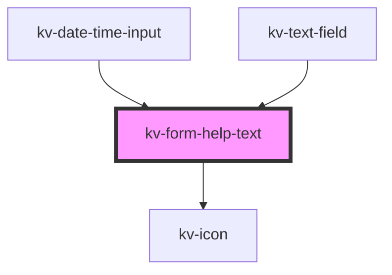

# _<kv-form-help-text>_

<!-- Auto Generated Below -->


## Usage

### React

```tsx
import React from 'react';

import { KvFormHelpText } from '@kelvininc/react-ui-components/client';

export const FormHelpTextExample: React.FC = () => (
	<>
		{/*-- Default --*/}
		<KvFormHelpText helpText="Help text"/>

		{/*-- Default with array of strings --*/}
		<KvFormHelpText helpText={['Help text 1', 'Help Text2']} />

		{/*-- Default with error state --*/}
		<KvFormHelpText helpText="Help text" state={EValidationState.Invalid} />
	</>
);

```


## Properties

| Property   | Attribute   | Description                     | Type                                                                          | Default                 |
| ---------- | ----------- | ------------------------------- | ----------------------------------------------------------------------------- | ----------------------- |
| `helpText` | `help-text` | (optional) Form field help text | `string \| string[]`                                                          | `[]`                    |
| `state`    | `state`     | (optional) Form field state     | `EValidationState.Invalid \| EValidationState.None \| EValidationState.Valid` | `EValidationState.None` |


## CSS Custom Properties

| Name                        | Description                            |
| --------------------------- | -------------------------------------- |
| `--help-text-default-color` | Help Text color when state is default. |
| `--help-text-error-color`   | Help Text color when state is invalid. |


## Dependencies

### Used by

 - [kv-date-time-input](../date-time-input)
 - [kv-text-field](../text-field)

### Depends on

- [kv-icon](../icon)

### Graph


----------------------------------------------


