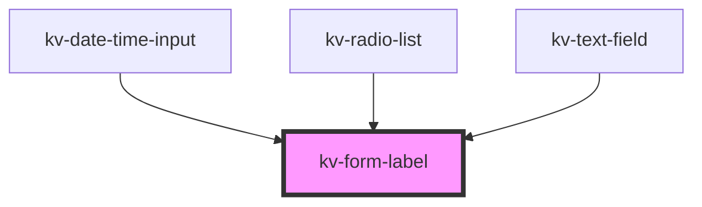

# _<kv-form-label>_

<!-- Auto Generated Below -->


## Usage

### React

```tsx
import React from 'react';

import { KvFormLabel } from '@kelvininc/react-ui-components/client';

export const FormLabelExample: React.FC = () => (
	<>
		{/*-- Default --*/}
		<KvFormLabel />

		{/*-- Labeled --*/}
		<KvFormLabel label="Form Field" />

		{/*-- Labeled & Required --*/}
		<KvFormLabel label="Form Field" required />
	</>
);

```


## Properties

| Property             | Attribute  | Description                    | Type      | Default     |
| -------------------- | ---------- | ------------------------------ | --------- | ----------- |
| `label` _(required)_ | `label`    | (required) Form field label    | `string`  | `undefined` |
| `required`           | `required` | (optional) Form field required | `boolean` | `undefined` |


## CSS Custom Properties

| Name            | Description       |
| --------------- | ----------------- |
| `--label-color` | Label Text color. |
| `--label-color` | Label Text color. |


## Dependencies

### Used by

 - [kv-date-time-input](../date-time-input)
 - [kv-radio-list](../radio-list)
 - [kv-text-field](../text-field)

### Graph


----------------------------------------------


