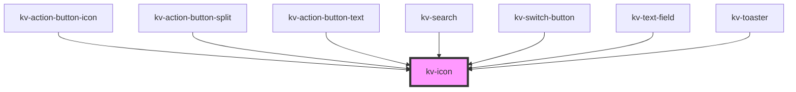

# _<kv-icon>_

## Styling Svg Icon Element

The `kv-icon` element consists only of an icon that is displayed on the view. To customize this, style using a combination of CSS and any of the [CSS custom properties](#css-custom-properties):

```css
kv-icon {
	/* Applies to the icon color */
	--icon-color: #103d73;

	/* Set a different icon height value */
	--icon-height: 16px;

	/* Set a different icon width value */
	--icon-width: 16px;

	/* Set a different icon rotation */
	--icon-rotation: 90deg;
}
```

Alternatively, depending on the [browser support](https://caniuse.com/#feat=mdn-css_selectors_part) needed, CSS shadow parts can be used to style the select:

```css
/* Set the width and height of icon to the full container */
kv-icon::part(icon) {
	width: 100%;
	height: 100%;
}

/* Set the icon color */
kv-icon::part(icon) {
	fill: kv-color(success);
}
```

Notice that by using `::part`, any CSS property on the element can be targeted.

Additionally, we already have some predefined classes that can be applied to scale and rotate the icon.

**Sizes**: `icon-8`, `icon-12`, `icon-16`, `icon-20`, `icon-24`, `icon-40`, `icon-full-size`

**Rotations**: `rotate-0`, `rotate-45`, `rotate-90`, `rotate-135`, `rotate-180`, `rotate-225`, `rotate-270`, `rotate-315`

<!-- Auto Generated Below -->


## Usage

### Angular

```html
<!-- Default -->
<kv-icon name="kv-logo-kelvin"></kv-icon>

<!-- Custom CSS -->
<kv-icon name="kv-logo-kelvin" customClass="icon-24 rotate-90"><kv-icon>

<!-- Custom Color -->
<kv-icon name="kv-logo-kelvin" customColor="#103d73"><kv-icon>
```


### React

```tsx
import React from 'react';

import { KvIcon } from '@kelvininc/react-ui-components';

export const SvgIconExample: React.FC = () => (
	<>
		{/*-- Default --*/}
		<KvIcon name="kv-logo-kelvin" />

		{/*-- Custom CSS --*/}
		<KvIcon name="kv-logo-kelvin" customClass="icon-24 rotate-90" />

		{/*-- Custom Color --*/}
		<KvIcon name="kv-logo-kelvin" customColor="#103d73" />
	</>
);
```


## Properties

| Property            | Attribute      | Description                                                                                                                 | Type                          | Default     |
| ------------------- | -------------- | --------------------------------------------------------------------------------------------------------------------------- | ----------------------------- | ----------- |
| `customClass`       | `custom-class` | (optional) Additional classes to apply for custom CSS. If multiple classes are provided they should be separated by spaces. | `string \| string[]`          | `''`        |
| `customColor`       | `custom-color` | (optional) Icon custom color                                                                                                | `string`                      | `''`        |
| `name` _(required)_ | `name`         | (required) Icon symbol name                                                                                                 | `EIconName \| EOtherIconName` | `undefined` |


## Shadow Parts

| Part     | Description         |
| -------- | ------------------- |
| `"icon"` | The icon container. |


## CSS Custom Properties

| Name              | Description       |
| ----------------- | ----------------- |
| `--icon-color`    | Color of the icon |
| `--icon-height`   | Height of icon    |
| `--icon-rotation` | Rotation of icon  |
| `--icon-width`    | Width of icon     |


## Dependencies

### Used by

 - [kv-action-button-icon](../action-button-icon)
 - [kv-action-button-split](../action-button-split)
 - [kv-action-button-text](../action-button-text)
 - [kv-search](../search)
 - [kv-switch-button](../switch-button)
 - [kv-text-field](../text-field)
 - [kv-toaster](../toaster)

### Graph


----------------------------------------------


