# kv-icon

<!-- Auto Generated Below -->


## Usage

### React

```tsx
import React from 'react';

import { KvIcon } from '@kelvininc/react-ui-components';

export const SvgIconExample: React.FC = () => (
	<>
		{/*-- Default --*/}
		<KvIcon name="kv-logo-kelvin" />

		{/*-- Custom CSS --*/}
		<KvIcon name="kv-logo-kelvin" customClass="icon-24 rotate-90" />

		{/*-- Custom Color --*/}
		<KvIcon name="kv-logo-kelvin" customColor="#103d73" />
	</>
);
```


## Properties

| Property            | Attribute      | Description                                                                                                                                                                             | Type                                | Default     |
| ------------------- | -------------- | --------------------------------------------------------------------------------------------------------------------------------------------------------------------------------------- | ----------------------------------- | ----------- |
| `customClass`       | `custom-class` | (optional) Additional classes to apply for custom CSS. If multiple classes are provided they should be separated by spaces. It is also valid to provide CssClassMap with boolean logic. | `CssClassMap \| string \| string[]` | `''`        |
| `customColor`       | `custom-color` | (optional) Icon custom color                                                                                                                                                            | `string`                            | `''`        |
| `name` _(required)_ | `name`         | (required) Icon symbol name                                                                                                                                                             | `EIconName \| EOtherIconName`       | `undefined` |


## Shadow Parts

| Part     | Description         |
| -------- | ------------------- |
| `"icon"` | The icon container. |


## CSS Custom Properties

| Name              | Description       |
| ----------------- | ----------------- |
| `--icon-color`    | Color of the icon |
| `--icon-height`   | Height of icon    |
| `--icon-rotation` | Rotation of icon  |
| `--icon-width`    | Width of icon     |


## Dependencies

### Used by

 - [kv-absolute-time-picker](../absolute-time-picker)
 - [kv-action-button-icon](../action-button-icon)
 - [kv-action-button-split](../action-button-split)
 - [kv-action-button-text](../action-button-text)
 - [kv-alert](../alert)
 - [kv-calendar](../calendar)
 - [kv-checkbox](../checkbox)
 - [kv-copy-to-clipboard](../copy-to-clipboard)
 - [kv-date-time-input](../date-time-input)
 - [kv-description-list](../description-list)
 - [kv-form-help-text](../form-help-text)
 - [kv-info-label](../info-label)
 - [kv-input-wrapper](../input-wrapper)
 - [kv-modal](../modal)
 - [kv-select-option](../select-option)
 - [kv-select-shortcuts-label](../select-shortcuts-label)
 - [kv-step-indicator](../step-indicator)
 - [kv-switch-button](../switch-button)
 - [kv-tag-alarm](../tag-alarm)
 - [kv-tag-status](../tag-status)
 - [kv-text-area](../text-area)
 - [kv-text-field](../text-field)
 - [kv-toaster](../toaster)
 - [kv-toggle-button](../toggle-button)
 - [kv-tree-item](../tree-item)
 - [kv-wizard-header](../wizard-header)

### Graph

```mermaid
graph TD;
  kv-absolute-time-picker --> kv-icon
  kv-action-button-icon --> kv-icon
  kv-action-button-split --> kv-icon
  kv-action-button-text --> kv-icon
  kv-alert --> kv-icon
  kv-calendar --> kv-icon
  kv-checkbox --> kv-icon
  kv-copy-to-clipboard --> kv-icon
  kv-date-time-input --> kv-icon
  kv-description-list --> kv-icon
  kv-form-help-text --> kv-icon
  kv-info-label --> kv-icon
  kv-input-wrapper --> kv-icon
  kv-modal --> kv-icon
  kv-select-option --> kv-icon
  kv-select-shortcuts-label --> kv-icon
  kv-step-indicator --> kv-icon
  kv-switch-button --> kv-icon
  kv-tag-alarm --> kv-icon
  kv-tag-status --> kv-icon
  kv-text-area --> kv-icon
  kv-text-field --> kv-icon
  kv-toaster --> kv-icon
  kv-toggle-button --> kv-icon
  kv-tree-item --> kv-icon
  kv-wizard-header --> kv-icon
  style kv-icon fill:#f9f,stroke:#333,stroke-width:4px
```


----------------------------------------------


