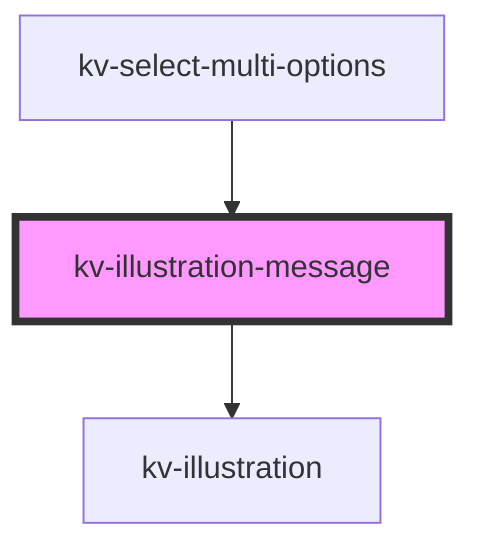

# _<kv-illustration-message>_

<!-- Auto Generated Below -->


## Usage

### React

```tsx
import React from 'react';

import { KvIllustrationMessage } from '@kelvininc/react-ui-components/client';

export const IllustrationMessageExample: React.FC = () => (
	<>
		{/*-- Default --*/}
		<KvIllustrationMessage is-loading />
	</>
);
```


## Properties

| Property       | Attribute      | Description                                                           | Type                | Default     |
| -------------- | -------------- | --------------------------------------------------------------------- | ------------------- | ----------- |
| `description`  | `description`  | (optional) The message description to be displayed below the title.   | `string`            | `undefined` |
| `header`       | `header`       | (required) The message header to be displayed below the illustration. | `string`            | `undefined` |
| `illustration` | `illustration` | (required) The illustration that will be presented.                   | `EIllustrationName` | `undefined` |


## Shadow Parts

| Part             | Description                 |
| ---------------- | --------------------------- |
| `"description"`  | The description container.  |
| `"header"`       | The header container.       |
| `"illustration"` | The illustration container. |


## CSS Custom Properties

| Name                  | Description                              |
| --------------------- | ---------------------------------------- |
| `--description-color` | The illustration description text color. |
| `--header-color`      | The illustration header text color.      |
| `--image-height`      | The illustration image height.           |
| `--image-width`       | The illustration image width.            |


## Dependencies

### Used by

 - [kv-select-multi-options](../select-multi-options)

### Depends on

- [kv-illustration](../illustration)

### Graph


----------------------------------------------


