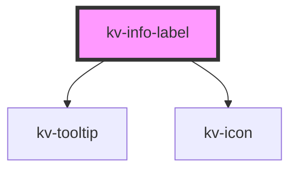

# *<kv-info-label>*


<!-- Auto Generated Below -->


## Usage

### Angular

```html
<!-- Default -->
<kv-info-label labelTitle="Default" />

<!-- Read more and read less -->
<kv-info-label
	labelTitle="Description"
	description="Lorem Ipsulum..."
	descriptionHeight="34"
	descriptionCollapsedText="Read more"
	descriptionOpennedText="Read less"
/>

<!-- Copy values -->
<kv-info-label
	labelTitle="TYPE"
	description="data-model"
	copyValue="data-model"
/>

<!-- With component -->
<kv-info-label labelTitle="DESCRIPTION">
	<kv-tag-letter label="Test" tagLetter="T" />
</kv-info-label>
```


### React

```tsx
import React from 'react';

import { KvInfoLabel, KvTagLetter } from '@kelvininc/react-ui-components';

export const InfoLabelExample: React.FC = () => (
	<>
		{/*-- Default --*/}
		<KvInfoLabel labelTitle="Default" />

		{/*-- Read more and read less --*/}
		<KvInfoLabel
			labelTitle="Description"
			description="Lorem Ipsulum..."
			descriptionHeight="34"
			descriptionCollapsedText="Read more"
			descriptionOpennedText="Read less"
		/>

		{/*-- Copy values --*/}
		<KvInfoLabel
			labelTitle="TYPE"
			description="data-model"
			copyValue="data-model"
		/>

		{/*-- With component --*/}
		<KvInfoLabel labelTitle="DESCRIPTION">
			<KvTagLetter label="Test" tagLetter="T" />
		</KvInfoLabel>
	</>
);

```


## Properties

| Property                   | Attribute                    | Description                                     | Type     | Default                              |
| -------------------------- | ---------------------------- | ----------------------------------------------- | -------- | ------------------------------------ |
| `copyValue`                | `copy-value`                 | (optional) Info label copy value                | `string` | `undefined`                          |
| `description`              | `description`                | (optional) Info label description               | `string` | `undefined`                          |
| `descriptionCollapsedText` | `description-collapsed-text` | (optional) Info label description collapse text | `string` | `DEFAULT_DESCRIPTION_COLLAPSED_TEXT` |
| `descriptionHeight`        | `description-height`         | (optional) Info label description height        | `number` | `undefined`                          |
| `descriptionOpenedText`    | `description-opened-text`    | (optional) Info label description opened text   | `string` | `DEFAULT_DESCRIPTION_OPENED_TEXT`    |
| `labelTitle`               | `label-title`                | (optional) Info label title                     | `string` | `undefined`                          |


## CSS Custom Properties

| Name                       | Description                     |
| -------------------------- | ------------------------------- |
| `--expanded-buttom-color`  | Expandded buttom's color.       |
| `--text-color-description` | Info label's description color. |
| `--text-color-title`       | Info label's title color.       |


## Dependencies

### Depends on

- [kv-tooltip](../tooltip)
- [kv-icon](../icon)

### Graph


----------------------------------------------


