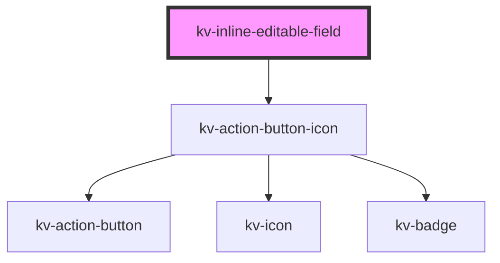

# kv-inline-editable-field

<!-- Auto Generated Below -->

## Properties

| Property    | Attribute    | Description                                       | Type      | Default              |
| ----------- | ------------ | ------------------------------------------------- | --------- | -------------------- |
| `disabled`  | `disabled`   | Indicates whether the editable field is disabled. | `boolean` | `undefined`          |
| `maxLength` | `max-length` | The maximum length of the editable field.         | `number`  | `DEFAULT_MAX_LENGTH` |
| `value`     | `value`      | The value of the field.                           | `string`  | `undefined`          |

## Events

| Event            | Description                          | Type                  |
| ---------------- | ------------------------------------ | --------------------- |
| `contentBlured`  | Emitted when the content is blurred. | `CustomEvent<void>`   |
| `contentEdited`  | Emitted when the content is edited.  | `CustomEvent<string>` |
| `contentFocused` | Emitted when the content is focused. | `CustomEvent<void>`   |

## Methods

### `resetContent() => Promise<void>`

Resets the content of the editable field.

#### Returns

Type: `Promise<void>`

## CSS Custom Properties

| Name                  | Description                                      |
| --------------------- | ------------------------------------------------ |
| `--margin-left-right` | Margin left and right of the editable container. |
| `--margin-top-bottom` | Margin top and bottom of the editable container. |

## Dependencies

### Depends on

- [kv-action-button-icon](../action-button-icon)

### Graph

----------------------------------------------

