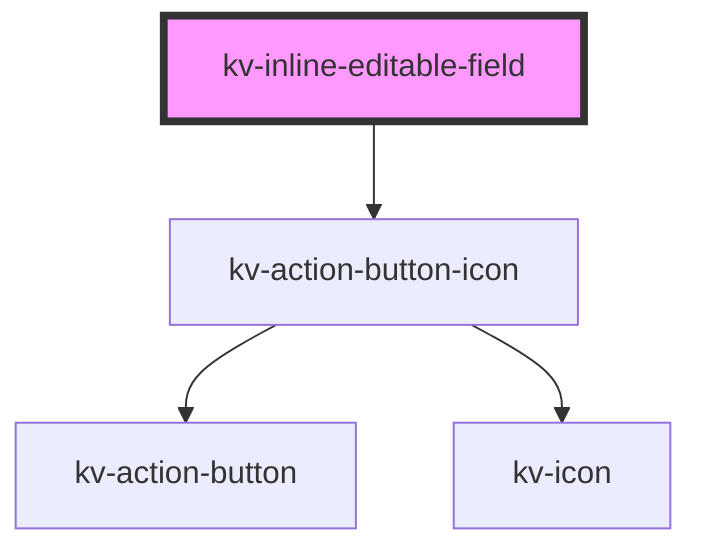

# kv-inline-editable-field

<!-- Auto Generated Below -->

## Properties

| Property      | Attribute     | Description                                                                                                                                                                                                        | Type      | Default              |
| ------------- | ------------- | ------------------------------------------------------------------------------------------------------------------------------------------------------------------------------------------------------------------ | --------- | -------------------- |
| `disabled`    | `disabled`    | Indicates whether the editable field is disabled.                                                                                                                                                                  | `boolean` | `undefined`          |
| `maxLength`   | `max-length`  | The maximum length of the editable field.                                                                                                                                                                          | `number`  | `DEFAULT_MAX_LENGTH` |
| `placeholder` | `placeholder` | Text displayed when the field has no value. Visible only when the slot is empty and the field is not in edit mode. Empty saves are not allowed: clearing all content and confirming reverts to the previous value. | `string`  | `undefined`          |
| `value`       | `value`       | The value of the field.                                                                                                                                                                                            | `string`  | `undefined`          |

## Events

| Event            | Description                          | Type                  |
| ---------------- | ------------------------------------ | --------------------- |
| `contentBlured`  | Emitted when the content is blurred. | `CustomEvent<void>`   |
| `contentEdited`  | Emitted when the content is edited.  | `CustomEvent<string>` |
| `contentFocused` | Emitted when the content is focused. | `CustomEvent<void>`   |

## Methods

### `resetContent() => Promise<void>`

Resets the content of the editable field.

#### Returns

Type: `Promise<void>`

## CSS Custom Properties

| Name                                             | Description                                                                                                                  |
| ------------------------------------------------ | ---------------------------------------------------------------------------------------------------------------------------- |
| `--inline-editable-field-background-color-hover` | Background color of the editable field on hover.                                                                             |
| `--inline-editable-field-editing-min-width`      | Minimum width applied while editing. Takes priority over `--inline-editable-field-min-width` in edit mode. Unset by default. |
| `--inline-editable-field-min-width`              | Minimum width applied to the field in visualization mode. Unset by default — consumers opt in for layout stability.          |
| `--inline-editable-field-outline-color-focus`    | Outline color of the editable field on focus.                                                                                |
| `--inline-editable-field-outline-color-hover`    | Outline color of the editable field on hover.                                                                                |
| `--inline-editable-field-placeholder-color`      | Text color used to render the placeholder when the field is empty.                                                           |
| `--margin-left-right`                            | Margin left and right of the editable container.                                                                             |
| `--margin-top-bottom`                            | Margin top and bottom of the editable container.                                                                             |

## Dependencies

### Depends on

- [kv-action-button-icon](../action-button-icon)

### Graph

```mermaid
graph TD;
  kv-inline-editable-field --> kv-action-button-icon
  kv-action-button-icon --> kv-action-button
  kv-action-button-icon --> kv-icon
  style kv-inline-editable-field fill:#f9f,stroke:#333,stroke-width:4px
```

----------------------------------------------

