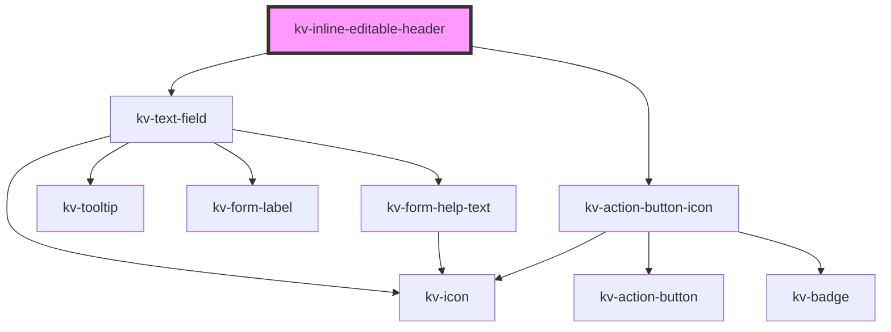

# _<kv-inline-editable-header>_


<!-- Auto Generated Below -->


## Usage

### Angular

```html
<!-- Default -->
<kv-inline-editable-header value="Node-01" />

<!-- Editing -->
<kv-inline-editable-header value="Node-01" isEditing />

<!-- With Help Text -->
<kv-inline-editable-header value="Node-01" helpText="Edit the node here" [state]="EValidationState.Invalid" isEditing />

<!-- With error -->
<kv-inline-editable-header value="Node-01" helpText="The node name already exists" [state]="EValidationState.Invalid" isEditing />
```


### React

```tsx
import React from 'react';

import { KvInlineEditableHeader, EValidationState } from '@kelvininc/react-ui-components';

export const InlineEditableHeaderExamples = () => (
	<>
		{/*-- Default */}
		<KvInlineEditableHeader value="Node-01" />

		{/*-- Editing */}
		<KvInlineEditableHeader value="Node-01" isEditing />

		{/*-- With Help Text */}
		<KvInlineEditableHeader value="Node-01" helpText="Edit the node here" state={EValidationState.None} isEditing />

		{/*-- With error */}
		<KvInlineEditableHeader value="Node-01" helpText="The node name already exists" state={EValidationState.Invalid} isEditing />
	</>
);
```


## Properties

| Property         | Attribute          | Description                                                                   | Type                                                                                                                                                                               | Default     |
| ---------------- | ------------------ | ----------------------------------------------------------------------------- | ---------------------------------------------------------------------------------------------------------------------------------------------------------------------------------- | ----------- |
| `disabled`       | `disabled`         | (optional) Text field disabled                                                | `boolean`                                                                                                                                                                          | `undefined` |
| `examples`       | --                 | (optional) Text field example values                                          | `string[]`                                                                                                                                                                         | `undefined` |
| `forcedFocus`    | `forced-focus`     | (optional) Text field focus state                                             | `boolean`                                                                                                                                                                          | `undefined` |
| `helpText`       | `help-text`        | (optional) Text field help text                                               | `string \| string[]`                                                                                                                                                               | `undefined` |
| `icon`           | `icon`             | (optional) Text field's icon symbol name                                      | `EIconName \| EOtherIconName`                                                                                                                                                      | `undefined` |
| `inputMaskRegex` | `input-mask-regex` | (optional) Input mask regex                                                   | `string`                                                                                                                                                                           | `undefined` |
| `inputName`      | `input-name`       | (optional) Text field input name                                              | `string`                                                                                                                                                                           | `undefined` |
| `isEditing`      | `is-editing`       | (optional) The control prop to change between editing and display             | `boolean`                                                                                                                                                                          | `false`     |
| `label`          | `label`            | (optional) Text field label                                                   | `string`                                                                                                                                                                           | `undefined` |
| `loading`        | `loading`          | (optional) Text field loading state                                           | `boolean`                                                                                                                                                                          | `undefined` |
| `max`            | `max`              | (optional) Text field maximum value                                           | `number \| string`                                                                                                                                                                 | `undefined` |
| `maxLength`      | `max-length`       | (optional) Text field maximum number of characters required                   | `number`                                                                                                                                                                           | `undefined` |
| `min`            | `min`              | (optional) Text field minimum value                                           | `number \| string`                                                                                                                                                                 | `undefined` |
| `minLength`      | `min-length`       | (optional) Text field minimum number of characters required                   | `number`                                                                                                                                                                           | `undefined` |
| `placeholder`    | `placeholder`      | (optional) Text field place holder                                            | `string`                                                                                                                                                                           | `undefined` |
| `readonly`       | `readonly`         | (optional) Text field is readonly                                             | `boolean`                                                                                                                                                                          | `undefined` |
| `required`       | `required`         | (optional) Text field required                                                | `boolean`                                                                                                                                                                          | `undefined` |
| `size`           | `size`             | (optional) Sets this tab item to a different styling configuration            | `EComponentSize.Large \| EComponentSize.Small`                                                                                                                                     | `undefined` |
| `state`          | `state`            | (optional) Text field state                                                   | `EValidationState.Invalid \| EValidationState.None \| EValidationState.Valid`                                                                                                      | `undefined` |
| `step`           | `step`             | (optional) Text field interval between legal numbers                          | `number \| string`                                                                                                                                                                 | `undefined` |
| `tooltipConfig`  | --                 | (optional) Text field tooltip configuration                                   | `{ text?: string; position?: ETooltipPosition; options?: Partial<ComputePositionConfig>; disabled?: boolean; contentElement?: HTMLElement; truncate?: boolean; }`                  | `undefined` |
| `type`           | `type`             | (optional) Text field type                                                    | `EInputFieldType.Date \| EInputFieldType.DateTime \| EInputFieldType.Email \| EInputFieldType.Number \| EInputFieldType.Password \| EInputFieldType.Radio \| EInputFieldType.Text` | `undefined` |
| `useInputMask`   | `use-input-mask`   | (optional) Use a input mask when the text field type is number (default true) | `boolean`                                                                                                                                                                          | `undefined` |
| `value`          | `value`            | (optional) Text field value                                                   | `number \| string`                                                                                                                                                                 | `''`        |


## Events

| Event             | Description                                       | Type                            |
| ----------------- | ------------------------------------------------- | ------------------------------- |
| `changeConfirmed` | Fires when the user clicks on the confirm button. | `CustomEvent<void>`             |
| `changeDiscarded` | Fires when the user clicks on the cancel button.  | `CustomEvent<void>`             |
| `doubleClick`     | Fires when the user double clicks on the text.    | `CustomEvent<void>`             |
| `textFieldBlur`   | Fires when losing focus on the text field.        | `CustomEvent<number \| string>` |
| `textFieldChange` | Fires on every keydown event on the text field    | `CustomEvent<number \| string>` |


## CSS Custom Properties

| Name                      | Description                                                |
| ------------------------- | ---------------------------------------------------------- |
| `--editable-header-width` | Sets the width of the container for this component (in px) |


## Dependencies

### Depends on

- [kv-text-field](../text-field)
- [kv-action-button-icon](../action-button-icon)

### Graph


----------------------------------------------


