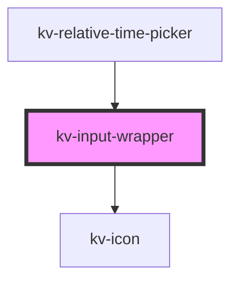

# kv-time-picker-timezone


<!-- Auto Generated Below -->


## Usage

### Angular

```html
<!-- Default -->
<kv-input-wrapper contentVisible>
	<kv-text-field label="Text Field"></kv-text-field>
</kv-input-wrapper>

<!-- With Label -->
<kv-input-wrapper label="Content Label">
	<kv-text-field label="Text Field"></kv-text-field>
</kv-input-wrapper>

<!-- With component hidden -->
<kv-input-wrapper label="Content Label" contentVisible={false}>
	<kv-text-field label="Text Field"></kv-text-field>
</kv-input-wrapper>
```


### React

```tsx
import React from 'react';
import { KvInputWrapper, KvTextField } from '@kelvininc/react-ui-components';

export const KvInputWrapperExample: React.FC = () => (
  <>
	<KvInputWrapper label="Options" contentVisible={false}>
		<KvTextField label="label" />
	</KvInputWrapper>
  </>
);
```


## Properties

| Property                      | Attribute          | Description                                                                  | Type        | Default          |
| ----------------------------- | ------------------ | ---------------------------------------------------------------------------- | ----------- | ---------------- |
| `contentDisabled`             | `content-disabled` | Defines if the content can be seen                                           | `boolean`   | `false`          |
| `contentVisible` _(required)_ | `content-visible`  | Defines the state of the component                                           | `boolean`   | `undefined`      |
| `icon`                        | `icon`             | Icon that is displayed when the component is hovered and is in default state | `EIconName` | `EIconName.Edit` |
| `label`                       | `label`            | Label that is shown when the component is in Default state                   | `string`    | `undefined`      |


## Events

| Event          | Description                                                                | Type                   |
| -------------- | -------------------------------------------------------------------------- | ---------------------- |
| `contentClick` | Event emitted when the component is clicked to display the wrapped content | `CustomEvent<boolean>` |


## Dependencies

### Used by

 - [kv-relative-time-picker](../relative-time-picker)

### Depends on

- [kv-icon](../icon)

### Graph


----------------------------------------------


