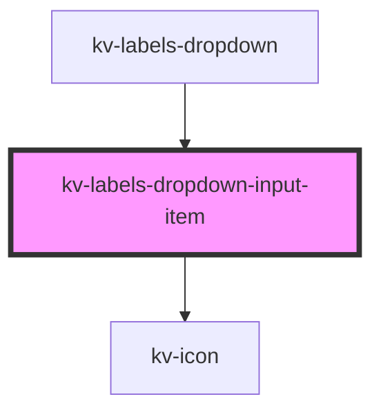

# kv-labels-dropdown-input-item

<!-- Auto Generated Below -->

## Properties

| Property             | Attribute  | Description                                                      | Type        | Default     |
| -------------------- | ---------- | ---------------------------------------------------------------- | ----------- | ----------- |
| `disabled`           | `disabled` | (optional) Defines if this item is disabled, defaults to `false` | `boolean`   | `false`     |
| `icon` _(required)_  | `icon`     | (required) The icon to show on the input input                   | `EIconName` | `undefined` |
| `label` _(required)_ | `label`    | (required) The label to show on this input item                  | `string`    | `undefined` |
| `selected`           | `selected` | (optional) Defines if this item is selected, defaults to `false` | `boolean`   | `false`     |
| `value` _(required)_ | `value`    | (required) The value this input item represents                  | `string`    | `undefined` |

## Events

| Event       | Description                                       | Type                  |
| ----------- | ------------------------------------------------- | --------------------- |
| `itemClick` | Emitted when there's a click on the assigned icon | `CustomEvent<string>` |

## Dependencies

### Used by

 - [kv-labels-dropdown](../labels-dropdown)

### Depends on

- [kv-icon](../icon)

### Graph

----------------------------------------------

