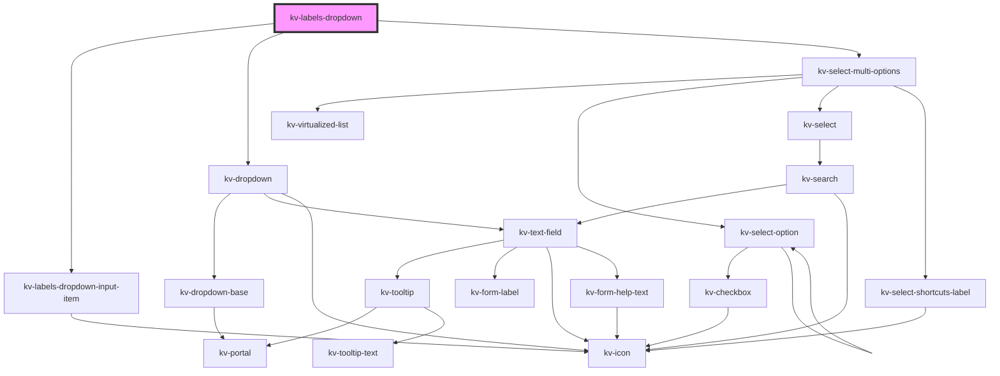

# kv-labels-dropdown

<!-- Auto Generated Below -->

## Properties

| Property               | Attribute                 | Description                                                                                                       | Type                                   | Default                      |
| ---------------------- | ------------------------- | ----------------------------------------------------------------------------------------------------------------- | -------------------------------------- | ---------------------------- |
| `clearSelectionLabel`  | `clear-selection-label`   | (optional) The clear selection action text                                                                        | `string`                               | `undefined`                  |
| `counter`              | `counter`                 | (optional) If `true` a selection counter is displayed                                                             | `boolean`                              | `true`                       |
| `filteredOptions`      | --                        | (optional) The object with the dropdown options filtered                                                          | `{ [x: string]: ISelectMultiOption; }` | `undefined`                  |
| `isOpen`               | `is-open`                 | (Optional) Allows outside implementation to open/close dropdown on demand                                         | `boolean`                              | `false`                      |
| `maxHeight`            | `max-height`              | (optional) The dropdown's max-height                                                                              | `string`                               | `undefined`                  |
| `minHeight`            | `min-height`              | (optional) The dropdown's min-height                                                                              | `string`                               | `undefined`                  |
| `minSearchOptions`     | `min-search-options`      | (optional) The minimum amount of options required to display the search. Defaults to `8`.                         | `number`                               | `MINIMUM_SEARCHABLE_OPTIONS` |
| `noDataAvailableLabel` | `no-data-available-label` | (required) The text to display when there are no options                                                          | `string`                               | `undefined`                  |
| `options`              | --                        | (optional) The object with the dropdown options                                                                   | `{ [x: string]: ISelectMultiOption; }` | `{}`                         |
| `searchValue`          | `search-value`            | (optional) The search value to display                                                                            | `string`                               | `undefined`                  |
| `searchable`           | `searchable`              | (optional) If `true` the dropdown is searchable                                                                   | `boolean`                              | `undefined`                  |
| `selectAllLabel`       | `select-all-label`        | (optional) The selection all action text                                                                          | `string`                               | `undefined`                  |
| `selectedOptions`      | --                        | (optional) The object with indexed by the dropdown labels and its selected value                                  | `{ [x: string]: boolean; }`            | `{}`                         |
| `selectionAll`         | `selection-all`           | (optional) If `true` the list has an action to select all items                                                   | `boolean`                              | `true`                       |
| `selectionClearable`   | `selection-clearable`     | (optional) If `true` dropdown items can be cleared                                                                | `boolean`                              | `true`                       |
| `shortcuts`            | `shortcuts`               | (optional) If `true` the keyboard shortcuts can be used to navigate between the dropdown results. Default `false` | `boolean`                              | `false`                      |

## Events

| Event             | Description                                                | Type                                     |
| ----------------- | ---------------------------------------------------------- | ---------------------------------------- |
| `clearSelection`  | Emitted when the user clears the selected items            | `CustomEvent<void>`                      |
| `optionsSelected` | Emitted when the selected options change                   | `CustomEvent<{ [x: string]: boolean; }>` |
| `searchChange`    | Emitted when the user interacts with the search text field | `CustomEvent<string>`                    |
| `selectAll`       | Emitted when the user clicks on the all items              | `CustomEvent<void>`                      |

## Dependencies

### Depends on

- [kv-labels-dropdown-input-item](../labels-dropdown-input-item)
- [kv-dropdown](../dropdown)
- [kv-select-multi-options](../select-multi-options)

### Graph

----------------------------------------------

