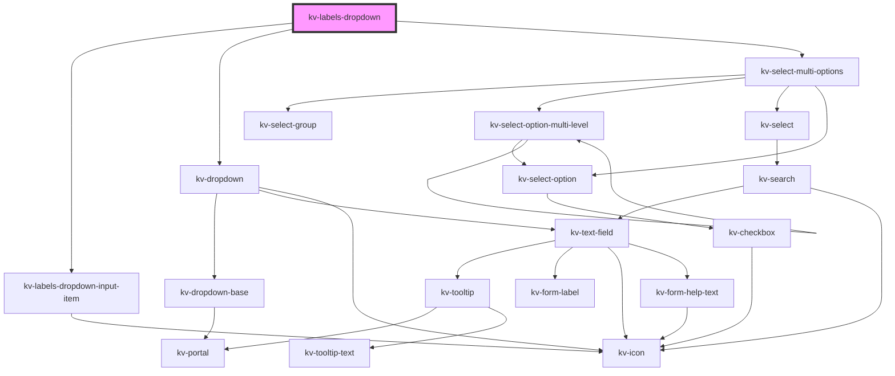

# kv-labels-dropdown

<!-- Auto Generated Below -->

## Properties

| Property               | Attribute                 | Description                                                                      | Type                                   | Default     |
| ---------------------- | ------------------------- | -------------------------------------------------------------------------------- | -------------------------------------- | ----------- |
| `filteredOptions`      | --                        | (optional) The object with the dropdown options filtered                         | `{ [x: string]: ISelectMultiOption; }` | `undefined` |
| `isOpen`               | `is-open`                 | (Optional) Allows outside implementation to open/close dropdown on demand        | `boolean`                              | `false`     |
| `maxHeight`            | `max-height`              | (optional) The dropdown's max-height                                             | `string`                               | `undefined` |
| `minHeight`            | `min-height`              | (optional) The dropdown's min-height                                             | `string`                               | `undefined` |
| `noDataAvailableLabel` | `no-data-available-label` | (required) The text to display when there are no options                         | `string`                               | `undefined` |
| `options`              | --                        | (optional) The object with the dropdown options                                  | `{ [x: string]: ISelectMultiOption; }` | `{}`        |
| `searchValue`          | `search-value`            | (optional) The search value to display                                           | `string`                               | `undefined` |
| `searchable`           | `searchable`              | (optional) If `true` the dropdown is searchable                                  | `boolean`                              | `true`      |
| `selectedOptions`      | --                        | (optional) The object with indexed by the dropdown labels and its selected value | `{ [x: string]: boolean; }`            | `{}`        |

## Events

| Event              | Description                                                | Type                                     |
| ------------------ | ---------------------------------------------------------- | ---------------------------------------- |
| `optionsSelected`  | Emitted when the selected options change                   | `CustomEvent<{ [x: string]: boolean; }>` |
| `searchChange`     | Emitted when the search term changes                       | `CustomEvent<string>`                    |
| `selectAll`        | Emits a signal whenever the 'select all' action is clicked | `CustomEvent<void>`                      |
| `selectionCleared` | Emitted when the selection is cleared                      | `CustomEvent<void>`                      |

## Dependencies

### Depends on

- [kv-labels-dropdown-input-item](../labels-dropdown-input-item)
- [kv-dropdown](../dropdown)
- [kv-select-multi-options](../select-multi-options)

### Graph

----------------------------------------------

