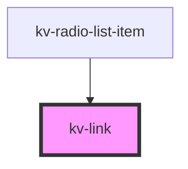

# *<kv-link>*


<!-- Auto Generated Below -->


## Usage

### Javascript

```html
<!-- Labeled -->
<kv-link label="Your label"></kv-link>

<!-- Labeled with subtitle -->
<kv-link label="Your label" subtitle="Your subtitle"></kv-link>

<!-- Labeled with subtitle and link -->
<kv-link label="Your label" subtitle="Your subtitle" href="https://kelvin.ai" target="_blank"></kv-link>
```


### React

```tsx
import React from 'react';
import { KvLink } from '@kelvininc/react-ui-components/client';

export const KvLinkExample: React.FC = () => (
	<>
		{/*-- Labeled --*/}
		<KvLink label={'Label here'}></KvLink>

		{/*-- Labeled with subtitle --*/}
		<KvLink label={'Label here'} subtitle={'Subtitle here'}></KvLink>

		{/*-- Labeled with subtitle and link --*/}
		<KvLink label="Your label" subtitle="Your subtitle" href="https://kelvin.ai" target="_blank"></KvLink>
	</>
);
```


### Stencil

```tsx
import { Component, h } from '@stencil/core';

@Component({
  tag: 'kv-link-example',
  styleUrl: 'kv-link-example.css',
  shadow: true,
})
export class SwichButtonExample {
  render() {
    return [
		// Labeled
		<kv-link label="Your label"></kv-link>

		// Labeled with subtitle
		<kv-link label="Your label" subtitle="Your subtitle"></kv-link>

		// Labeled with subtitle and link
		<kv-link label="Your label" subtitle="Your subtitle" href="https://kelvin.ai" target="_blank"></kv-link>
    ];
  }
}
```


## Properties

| Property             | Attribute  | Description                                          | Type                                                                                                | Default     |
| -------------------- | ---------- | ---------------------------------------------------- | --------------------------------------------------------------------------------------------------- | ----------- |
| `href`               | `href`     | (optional) The link to open when clicking on the tag | `string`                                                                                            | `undefined` |
| `label` _(required)_ | `label`    | (required) Main component label                      | `string`                                                                                            | `undefined` |
| `subtitle`           | `subtitle` | (optional) Description for the label                 | `string`                                                                                            | `undefined` |
| `target`             | `target`   | (optional) The link to open when clicking on the tag | `EAnchorTarget.BrowserDefault \| EAnchorTarget.NewTab \| EAnchorTarget.Parent \| EAnchorTarget.Top` | `undefined` |


## Events

| Event        | Description                     | Type                      |
| ------------ | ------------------------------- | ------------------------- |
| `labelClick` | Emitted when clicking the label | `CustomEvent<MouseEvent>` |


## Shadow Parts

| Part          | Description          |
| ------------- | -------------------- |
| `"container"` | The link's container |


## Dependencies

### Used by

 - [kv-radio-list-item](../radio-list-item)

### Graph


----------------------------------------------


