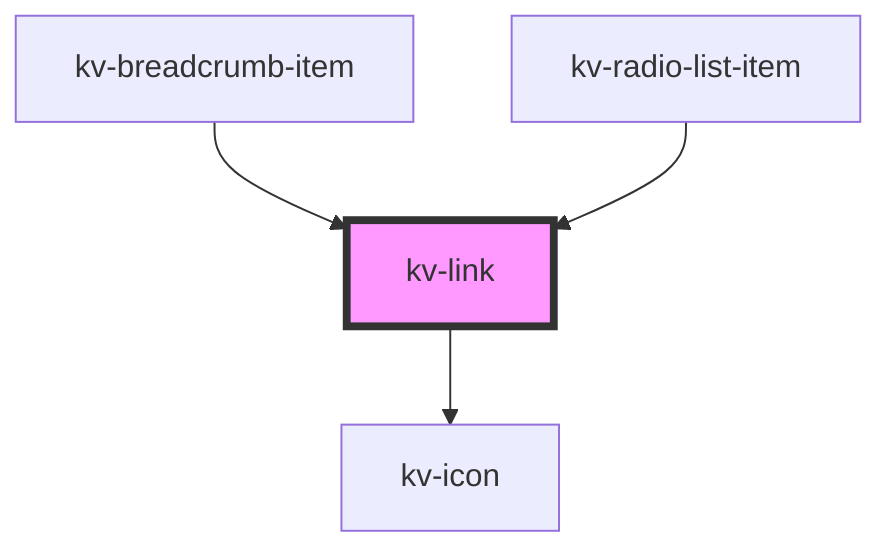

# *<kv-link>*


<!-- Auto Generated Below -->


## Usage

### Javascript

```html
<!-- Labeled -->
<kv-link label="Your label"></kv-link>

<!-- Labeled with subtitle -->
<kv-link label="Your label" subtitle="Your subtitle"></kv-link>

<!-- Labeled with subtitle and link -->
<kv-link label="Your label" subtitle="Your subtitle" href="https://kelvin.ai" target="_blank"></kv-link>
```


### React

```tsx
import React from 'react';
import { KvLink } from '@kelvininc/react-ui-components/client';

export const KvLinkExample: React.FC = () => (
	<>
		{/*-- Labeled --*/}
		<KvLink label={'Label here'}></KvLink>

		{/*-- Labeled with subtitle --*/}
		<KvLink label={'Label here'} subtitle={'Subtitle here'}></KvLink>

		{/*-- Labeled with subtitle and link --*/}
		<KvLink label="Your label" subtitle="Your subtitle" href="https://kelvin.ai" target="_blank"></KvLink>
	</>
);
```


### Stencil

```tsx
import { Component, h } from '@stencil/core';

@Component({
  tag: 'kv-link-example',
  styleUrl: 'kv-link-example.css',
  shadow: true,
})
export class SwichButtonExample {
  render() {
    return [
		// Labeled
		<kv-link label="Your label"></kv-link>

		// Labeled with subtitle
		<kv-link label="Your label" subtitle="Your subtitle"></kv-link>

		// Labeled with subtitle and link
		<kv-link label="Your label" subtitle="Your subtitle" href="https://kelvin.ai" target="_blank"></kv-link>
    ];
  }
}
```


## Properties

| Property             | Attribute    | Description                                                                   | Type                                                                                                             | Default     |
| -------------------- | ------------ | ----------------------------------------------------------------------------- | ---------------------------------------------------------------------------------------------------------------- | ----------- |
| `disabled`           | `disabled`   | (optional) Defines if the link are disabled. Default: false                   | `boolean \| undefined`                                                                                           | `false`     |
| `href`               | `href`       | (optional) The anchor's link to open when clicking                            | `string \| undefined`                                                                                            | `undefined` |
| `inline`             | `inline`     | (optional) Whether the link is displayed inline. Default: false               | `boolean \| undefined`                                                                                           | `false`     |
| `label` _(required)_ | `label`      | (required) Main component label                                               | `string`                                                                                                         | `undefined` |
| `leftIcon`           | `left-icon`  | (optional) The name of the icon to be rendered on the left side of the label  | `EIconName \| undefined`                                                                                         | `undefined` |
| `rightIcon`          | `right-icon` | (optional) The name of the icon to be rendered on the right side of the label | `EIconName \| undefined`                                                                                         | `undefined` |
| `subtitle`           | `subtitle`   | (optional) Description for the label                                          | `string \| undefined`                                                                                            | `undefined` |
| `target`             | `target`     | (optional) The anchor's target                                                | `EAnchorTarget.BrowserDefault \| EAnchorTarget.NewTab \| EAnchorTarget.Parent \| EAnchorTarget.Top \| undefined` | `undefined` |


## Events

| Event        | Description                     | Type                      |
| ------------ | ------------------------------- | ------------------------- |
| `labelClick` | Emitted when clicking the label | `CustomEvent<MouseEvent>` |


## Shadow Parts

| Part           | Description          |
| -------------- | -------------------- |
| `"container"`  | The link's container |
| `"label"`      | The link's label     |
| `"label-text"` |                      |


## Dependencies

### Used by

 - [kv-breadcrumb-item](../breadcrumb-item)
 - [kv-radio-list-item](../radio-list-item)

### Depends on

- [kv-icon](../icon)

### Graph

```mermaid
graph TD;
  kv-link --> kv-icon
  kv-breadcrumb-item --> kv-link
  kv-radio-list-item --> kv-link
  style kv-link fill:#f9f,stroke:#333,stroke-width:4px
```

----------------------------------------------


