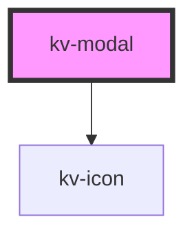

# *<kv-modal>*


<!-- Auto Generated Below -->


## Usage

### Angular

```html
<!-- Default -->
<kv-modal modalTitle="Modal Test">
	<div className="header">This is a modal header</div>
	<div className="body">This is a modal body</div>
	<div className="footer">This is a modal footer</div>
</kv-modal>
```


### React

```tsx
import React from 'react';

import { KvModal } from '@kelvininc/react-ui-components';

export const ModalExample: React.FC = () => (
	<>
		{/*-- Default --*/}
		<KvModal>
			<div className="header">This is a modal header</div>
			<div className="body">This is a modal body</div>
			<div className="footer">This is a modal footer</div>
		</KvModal>
	</>
);
```


## Properties

| Property            | Attribute             | Description                               | Type      | Default     |
| ------------------- | --------------------- | ----------------------------------------- | --------- | ----------- |
| `center`            | `center`              | (optional) Modal center                   | `boolean` | `undefined` |
| `closeClickOutside` | `close-click-outside` | (optional) Modal close when click outside | `boolean` | `undefined` |
| `modalTitle`        | `modal-title`         | (optional) Modal title                    | `string`  | `undefined` |


## Events

| Event              | Description                            | Type                      |
| ------------------ | -------------------------------------- | ------------------------- |
| `clickCloseButton` | Emitted when clicking the close button | `CustomEvent<MouseEvent>` |


## CSS Custom Properties

| Name             | Description   |
| ---------------- | ------------- |
| `--modal-height` | Modal height. |
| `--modal-width`  | Modal width.  |


## Dependencies

### Depends on

- [kv-icon](../icon)

### Graph


----------------------------------------------


