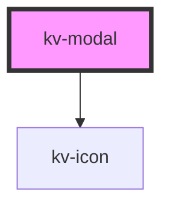

# *<kv-modal>*


<!-- Auto Generated Below -->


## Usage

### React

```tsx
import React from 'react';
import { ModalOverlay, useModal } from '@kelvininc/react-ui-components';
import type { ModalOverlayProps } from '@kelvininc/react-ui-components';

export const ModalOverlayExample: React.FC = (args: ModalOverlayProps) => {
	const modalController = useModal(args.isOpen);

	return (
		<>
			<button type="button" onClick={modalController.open}>
				Open Modal
			</button>
			<ModalOverlay rootId="root" {...args} isOpen={modalCtrl.isOpen} />
		</>
	);
};
```


## Properties

| Property          | Attribute           | Description                                                                                                                                                                             | Type                                | Default     |
| ----------------- | ------------------- | --------------------------------------------------------------------------------------------------------------------------------------------------------------------------------------- | ----------------------------------- | ----------- |
| `customClass`     | `custom-class`      | (optional) Additional classes to apply for custom CSS. If multiple classes are provided they should be separated by spaces. It is also valid to provide CssClassMap with boolean logic. | `CssClassMap \| string \| string[]` | `''`        |
| `headerTitle`     | `header-title`      | (optional) Defines the modal title label                                                                                                                                                | `string`                            | `undefined` |
| `showCloseButton` | `show-close-button` | (optional) Defines if the modal shows the close button                                                                                                                                  | `boolean`                           | `true`      |
| `showOverlay`     | `show-overlay`      | (optional) Defines if the modal has an overlay background                                                                                                                               | `boolean`                           | `true`      |


## Events

| Event          | Description                                   | Type                |
| -------------- | --------------------------------------------- | ------------------- |
| `clickClose`   | Emitted when the close button is clicked      | `CustomEvent<void>` |
| `clickOverlay` | Emitted when the overlay container is clicked | `CustomEvent<void>` |


## Shadow Parts

| Part        | Description                  |
| ----------- | ---------------------------- |
| `"content"` | The modal's content section. |
| `"topbar"`  | The modal's topbar section.  |


## CSS Custom Properties

| Name                          | Description                       |
| ----------------------------- | --------------------------------- |
| `--modal-background-color`    | The modal's background color.     |
| `--modal-background-color`    | The modal's background color.     |
| `--modal-close-button-height` | The modal's close button height   |
| `--modal-close-button-height` | The modal's close button height   |
| `--modal-close-button-width`  | The modal's close button width    |
| `--modal-close-button-width`  | The modal's close button width    |
| `--modal-height`              | The modal's height in px.         |
| `--modal-height`              | The modal's height in px.         |
| `--modal-min-height`          | The modal's minimum height in px. |
| `--modal-min-height`          | The modal's minimum height in px. |
| `--modal-min-width`           | The modal's minimum width in px.  |
| `--modal-min-width`           | The modal's minimum width in px.  |
| `--modal-overlay-color`       | The modal's overlay color.        |
| `--modal-overlay-color`       | The modal's overlay color.        |
| `--modal-topbar-height`       | The modal's topbar height in px.  |
| `--modal-topbar-height`       | The modal's topbar height in px.  |
| `--modal-topbar-text-color`   | The modal's text topbar color.    |
| `--modal-topbar-text-color`   | The modal's text topbar color.    |
| `--modal-width`               | The modal's width in px.          |
| `--modal-width`               | The modal's width in px.          |
| `--modal-z-index`             | The modal's z-index               |
| `--modal-z-index`             | The modal's z-index               |


## Dependencies

### Depends on

- [kv-icon](../icon)

### Graph


----------------------------------------------


