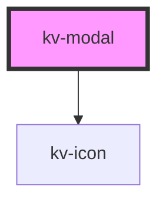

# *<kv-modal>*


<!-- Auto Generated Below -->


## Usage

### React

```tsx
import React from 'react';
import { ModalOverlay, useModal } from '@kelvininc/react-ui-components';
import type { ModalOverlayProps } from '@kelvininc/react-ui-components';

export const ModalOverlayExample: React.FC = (args: ModalOverlayProps) => {
	const modalController = useModal(args.isOpen);

	return (
		<>
			<button type="button" onClick={modalController.open}>
				Open Modal
			</button>
			<ModalOverlay rootId="root" {...args} isOpen={modalCtrl.isOpen} />
		</>
	);
};
```


## Properties

| Property          | Attribute           | Description                                                       | Type      | Default     |
| ----------------- | ------------------- | ----------------------------------------------------------------- | --------- | ----------- |
| `closable`        | `closable`          | (optional) The modal can be closed by the button or click outside | `boolean` | `true`      |
| `hasBackdrop`     | `has-backdrop`      | (optional) The modal has a backdrop                               | `boolean` | `true`      |
| `headerTitle`     | `header-title`      | (optional) The modal title label                                  | `string`  | `undefined` |
| `showCloseButton` | `show-close-button` | (optional) The modal shows the close button                       | `boolean` | `true`      |


## Events

| Event        | Description                              | Type                |
| ------------ | ---------------------------------------- | ------------------- |
| `clickClose` | Emitted when the close button is clicked | `CustomEvent<void>` |


## CSS Custom Properties

| Name                          | Description                                     |
| ----------------------------- | ----------------------------------------------- |
| `--modal-backdrop-color`      | The modal's backdrop/overlay color.             |
| `--modal-background-color`    | The modal's background color.                   |
| `--modal-body-z-index`        | The modal's body z-index css property value.    |
| `--modal-close-button-height` | The modal's close button height                 |
| `--modal-close-button-width`  | The modal's close button width                  |
| `--modal-footer-height`       | The modal's footer height in px.                |
| `--modal-header-height`       | The modal's header height in px.                |
| `--modal-height`              | The modal's height in px.                       |
| `--modal-overlay-z-index`     | The modal's overlay z-index css property value. |
| `--modal-title-text-color`    | The modal's text header color.                  |
| `--modal-width`               | The modal's width in px.                        |


## Dependencies

### Depends on

- [kv-icon](../icon)

### Graph


----------------------------------------------


