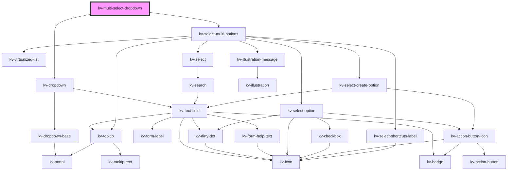

# _<kv-multi-select-dropdown>_

<!-- Auto Generated Below -->


## Usage

### React

```tsx
import React from 'react';
import { KvMultiSelectDropdown } from '@kelvininc/react-ui-components';

export const KvMultiSelectDropdownExample: React.FC = (props) => (
  <>
    <KvMultiSelectDropdown 
		placeholder="Select an option"
		label="Options"
		icon={EIconName.Layer}
		options={props.options}
		selectedOptions={props.selectedOptions}
		searchable
		selectionClearable>
	</KvMultiSelectDropdown>
  </>
);
```


## Properties

| Property                | Attribute               | Description                                                                                                                                                                             | Type                                                                                                                                                                                                                                                                                                                                                                                                                                                                                                                                                                                                                                                                                                                                                    | Default                      |
| ----------------------- | ----------------------- | --------------------------------------------------------------------------------------------------------------------------------------------------------------------------------------- | ------------------------------------------------------------------------------------------------------------------------------------------------------------------------------------------------------------------------------------------------------------------------------------------------------------------------------------------------------------------------------------------------------------------------------------------------------------------------------------------------------------------------------------------------------------------------------------------------------------------------------------------------------------------------------------------------------------------------------------------------------- | ---------------------------- |
| `actionElement`         | --                      | (optional) A reference to the dropdown action element                                                                                                                                   | `HTMLElement`                                                                                                                                                                                                                                                                                                                                                                                                                                                                                                                                                                                                                                                                                                                                           | `null`                       |
| `autoFocus`             | `auto-focus`            | (optional) If `false` the search text field is not auto-focused. Default `true`.                                                                                                        | `boolean`                                                                                                                                                                                                                                                                                                                                                                                                                                                                                                                                                                                                                                                                                                                                               | `true`                       |
| `badge`                 | `badge`                 | (optional) Text to display inside a badge on the right side of the displayed value                                                                                                      | `string`                                                                                                                                                                                                                                                                                                                                                                                                                                                                                                                                                                                                                                                                                                                                                | `undefined`                  |
| `clearSelectionLabel`   | `clear-selection-label` | (optional) The clear selection action text                                                                                                                                              | `string`                                                                                                                                                                                                                                                                                                                                                                                                                                                                                                                                                                                                                                                                                                                                                | `undefined`                  |
| `clickOutsideClose`     | `click-outside-close`   | (optional) If `false` clicking outside the dropdown will not trigger state change. Default: true                                                                                        | `boolean`                                                                                                                                                                                                                                                                                                                                                                                                                                                                                                                                                                                                                                                                                                                                               | `true`                       |
| `counter`               | `counter`               | (optional) If `true` a selection counter is displayed                                                                                                                                   | `boolean`                                                                                                                                                                                                                                                                                                                                                                                                                                                                                                                                                                                                                                                                                                                                               | `true`                       |
| `customClass`           | `custom-class`          | (optional) Additional classes to apply for custom CSS. If multiple classes are provided they should be separated by spaces. It is also valid to provide CssClassMap with boolean logic. | `CssClassMap \| string \| string[]`                                                                                                                                                                                                                                                                                                                                                                                                                                                                                                                                                                                                                                                                                                                     | `''`                         |
| `disabled`              | `disabled`              | (optional) If `true` the dropdown is disabled                                                                                                                                           | `boolean`                                                                                                                                                                                                                                                                                                                                                                                                                                                                                                                                                                                                                                                                                                                                               | `undefined`                  |
| `displayPrefix`         | `display-prefix`        | (optional) The text to display as a prefix to `displayValue`                                                                                                                            | `string`                                                                                                                                                                                                                                                                                                                                                                                                                                                                                                                                                                                                                                                                                                                                                | `undefined`                  |
| `displayValue`          | `display-value`         | (optional) The text to display on the dropdown                                                                                                                                          | `string`                                                                                                                                                                                                                                                                                                                                                                                                                                                                                                                                                                                                                                                                                                                                                | `undefined`                  |
| `dropdownOptions`       | --                      | (optional) The dropdown position config options                                                                                                                                         | `{ strategy?: Strategy; placement?: Placement; middleware?: (false \| { name: string; options?: any; fn: (state: { x: number; y: number; initialPlacement: Placement; strategy: Strategy; platform: Platform; placement: Placement; middlewareData: MiddlewareData; rects: ElementRects; elements: Elements; }) => Promisable<MiddlewareReturn>; })[]; platform?: Platform; }`                                                                                                                                                                                                                                                                                                                                                                          | `undefined`                  |
| `errorState`            | `error-state`           | (required) The error state for the dropdown                                                                                                                                             | `EValidationState.Invalid \| EValidationState.None \| EValidationState.Valid`                                                                                                                                                                                                                                                                                                                                                                                                                                                                                                                                                                                                                                                                           | `undefined`                  |
| `filteredOptions`       | --                      | (optional) The object with the dropdown options filtered                                                                                                                                | `{ [x: string]: ISelectMultiOption; }`                                                                                                                                                                                                                                                                                                                                                                                                                                                                                                                                                                                                                                                                                                                  | `undefined`                  |
| `helpText`              | `help-text`             | (optional) The text to display as help text                                                                                                                                             | `string \| string[]`                                                                                                                                                                                                                                                                                                                                                                                                                                                                                                                                                                                                                                                                                                                                    | `[]`                         |
| `icon`                  | `icon`                  | (optional) The icon to display on the dropdown                                                                                                                                          | `EIconName \| EOtherIconName`                                                                                                                                                                                                                                                                                                                                                                                                                                                                                                                                                                                                                                                                                                                           | `undefined`                  |
| `inputConfig`           | --                      | (optional) The text field options                                                                                                                                                       | `{ type?: EInputFieldType; label?: string; icon?: EIconName \| EOtherIconName; actionIcon?: EIconName \| EOtherIconName; inputName?: string; examples?: string[]; placeholder?: string; maxLength?: number; minLength?: number; max?: string \| number; min?: string \| number; step?: string \| number; size?: EComponentSize; inputDisabled?: boolean; inputRequired?: boolean; loading?: boolean; state?: EValidationState; helpText?: string \| string[]; value?: string \| number; valuePrefix?: string; badge?: string; inputReadonly?: boolean; forcedFocus?: boolean; tooltipConfig?: Partial<ITooltip>; useInputMask?: boolean; inputMaskRegex?: string; fitContent?: boolean; customStyle?: { [key: string]: string; }; isDirty?: boolean; }` | `undefined`                  |
| `inputSize`             | `input-size`            | (optional) The size of the input                                                                                                                                                        | `EComponentSize.Large \| EComponentSize.Small`                                                                                                                                                                                                                                                                                                                                                                                                                                                                                                                                                                                                                                                                                                          | `EComponentSize.Large`       |
| `label`                 | `label`                 | (optional) The text to display on the dropdown label                                                                                                                                    | `string`                                                                                                                                                                                                                                                                                                                                                                                                                                                                                                                                                                                                                                                                                                                                                | `undefined`                  |
| `loading`               | `loading`               | (optional) If `true` the dropdown is loading                                                                                                                                            | `boolean`                                                                                                                                                                                                                                                                                                                                                                                                                                                                                                                                                                                                                                                                                                                                               | `false`                      |
| `maxHeight`             | `max-height`            | (optional) The dropdown's max-height                                                                                                                                                    | `string`                                                                                                                                                                                                                                                                                                                                                                                                                                                                                                                                                                                                                                                                                                                                                | `undefined`                  |
| `maxWidth`              | `max-width`             | (optional) The dropdown's max-width                                                                                                                                                     | `string`                                                                                                                                                                                                                                                                                                                                                                                                                                                                                                                                                                                                                                                                                                                                                | `undefined`                  |
| `minHeight`             | `min-height`            | (optional) The dropdown's min-height                                                                                                                                                    | `string`                                                                                                                                                                                                                                                                                                                                                                                                                                                                                                                                                                                                                                                                                                                                                | `undefined`                  |
| `minSearchOptions`      | `min-search-options`    | (optional) The minimum amount of options required to display the search. Defaults to `15`.                                                                                              | `number`                                                                                                                                                                                                                                                                                                                                                                                                                                                                                                                                                                                                                                                                                                                                                | `MINIMUM_SEARCHABLE_OPTIONS` |
| `minWidth`              | `min-width`             | (optional) The dropdown's min-width                                                                                                                                                     | `string`                                                                                                                                                                                                                                                                                                                                                                                                                                                                                                                                                                                                                                                                                                                                                | `undefined`                  |
| `noDataAvailableConfig` | --                      | (optional) The configuration for the "no data available" empty state illustration                                                                                                       | `IIllustrationMessage`                                                                                                                                                                                                                                                                                                                                                                                                                                                                                                                                                                                                                                                                                                                                  | `undefined`                  |
| `noResultsFoundConfig`  | --                      | (optional) The configuration for the "no results found" empty state illustration                                                                                                        | `IIllustrationMessage`                                                                                                                                                                                                                                                                                                                                                                                                                                                                                                                                                                                                                                                                                                                                  | `undefined`                  |
| `options`               | --                      | (optional) The object with the dropdown options                                                                                                                                         | `{ [x: string]: ISelectMultiOption; }`                                                                                                                                                                                                                                                                                                                                                                                                                                                                                                                                                                                                                                                                                                                  | `{}`                         |
| `placeholder`           | `placeholder`           | (required) The text to display as the dropdown placeholder                                                                                                                              | `string`                                                                                                                                                                                                                                                                                                                                                                                                                                                                                                                                                                                                                                                                                                                                                | `undefined`                  |
| `required`              | `required`              | (optional) If `true` dropdown requires a value to be selected                                                                                                                           | `boolean`                                                                                                                                                                                                                                                                                                                                                                                                                                                                                                                                                                                                                                                                                                                                               | `undefined`                  |
| `searchPlaceholder`     | `search-placeholder`    | (optional) The list search text field placeholder                                                                                                                                       | `string`                                                                                                                                                                                                                                                                                                                                                                                                                                                                                                                                                                                                                                                                                                                                                | `undefined`                  |
| `searchable`            | `searchable`            | (optional) If `false` the dropdown is not searchable. Default `true`                                                                                                                    | `boolean`                                                                                                                                                                                                                                                                                                                                                                                                                                                                                                                                                                                                                                                                                                                                               | `true`                       |
| `selectAllLabel`        | `select-all-label`      | (optional) The selection all action text                                                                                                                                                | `string`                                                                                                                                                                                                                                                                                                                                                                                                                                                                                                                                                                                                                                                                                                                                                | `undefined`                  |
| `selectedOptions`       | --                      | (optional) The object with indexed by the dropdown labels and its selected value                                                                                                        | `{ [x: string]: boolean; }`                                                                                                                                                                                                                                                                                                                                                                                                                                                                                                                                                                                                                                                                                                                             | `{}`                         |
| `selectionAll`          | `selection-all`         | (optional) If `true` the list has an action to select all items                                                                                                                         | `boolean`                                                                                                                                                                                                                                                                                                                                                                                                                                                                                                                                                                                                                                                                                                                                               | `true`                       |
| `selectionClearable`    | `selection-clearable`   | (optional) If `true` dropdown items can be cleared                                                                                                                                      | `boolean`                                                                                                                                                                                                                                                                                                                                                                                                                                                                                                                                                                                                                                                                                                                                               | `true`                       |
| `shortcuts`             | `shortcuts`             | (optional) If `true` the keyboard shortcuts can be used to navigate between the dropdown results. Default `false`                                                                       | `boolean`                                                                                                                                                                                                                                                                                                                                                                                                                                                                                                                                                                                                                                                                                                                                               | `false`                      |
| `zIndex`                | `z-index`               | (optional) the dropdown list z-index (default: 9004)                                                                                                                                    | `number`                                                                                                                                                                                                                                                                                                                                                                                                                                                                                                                                                                                                                                                                                                                                                | `DEFAULT_DROPDOWN_Z_INDEX`   |


## Events

| Event             | Description                                                   | Type                                     |
| ----------------- | ------------------------------------------------------------- | ---------------------------------------- |
| `clearSelection`  | Emitted when the user clears the selected items               | `CustomEvent<void>`                      |
| `clickOutside`    | Emitted when there's a click outside the dropdown's bondaries | `CustomEvent<void>`                      |
| `dismiss`         | Emitted when the 'esc' key is pressed                         | `CustomEvent<void>`                      |
| `openStateChange` | Emitted when the dropdown open state changes                  | `CustomEvent<boolean>`                   |
| `optionsSelected` | Emitted when the selected options change                      | `CustomEvent<{ [x: string]: boolean; }>` |
| `searchChange`    | Emitted when the user interacts with the search text field    | `CustomEvent<string>`                    |
| `selectAll`       | Emitted when the user clicks on the all items                 | `CustomEvent<void>`                      |


## CSS Custom Properties

| Name                    | Description                   |
| ----------------------- | ----------------------------- |
| `--dropdown-max-height` | Dropdown list maximum height. |
| `--dropdown-max-width`  | Dropdown list maximum width.  |
| `--dropdown-min-height` | Dropdown list minimum height. |
| `--dropdown-min-width`  | Dropdown list minimum width.  |


## Dependencies

### Depends on

- [kv-dropdown](../dropdown)
- [kv-select-multi-options](../select-multi-options)

### Graph


----------------------------------------------


