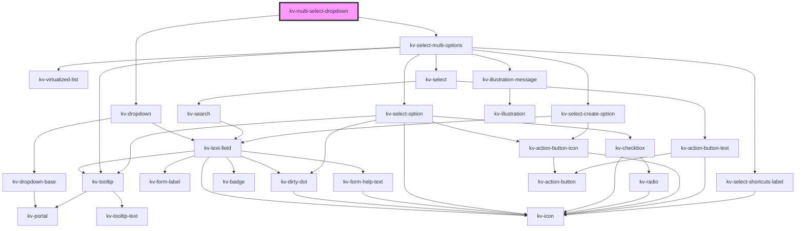

# _<kv-multi-select-dropdown>_

<!-- Auto Generated Below -->


## Usage

### React

```tsx
import React from 'react';
import { KvMultiSelectDropdown } from '@kelvininc/react-ui-components/client';

export const KvMultiSelectDropdownExample: React.FC = (props) => (
  <>
    <KvMultiSelectDropdown 
		placeholder="Select an option"
		label="Options"
		icon={EIconName.Layer}
		options={props.options}
		selectedOptions={props.selectedOptions}
		searchable
		selectionClearable>
	</KvMultiSelectDropdown>
  </>
);
```


## Properties

| Property                | Attribute                  | Description                                                                                                                                                                             | Type                                                                                                                                                                                                                                                                                                                                                                                                                                                                                                                                                                                                                                                                                                                                                                                                                                                                                                                                                                                                                                                                                                                                                                             | Default                      |
| ----------------------- | -------------------------- | --------------------------------------------------------------------------------------------------------------------------------------------------------------------------------------- | -------------------------------------------------------------------------------------------------------------------------------------------------------------------------------------------------------------------------------------------------------------------------------------------------------------------------------------------------------------------------------------------------------------------------------------------------------------------------------------------------------------------------------------------------------------------------------------------------------------------------------------------------------------------------------------------------------------------------------------------------------------------------------------------------------------------------------------------------------------------------------------------------------------------------------------------------------------------------------------------------------------------------------------------------------------------------------------------------------------------------------------------------------------------------------- | ---------------------------- |
| `actionElement`         | `action-element`           | (optional) A reference to the dropdown action element                                                                                                                                   | `HTMLElement \| undefined`                                                                                                                                                                                                                                                                                                                                                                                                                                                                                                                                                                                                                                                                                                                                                                                                                                                                                                                                                                                                                                                                                                                                                       | `undefined`                  |
| `autoFocus`             | `auto-focus`               | (optional) If `false` the search text field is not auto-focused. Default `true`.                                                                                                        | `boolean \| undefined`                                                                                                                                                                                                                                                                                                                                                                                                                                                                                                                                                                                                                                                                                                                                                                                                                                                                                                                                                                                                                                                                                                                                                           | `true`                       |
| `badge`                 | `badge`                    | (optional) Text to display inside a badge on the right side of the displayed value                                                                                                      | `string \| undefined`                                                                                                                                                                                                                                                                                                                                                                                                                                                                                                                                                                                                                                                                                                                                                                                                                                                                                                                                                                                                                                                                                                                                                            | `undefined`                  |
| `clearSelectionLabel`   | `clear-selection-label`    | (optional) The clear selection action text                                                                                                                                              | `string \| undefined`                                                                                                                                                                                                                                                                                                                                                                                                                                                                                                                                                                                                                                                                                                                                                                                                                                                                                                                                                                                                                                                                                                                                                            | `undefined`                  |
| `clickOutsideClose`     | `click-outside-close`      | (optional) If `false` clicking outside the dropdown will not trigger state change. Default: true                                                                                        | `boolean \| undefined`                                                                                                                                                                                                                                                                                                                                                                                                                                                                                                                                                                                                                                                                                                                                                                                                                                                                                                                                                                                                                                                                                                                                                           | `true`                       |
| `counter`               | `counter`                  | (optional) If `true` a selection counter is displayed                                                                                                                                   | `boolean`                                                                                                                                                                                                                                                                                                                                                                                                                                                                                                                                                                                                                                                                                                                                                                                                                                                                                                                                                                                                                                                                                                                                                                        | `true`                       |
| `customClass`           | `custom-class`             | (optional) Additional classes to apply for custom CSS. If multiple classes are provided they should be separated by spaces. It is also valid to provide CssClassMap with boolean logic. | `CssClassMap \| string \| string[] \| undefined`                                                                                                                                                                                                                                                                                                                                                                                                                                                                                                                                                                                                                                                                                                                                                                                                                                                                                                                                                                                                                                                                                                                                 | `''`                         |
| `disabled`              | `disabled`                 | (optional) If `true` the dropdown is disabled                                                                                                                                           | `boolean \| undefined`                                                                                                                                                                                                                                                                                                                                                                                                                                                                                                                                                                                                                                                                                                                                                                                                                                                                                                                                                                                                                                                                                                                                                           | `undefined`                  |
| `displayPrefix`         | `display-prefix`           | (optional) The text to display as a prefix to `displayValue`                                                                                                                            | `string \| undefined`                                                                                                                                                                                                                                                                                                                                                                                                                                                                                                                                                                                                                                                                                                                                                                                                                                                                                                                                                                                                                                                                                                                                                            | `undefined`                  |
| `displayValue`          | `display-value`            | (optional) The text to display on the dropdown                                                                                                                                          | `string \| undefined`                                                                                                                                                                                                                                                                                                                                                                                                                                                                                                                                                                                                                                                                                                                                                                                                                                                                                                                                                                                                                                                                                                                                                            | `undefined`                  |
| `dropdownOptions`       | `dropdown-options`         | (optional) The dropdown position config options                                                                                                                                         | `{ strategy?: Strategy \| undefined; placement?: Placement \| undefined; middleware?: (false \| { name: string; options?: any; fn: (state: { x: number; y: number; initialPlacement: Placement; strategy: Strategy; platform: Platform; placement: Placement; middlewareData: MiddlewareData; rects: ElementRects; elements: Elements; }) => Promisable<MiddlewareReturn>; } \| null \| undefined)[] \| undefined; platform?: Platform \| undefined; }`                                                                                                                                                                                                                                                                                                                                                                                                                                                                                                                                                                                                                                                                                                                          | `undefined`                  |
| `errorState`            | `error-state`              | (required) The error state for the dropdown                                                                                                                                             | `EValidationState.Invalid \| EValidationState.None \| EValidationState.Valid \| undefined`                                                                                                                                                                                                                                                                                                                                                                                                                                                                                                                                                                                                                                                                                                                                                                                                                                                                                                                                                                                                                                                                                       | `undefined`                  |
| `filteredOptions`       | `filtered-options`         | (optional) The object with the dropdown options filtered                                                                                                                                | `undefined \| { [x: string]: ISelectMultiOption; }`                                                                                                                                                                                                                                                                                                                                                                                                                                                                                                                                                                                                                                                                                                                                                                                                                                                                                                                                                                                                                                                                                                                              | `undefined`                  |
| `helpText`              | `help-text`                | (optional) The text to display as help text                                                                                                                                             | `string \| string[] \| undefined`                                                                                                                                                                                                                                                                                                                                                                                                                                                                                                                                                                                                                                                                                                                                                                                                                                                                                                                                                                                                                                                                                                                                                | `[]`                         |
| `hideBadge`             | `hide-badge`               | (optional) If `true` the badge is not displayed                                                                                                                                         | `boolean \| undefined`                                                                                                                                                                                                                                                                                                                                                                                                                                                                                                                                                                                                                                                                                                                                                                                                                                                                                                                                                                                                                                                                                                                                                           | `false`                      |
| `icon`                  | `icon`                     | (optional) The icon to display on the dropdown                                                                                                                                          | `EIconName \| undefined`                                                                                                                                                                                                                                                                                                                                                                                                                                                                                                                                                                                                                                                                                                                                                                                                                                                                                                                                                                                                                                                                                                                                                         | `undefined`                  |
| `inputConfig`           | `input-config`             | (optional) The text field options                                                                                                                                                       | `undefined \| { type?: EInputFieldType \| undefined; label?: string \| undefined; icon?: EIconName \| undefined; actionIcon?: EIconName \| undefined; inputName?: string \| undefined; examples?: string[] \| undefined; placeholder?: string \| undefined; maxLength?: number \| undefined; minLength?: number \| undefined; max?: string \| number \| undefined; min?: string \| number \| undefined; step?: string \| number \| undefined; size?: EComponentSize \| undefined; inputDisabled?: boolean \| undefined; inputRequired?: boolean \| undefined; loading?: boolean \| undefined; state?: EValidationState \| undefined; helpText?: string \| string[] \| undefined; value?: string \| number \| null \| undefined; valuePrefix?: string \| undefined; badge?: string \| undefined; inputReadonly?: boolean \| undefined; forcedFocus?: boolean \| undefined; tooltipConfig?: Partial<ITooltip> \| undefined; useInputMask?: boolean \| undefined; inputMaskRegex?: string \| undefined; fitContent?: boolean \| undefined; customStyle?: { [key: string]: string \| undefined; } \| undefined; isDirty?: boolean \| undefined; hideBadge?: boolean \| undefined; }` | `undefined`                  |
| `inputSize`             | `input-size`               | (optional) The size of the input                                                                                                                                                        | `EComponentSize.Large \| EComponentSize.Small \| undefined`                                                                                                                                                                                                                                                                                                                                                                                                                                                                                                                                                                                                                                                                                                                                                                                                                                                                                                                                                                                                                                                                                                                      | `EComponentSize.Large`       |
| `label`                 | `label`                    | (optional) The text to display on the dropdown label                                                                                                                                    | `string \| undefined`                                                                                                                                                                                                                                                                                                                                                                                                                                                                                                                                                                                                                                                                                                                                                                                                                                                                                                                                                                                                                                                                                                                                                            | `undefined`                  |
| `loading`               | `loading`                  | (optional) If `true` the dropdown is loading                                                                                                                                            | `boolean \| undefined`                                                                                                                                                                                                                                                                                                                                                                                                                                                                                                                                                                                                                                                                                                                                                                                                                                                                                                                                                                                                                                                                                                                                                           | `false`                      |
| `maxHeight`             | `max-height`               | (optional) The dropdown's max-height                                                                                                                                                    | `string \| undefined`                                                                                                                                                                                                                                                                                                                                                                                                                                                                                                                                                                                                                                                                                                                                                                                                                                                                                                                                                                                                                                                                                                                                                            | `undefined`                  |
| `maxSelectable`         | `max-selectable`           | (optional) Maximum number of items that can be selected                                                                                                                                 | `number \| undefined`                                                                                                                                                                                                                                                                                                                                                                                                                                                                                                                                                                                                                                                                                                                                                                                                                                                                                                                                                                                                                                                                                                                                                            | `undefined`                  |
| `maxWidth`              | `max-width`                | (optional) The dropdown's max-width                                                                                                                                                     | `string \| undefined`                                                                                                                                                                                                                                                                                                                                                                                                                                                                                                                                                                                                                                                                                                                                                                                                                                                                                                                                                                                                                                                                                                                                                            | `undefined`                  |
| `minHeight`             | `min-height`               | (optional) The dropdown's min-height                                                                                                                                                    | `string \| undefined`                                                                                                                                                                                                                                                                                                                                                                                                                                                                                                                                                                                                                                                                                                                                                                                                                                                                                                                                                                                                                                                                                                                                                            | `undefined`                  |
| `minSearchOptions`      | `min-search-options`       | (optional) The minimum amount of options required to display the search. Defaults to `15`.                                                                                              | `number \| undefined`                                                                                                                                                                                                                                                                                                                                                                                                                                                                                                                                                                                                                                                                                                                                                                                                                                                                                                                                                                                                                                                                                                                                                            | `MINIMUM_SEARCHABLE_OPTIONS` |
| `minWidth`              | `min-width`                | (optional) The dropdown's min-width                                                                                                                                                     | `string \| undefined`                                                                                                                                                                                                                                                                                                                                                                                                                                                                                                                                                                                                                                                                                                                                                                                                                                                                                                                                                                                                                                                                                                                                                            | `undefined`                  |
| `noDataAvailableConfig` | `no-data-available-config` | (optional) The configuration for the "no data available" empty state illustration                                                                                                       | `IIllustrationMessage \| undefined`                                                                                                                                                                                                                                                                                                                                                                                                                                                                                                                                                                                                                                                                                                                                                                                                                                                                                                                                                                                                                                                                                                                                              | `undefined`                  |
| `noResultsFoundConfig`  | `no-results-found-config`  | (optional) The configuration for the "no results found" empty state illustration                                                                                                        | `IIllustrationMessage \| undefined`                                                                                                                                                                                                                                                                                                                                                                                                                                                                                                                                                                                                                                                                                                                                                                                                                                                                                                                                                                                                                                                                                                                                              | `undefined`                  |
| `options`               | `options`                  | (optional) The object with the dropdown options                                                                                                                                         | `undefined \| { [x: string]: ISelectMultiOption; }`                                                                                                                                                                                                                                                                                                                                                                                                                                                                                                                                                                                                                                                                                                                                                                                                                                                                                                                                                                                                                                                                                                                              | `{}`                         |
| `placeholder`           | `placeholder`              | (required) The text to display as the dropdown placeholder                                                                                                                              | `string \| undefined`                                                                                                                                                                                                                                                                                                                                                                                                                                                                                                                                                                                                                                                                                                                                                                                                                                                                                                                                                                                                                                                                                                                                                            | `undefined`                  |
| `required`              | `required`                 | (optional) If `true` dropdown requires a value to be selected                                                                                                                           | `boolean \| undefined`                                                                                                                                                                                                                                                                                                                                                                                                                                                                                                                                                                                                                                                                                                                                                                                                                                                                                                                                                                                                                                                                                                                                                           | `undefined`                  |
| `searchPlaceholder`     | `search-placeholder`       | (optional) The list search text field placeholder                                                                                                                                       | `string \| undefined`                                                                                                                                                                                                                                                                                                                                                                                                                                                                                                                                                                                                                                                                                                                                                                                                                                                                                                                                                                                                                                                                                                                                                            | `undefined`                  |
| `searchable`            | `searchable`               | (optional) If `false` the dropdown is not searchable. Default `true`                                                                                                                    | `boolean \| undefined`                                                                                                                                                                                                                                                                                                                                                                                                                                                                                                                                                                                                                                                                                                                                                                                                                                                                                                                                                                                                                                                                                                                                                           | `true`                       |
| `selectAllLabel`        | `select-all-label`         | (optional) The selection all action text                                                                                                                                                | `string`                                                                                                                                                                                                                                                                                                                                                                                                                                                                                                                                                                                                                                                                                                                                                                                                                                                                                                                                                                                                                                                                                                                                                                         | `undefined`                  |
| `selectedOptions`       | `selected-options`         | (optional) The object with indexed by the dropdown labels and its selected value                                                                                                        | `undefined \| { [x: string]: boolean; }`                                                                                                                                                                                                                                                                                                                                                                                                                                                                                                                                                                                                                                                                                                                                                                                                                                                                                                                                                                                                                                                                                                                                         | `{}`                         |
| `selectionAll`          | `selection-all`            | (optional) If `true` the list has an action to select all items                                                                                                                         | `boolean`                                                                                                                                                                                                                                                                                                                                                                                                                                                                                                                                                                                                                                                                                                                                                                                                                                                                                                                                                                                                                                                                                                                                                                        | `true`                       |
| `selectionClearable`    | `selection-clearable`      | (optional) If `true` dropdown items can be cleared                                                                                                                                      | `boolean \| undefined`                                                                                                                                                                                                                                                                                                                                                                                                                                                                                                                                                                                                                                                                                                                                                                                                                                                                                                                                                                                                                                                                                                                                                           | `true`                       |
| `shortcuts`             | `shortcuts`                | (optional) If `true` the keyboard shortcuts can be used to navigate between the dropdown results. Default `false`                                                                       | `boolean \| undefined`                                                                                                                                                                                                                                                                                                                                                                                                                                                                                                                                                                                                                                                                                                                                                                                                                                                                                                                                                                                                                                                                                                                                                           | `false`                      |
| `showShortcuts`         | `show-shortcuts`           |                                                                                                                                                                                         | `boolean \| undefined`                                                                                                                                                                                                                                                                                                                                                                                                                                                                                                                                                                                                                                                                                                                                                                                                                                                                                                                                                                                                                                                                                                                                                           | `false`                      |
| `zIndex`                | `z-index`                  | (optional) the dropdown list z-index (default: 9004)                                                                                                                                    | `number \| undefined`                                                                                                                                                                                                                                                                                                                                                                                                                                                                                                                                                                                                                                                                                                                                                                                                                                                                                                                                                                                                                                                                                                                                                            | `DEFAULT_DROPDOWN_Z_INDEX`   |


## Events

| Event             | Description                                                   | Type                                     |
| ----------------- | ------------------------------------------------------------- | ---------------------------------------- |
| `clearSelection`  | Emitted when the user clears the selected items               | `CustomEvent<void>`                      |
| `clickOutside`    | Emitted when there's a click outside the dropdown's bondaries | `CustomEvent<MouseEvent>`                |
| `dismiss`         | Emitted when the 'esc' key is pressed                         | `CustomEvent<void>`                      |
| `openStateChange` | Emitted when the dropdown open state changes                  | `CustomEvent<boolean>`                   |
| `optionsSelected` | Emitted when the selected options change                      | `CustomEvent<{ [x: string]: boolean; }>` |
| `searchChange`    | Emitted when the user interacts with the search text field    | `CustomEvent<string>`                    |
| `selectAll`       | Emitted when the user clicks on the all items                 | `CustomEvent<void>`                      |


## Methods

### `focusSearch() => Promise<void>`

Focuses the search text field

#### Returns

Type: `Promise<void>`


## CSS Custom Properties

| Name                    | Description                   |
| ----------------------- | ----------------------------- |
| `--dropdown-max-height` | Dropdown list maximum height. |
| `--dropdown-max-width`  | Dropdown list maximum width.  |
| `--dropdown-min-height` | Dropdown list minimum height. |
| `--dropdown-min-width`  | Dropdown list minimum width.  |


## Dependencies

### Depends on

- [kv-dropdown](../dropdown)
- [kv-select-multi-options](../select-multi-options)

### Graph

```mermaid
graph TD;
  kv-multi-select-dropdown --> kv-dropdown
  kv-multi-select-dropdown --> kv-select-multi-options
  kv-dropdown --> kv-dropdown-base
  kv-dropdown --> kv-text-field
  kv-dropdown-base --> kv-portal
  kv-text-field --> kv-tooltip
  kv-text-field --> kv-form-label
  kv-text-field --> kv-icon
  kv-text-field --> kv-dirty-dot
  kv-text-field --> kv-badge
  kv-text-field --> kv-form-help-text
  kv-tooltip --> kv-portal
  kv-tooltip --> kv-tooltip-text
  kv-dirty-dot --> kv-icon
  kv-form-help-text --> kv-icon
  kv-select-multi-options --> kv-virtualized-list
  kv-select-multi-options --> kv-select-option
  kv-select-multi-options --> kv-select
  kv-select-multi-options --> kv-tooltip
  kv-select-multi-options --> kv-illustration-message
  kv-select-multi-options --> kv-select-create-option
  kv-select-multi-options --> kv-select-shortcuts-label
  kv-select-option --> kv-checkbox
  kv-select-option --> kv-tooltip
  kv-select-option --> kv-icon
  kv-select-option --> kv-dirty-dot
  kv-select-option --> kv-action-button-icon
  kv-checkbox --> kv-radio
  kv-checkbox --> kv-icon
  kv-radio --> kv-icon
  kv-action-button-icon --> kv-action-button
  kv-action-button-icon --> kv-icon
  kv-select --> kv-search
  kv-select --> kv-action-button-text
  kv-search --> kv-text-field
  kv-action-button-text --> kv-action-button
  kv-action-button-text --> kv-icon
  kv-illustration-message --> kv-illustration
  kv-select-create-option --> kv-text-field
  kv-select-create-option --> kv-action-button-icon
  kv-select-shortcuts-label --> kv-icon
  style kv-multi-select-dropdown fill:#f9f,stroke:#333,stroke-width:4px
```

----------------------------------------------


