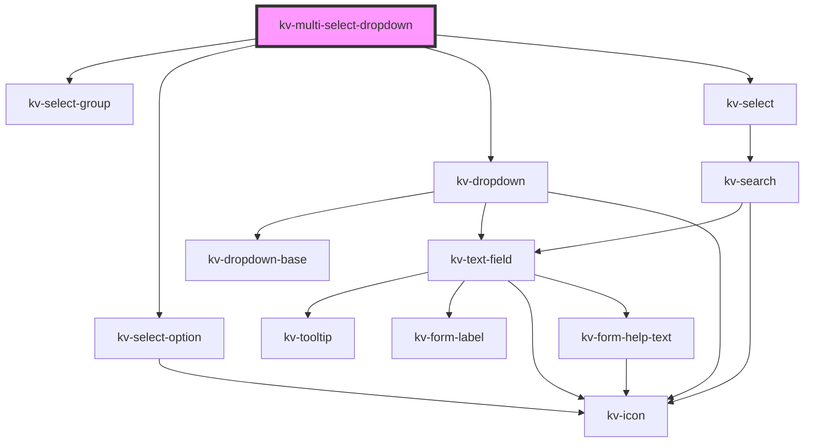

# *<kv-multi-select-dropdown>*


<!-- Auto Generated Below -->


## Usage

### Angular

```html
<kv-multi-select-dropdown
	placeholder="Select an option"
	label="Options"
	[icon]="EIconName.Layer"
	[options]="options"
	[selectedOptions]="selectedOptions"
	searchable=true
	selectionClearable=true>
</kv-multi-select-dropdown>
```


### React

```tsx
import React from 'react';
import { KvMultiSelectDropdown } from '@kelvininc/react-ui-components';

export const KvMultiSelectDropdownExample: React.FC = (props) => (
  <>
    <KvMultiSelectDropdown 
		placeholder="Select an option"
		label="Options"
		icon={EIconName.Layer}
		options={props.options}
		selectedOptions={props.selectedOptions}
		searchable
		selectionClearable>
	</KvMultiSelectDropdown>
  </>
);
```


## Properties

| Property               | Attribute                 | Description                                                                      | Type                                                                          | Default                                   |
| ---------------------- | ------------------------- | -------------------------------------------------------------------------------- | ----------------------------------------------------------------------------- | ----------------------------------------- |
| `clearSelectionLabel`  | `clear-selection-label`   | (optional) The clear search action text                                          | `string`                                                                      | `undefined`                               |
| `disabled`             | `disabled`                | (optional) If `true` the dropdown is disabled                                    | `boolean`                                                                     | `undefined`                               |
| `displayValue`         | `display-value`           | (optional) The text to display on the dropdown                                   | `string`                                                                      | `undefined`                               |
| `errorState`           | `error-state`             | (required) The error state for the dropdown                                      | `EValidationState.Invalid \| EValidationState.None \| EValidationState.Valid` | `undefined`                               |
| `filteredOptions`      | --                        | (optional) The object with the dropdown options filtered                         | `{ [key: string]: IMultiSelectDropdownOption; }`                              | `undefined`                               |
| `helpText`             | `help-text`               | (optional) The text to display as help text                                      | `string \| string[]`                                                          | `[]`                                      |
| `icon`                 | `icon`                    | (optional) The icon to display on the dropdown                                   | `EIconName \| EOtherIconName`                                                 | `undefined`                               |
| `label`                | `label`                   | (optional) The text to display on the dropdown label                             | `string`                                                                      | `undefined`                               |
| `loading`              | `loading`                 | (optional) If `true` the dropdown is loading                                     | `boolean`                                                                     | `false`                                   |
| `noDataAvailableLabel` | `no-data-available-label` | (required) The text to display when there are no options                         | `string`                                                                      | `MULTI_SELECT_DROPDOWN_NO_DATA_AVAILABLE` |
| `options`              | --                        | (optional) The object with the dropdown options                                  | `{ [key: string]: IMultiSelectDropdownOption; }`                              | `undefined`                               |
| `placeholder`          | `placeholder`             | (required) The text to display as the dropdown placeholder                       | `string`                                                                      | `undefined`                               |
| `required`             | `required`                | (optional) If `true` dropdown requires a value to be selected                    | `boolean`                                                                     | `undefined`                               |
| `searchable`           | `searchable`              | (optional) If `true` the dropdown is searchable                                  | `boolean`                                                                     | `undefined`                               |
| `selectedOptions`      | --                        | (optional) The object with indexed by the dropdown labels and its selected value | `{ [key: string]: boolean; }`                                                 | `{}`                                      |
| `selectionClearable`   | `selection-clearable`     | (optional) If `true` dropdown items can be cleared                               | `boolean`                                                                     | `undefined`                               |


## Events

| Event              | Description                              | Type                                       |
| ------------------ | ---------------------------------------- | ------------------------------------------ |
| `optionsSelected`  | Emitted when the selected options change | `CustomEvent<{ [key: string]: boolean; }>` |
| `searchChange`     | Emitted when the search term changes     | `CustomEvent<string>`                      |
| `selectionCleared` | Emitted when the selection is cleared    | `CustomEvent<void>`                        |


## CSS Custom Properties

| Name                    | Description                   |
| ----------------------- | ----------------------------- |
| `--dropdown-max-height` | Dropdown list maximum height. |


## Dependencies

### Depends on

- [kv-select-group](../select-group)
- [kv-select-option](../select-option)
- [kv-dropdown](../dropdown)
- [kv-select](../select)

### Graph


----------------------------------------------


