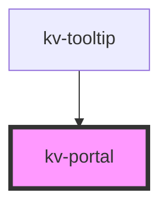

# _<kv-portal>_

<!-- Auto Generated Below -->

## Properties

| Property     | Attribute     | Description                                                                                | Type                                                                                                                                                                                                                                                                                                                                                                           | Default       |
| ------------ | ------------- | ------------------------------------------------------------------------------------------ | ------------------------------------------------------------------------------------------------------------------------------------------------------------------------------------------------------------------------------------------------------------------------------------------------------------------------------------------------------------------------------ | ------------- |
| `animated`   | `animated`    | (optional) if true portal content will gradually appear (default false)                    | `boolean`                                                                                                                                                                                                                                                                                                                                                                      | `false`       |
| `autoUpdate` | `auto-update` | (optional) enable position auto update (default true)                                      | `boolean`                                                                                                                                                                                                                                                                                                                                                                      | `true`        |
| `delay`      | `delay`       | (optional) Delay to show portal in milliseconds. (default 0)                               | `number`                                                                                                                                                                                                                                                                                                                                                                       | `0`           |
| `options`    | --            | (optional) options used to compute the portal position                                     | `{ placement?: Placement; strategy?: Strategy; middleware?: (false \| { name: string; options?: any; fn: (state: { platform: Platform; placement: Placement; strategy: Strategy; x: number; y: number; initialPlacement: Placement; middlewareData: MiddlewareData; rects: ElementRects; elements: Elements; }) => Promisable<MiddlewareReturn>; })[]; platform?: Platform; }` | `undefined`   |
| `portalId`   | `portal-id`   | (required) The portal id                                                                   | `string`                                                                                                                                                                                                                                                                                                                                                                       | `'kv-portal'` |
| `reference`  | --            | (required) The reference element                                                           | `HTMLElement`                                                                                                                                                                                                                                                                                                                                                                  | `undefined`   |
| `withArrow`  | `with-arrow`  | (optional) if true it will render an arrow pointing to the opening element (default false) | `boolean`                                                                                                                                                                                                                                                                                                                                                                      | `false`       |

## Events

| Event           | Description                                       | Type                |
| --------------- | ------------------------------------------------- | ------------------- |
| `elementAppend` | Emitted when the element it's appended to the DOM | `CustomEvent<void>` |

## CSS Custom Properties

| Name                   | Description  |
| ---------------------- | ------------ |
| `--portal-arrow-color` | arrow color. |

## Dependencies

### Used by

 - [kv-tooltip](../tooltip)

### Graph

----------------------------------------------

