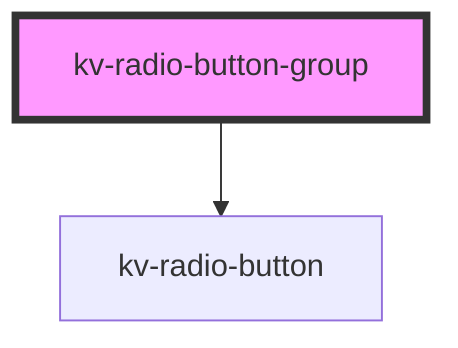

# _<kv-radio-button-group>_

<!-- Auto Generated Below -->

## Properties

| Property          | Attribute  | Description                                                                      | Type                        | Default |
| ----------------- | ---------- | -------------------------------------------------------------------------------- | --------------------------- | ------- |
| `buttons`         | --         | (optional) List of radio buttons                                                 | `IRadioButtonGroupButton[]` | `[]`    |
| `disabled`        | `disabled` | (optional) Disables all buttons                                                  | `boolean`                   | `false` |
| `selectedButtons` | --         | (optional) A record with the button's label/value and with if the selected value | `{ [x: string]: boolean; }` | `{}`    |

## Events

| Event           | Description                                                           | Type                  |
| --------------- | --------------------------------------------------------------------- | --------------------- |
| `checkedChange` | When the radio button selection changes, emit the requested tab's key | `CustomEvent<string>` |

## Dependencies

### Depends on

- [kv-radio-button](../radio-button)

### Graph

----------------------------------------------

