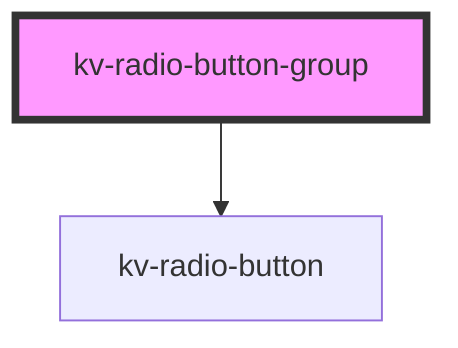

# *<kv-radio-button-group>*

<!-- Auto Generated Below -->

## Properties

| Property  | Attribute | Description                      | Type                               | Default |
| --------- | --------- | -------------------------------- | ---------------------------------- | ------- |
| `buttons` | --        | (required) List of radio buttons | `{ [key: string]: IRadioButton; }` | `{}`    |

## Events

| Event               | Description                                                           | Type                  |
| ------------------- | --------------------------------------------------------------------- | --------------------- |
| `radioButtonChange` | When the radio button selection changes, emit the requested tab's key | `CustomEvent<string>` |

## Dependencies

### Depends on

- [kv-radio-button](../radio-button)

### Graph

----------------------------------------------

