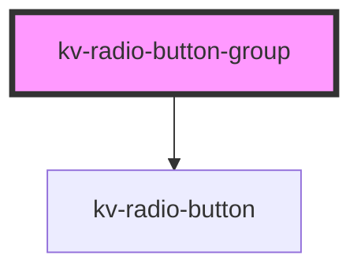

# *<kv-radio-button-group>*

<!-- Auto Generated Below -->

## Properties

| Property          | Attribute | Description                              | Type             | Default |
| ----------------- | --------- | ---------------------------------------- | ---------------- | ------- |
| `buttons`         | --        | (optional) List of radio buttons         | `IRadioButton[]` | `[]`    |
| `selectedButtons` | --        | (optional) The array of selected options | `string[]`       | `[]`    |

## Events

| Event           | Description                                                           | Type                  |
| --------------- | --------------------------------------------------------------------- | --------------------- |
| `checkedChange` | When the radio button selection changes, emit the requested tab's key | `CustomEvent<string>` |

## Dependencies

### Depends on

- [kv-radio-button](../radio-button)

### Graph

```mermaid
graph TD;
  kv-radio-button-group --> kv-radio-button
  style kv-radio-button-group fill:#f9f,stroke:#333,stroke-width:4px
```

----------------------------------------------

