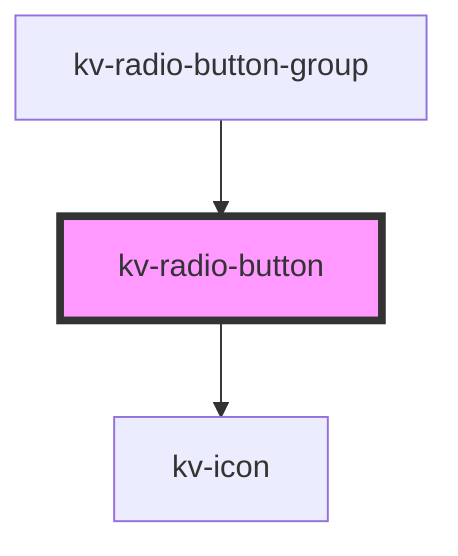

# _<kv-radio-button>_

<!-- Auto Generated Below -->


## Usage

### Angular

```html
<!-- Default -->
<kv-radio-button label="Option 1" value="option-1"></kv-radio-button>

<!-- Disabled -->
<kv-radio-button label="Option 1" value="option-1" disabled></kv-radio-button>

<!-- Checked -->
<kv-radio-button label="Option 1" value="option-1" checked></kv-radio-button>

<!-- With Icon -->
<kv-radio-button [icon]="EIconName.Add" label="Option 1" value="option-1"></kv-radio-button>

<!-- Only Icon -->
<kv-radio-button [icon]="EIconName.Add" value="option-1"></kv-radio-button>
```


### React

```tsx
import React from 'react';

import { KvRadioButton, EIconName } from '@kelvininc/react-ui-components';

export const RadioButtonExample: React.FC = () => (
	<>
		{/*-- Default --*/}
		<KvRadioButton label="Option 1" value="option-1" />

		{/*-- Disabled --*/}
		<KvRadioButton label="Option 1" value="option-1" disabled />

		{/*-- Checked --*/}
		<KvRadioButton label="Option 1" value="option-1" checked />

		{/*-- With Icon --*/}
		<KvRadioButton icon={EIconName.Add} label="Option 1" value="option-1" />

		{/*-- Only Icon --*/}
		<KvRadioButton icon={EIconName.Add} value="option-1" />
	</>
);
```


## Properties

| Property             | Attribute         | Description                                                                                                     | Type                                                                                                | Default     |
| -------------------- | ----------------- | --------------------------------------------------------------------------------------------------------------- | --------------------------------------------------------------------------------------------------- | ----------- |
| `checked`            | `checked`         | (optional) Sets the button as checked                                                                           | `boolean`                                                                                           | `false`     |
| `disabled`           | `disabled`        | (optional) Sets the button's styling to be disabled and disables click events                                   | `boolean`                                                                                           | `false`     |
| `download`           | `download`        | (optional) Specifies that the target will be downloaded when a user clicks on. The value should be the filename | `string`                                                                                            | `undefined` |
| `href`               | `href`            | (optional) The anchor's link to open when clicking                                                              | `string`                                                                                            | `undefined` |
| `icon`               | `icon`            | (optional) The button's icon. Only valid for radio button icon                                                  | `EIconName \| EOtherIconName`                                                                       | `undefined` |
| `label`              | `label`           | (optional) The button's label. Only valid for radio button text                                                 | `string`                                                                                            | `undefined` |
| `preventDefault`     | `prevent-default` | (optional) Defines if the item click event should prevent default behaviour.                                    | `boolean`                                                                                           | `false`     |
| `target`             | `target`          | (optional) The anchor's target                                                                                  | `EAnchorTarget.BrowserDefault \| EAnchorTarget.NewTab \| EAnchorTarget.Parent \| EAnchorTarget.Top` | `undefined` |
| `value` _(required)_ | `value`           | (required) The value to be emitted upon click events                                                            | `string`                                                                                            | `undefined` |


## Events

| Event           | Description                    | Type                  |
| --------------- | ------------------------------ | --------------------- |
| `checkedChange` | Emits when a button is clicked | `CustomEvent<string>` |


## Shadow Parts

| Part             | Description                        |
| ---------------- | ---------------------------------- |
| `"radio-button"` | The radio action.                  |
| `"radio-icon"`   | The radio button's icon container. |
| `"radio-label"`  |                                    |
| `"radio-text"`   | The radio button's text container. |


## CSS Custom Properties

| Name                          | Description                                         |
| ----------------------------- | --------------------------------------------------- |
| `--background-color-active`   | Radio button component's background color active.   |
| `--background-color-default`  | Radio button component's background color default.  |
| `--background-color-disabled` | Radio button component's background color disabled. |
| `--border-color-active`       | Radio button component's border color active.       |
| `--border-color-default`      | Radio button component's border color default.      |
| `--border-color-disabled`     | Radio button component's border color disabled.     |
| `--button-height`             | Radio button component's height.                    |
| `--button-icon-height`        | Radio button component's icon height.               |
| `--button-icon-width`         | Radio button component's icon width.                |
| `--button-padding`            | Radio button component's padding.                   |
| `--button-width`              | Radio button component's width.                     |
| `--text-color-active`         | Radio button component's text color active.         |
| `--text-color-default`        | Radio button component's text color default.        |
| `--text-color-disabled`       | Radio button component's text color disabled.       |


## Dependencies

### Used by

 - [kv-radio-button-group](../radio-button-group)

### Depends on

- [kv-icon](../icon)

### Graph


----------------------------------------------


