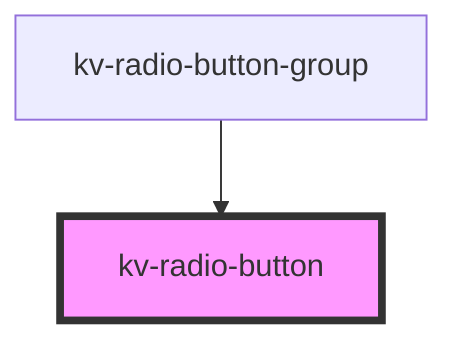

# _<kv-radio-button>_

<!-- Auto Generated Below -->


## Usage

### Angular

```html
<!-- Default -->
<kv-radio-button label="Option 1" value="option-1"></kv-radio-button>

<!-- Disabled -->
<kv-radio-button label="Option 1" value="option-1" disabled></kv-radio-button>

<!-- Checked -->
<kv-radio-button label="Option 1" value="option-1" checked></kv-radio-button>
```


### React

```tsx
import React from 'react';

import { KvRadioButton } from '@kelvininc/react-ui-components';

export const RadioButtonExample: React.FC = () => (
	<>
		{/*-- Default --*/}
		<KvRadioButton label="Option 1" value="option-1" />

		{/*-- Disabled --*/}
		<KvRadioButton label="Option 1" value="option-1" disabled />

		{/*-- Checked --*/}
		<KvRadioButton label="Option 1" value="option-1" checked />
	</>
);
```


## Properties

| Property             | Attribute  | Description                                                                   | Type      | Default      |
| -------------------- | ---------- | ----------------------------------------------------------------------------- | --------- | ------------ |
| `checked`            | `checked`  | (optional) Sets the button as checked                                         | `boolean` | `false`      |
| `disabled`           | `disabled` | (optional) Sets the button's styling to be disabled and disables click events | `boolean` | `false`      |
| `label` _(required)_ | `label`    | (required) Adds a label aside the button                                      | `string`  | `undefined`  |
| `value`              | `value`    | (optional) The value to be emitted upon click events                          | `string`  | `this.label` |


## Events

| Event           | Description                    | Type                  |
| --------------- | ------------------------------ | --------------------- |
| `checkedChange` | Emits when a button is clicked | `CustomEvent<string>` |


## Shadow Parts

| Part             | Description       |
| ---------------- | ----------------- |
| `"radio-button"` | The radio action. |


## CSS Custom Properties

| Name                          | Description                                         |
| ----------------------------- | --------------------------------------------------- |
| `--background-color-active`   | Radio button component's background color active.   |
| `--background-color-default`  | Radio button component's background color default.  |
| `--background-color-disabled` | Radio button component's background color disabled. |
| `--border-color-active`       | Radio button component's border color active.       |
| `--border-color-default`      | Radio button component's border color default.      |
| `--border-color-disabled`     | Radio button component's border color disabled.     |
| `--button-height`             | Radio button component's height.                    |
| `--text-color-active`         | Radio button component's text color active.         |
| `--text-color-default`        | Radio button component's text color default.        |
| `--text-color-disabled`       | Radio button component's text color disabled.       |


## Dependencies

### Used by

 - [kv-radio-button-group](../radio-button-group)

### Graph


----------------------------------------------


