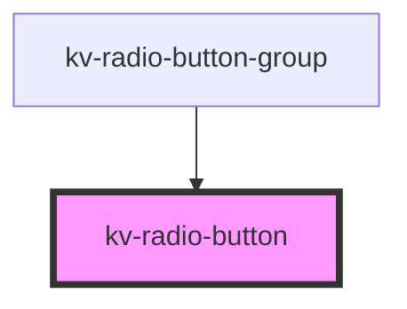

# *<kv-radio-button>*


<!-- Auto Generated Below -->


## Usage

### Angular

```html
<!-- Default -->
<kv-radio-button label="Option 1"></kv-radio-button>

<!-- Disabled -->
<kv-radio-button label="Option 1" disabled></kv-radio-button>

<!-- Checked -->
<kv-radio-button label="Option 1" checked></kv-radio-button>
```


### React

```tsx
import React from 'react';

import { KvRadioButton } from '@kelvininc/react-ui-components';

export const RadioButtonExample: React.FC = () => (
	<>
		{/*-- Default --*/}
		<KvRadioButton label="Option 1" />

		{/*-- Disabled --*/}
		<KvRadioButton label="Option 1" disabled />

		{/*-- Checked --*/}
		<KvRadioButton label="Option 1" checked />
	</>
);
```


## Properties

| Property             | Attribute  | Description                                                                  | Type      | Default     |
| -------------------- | ---------- | ---------------------------------------------------------------------------- | --------- | ----------- |
| `checked`            | `checked`  | (optional) Sets the button as checked when initializing                      | `boolean` | `false`     |
| `disabled`           | `disabled` | (optional) Sets this button styling to be disabled and disables click events | `boolean` | `false`     |
| `label` _(required)_ | `label`    | (required) Adds a label aside the button                                     | `string`  | `undefined` |


## Events

| Event           | Description                                     | Type                  |
| --------------- | ----------------------------------------------- | --------------------- |
| `checkedChange` | Emits when there's a change in state internally | `CustomEvent<string>` |


## Dependencies

### Used by

 - [kv-radio-button-group](../radio-button-group)

### Graph

```mermaid
graph TD;
  kv-radio-button-group --> kv-radio-button
  style kv-radio-button fill:#f9f,stroke:#333,stroke-width:4px
```

----------------------------------------------


