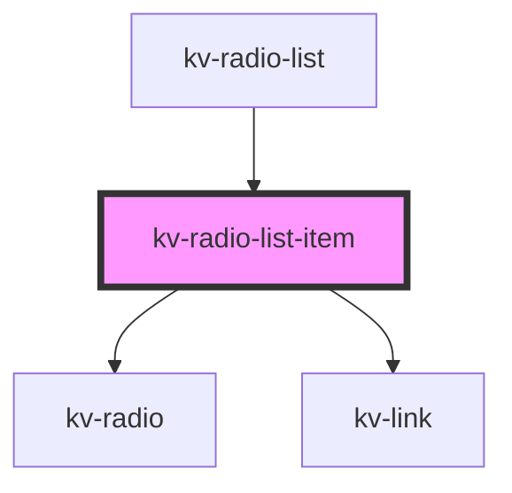

# _<kv-rich-radio>_


<!-- Auto Generated Below -->


## Usage

### React

```tsx

import React from 'react';

import { KvRadioListItem } from '@kelvininc/react-ui-components/client';

export const RadioListItemExample: React.FC = () => (
	{/* Default state */}
	<KvRadioListItem
		optionId="option-1"
		label="Option 1"
		onOptionClick={onOptionClick}
	/>

	{/* Checked state */}
	<KvRadioListItem
		optionId="option-2"
		label="Option 2"
		checked={true}
		onOptionClick={onOptionClick}
	/>

	{/* Disabled state */}
	<KvRadioListItem
		optionId="option-3"
		label="Option 3"
		disabled={true}
		onOptionClick={onOptionClick}
	/>

	{/* With description */}
	<KvRadioListItem
		optionId="option-4"
		label="Option 4"
		description="Description for option 4"
		onOptionClick={onOptionClick}
	/>
)
```


## Properties

| Property                | Attribute     | Description                                                                 | Type               | Default     |
| ----------------------- | ------------- | --------------------------------------------------------------------------- | ------------------ | ----------- |
| `checked`               | `checked`     | (optional) Defines if this option is checked                                | `boolean`          | `false`     |
| `description`           | `description` | (optional) The description that can contain links in the [text](url) format | `string`           | `undefined` |
| `disabled`              | `disabled`    | (optional) Defines if this option is disabled                               | `boolean`          | `false`     |
| `label` _(required)_    | `label`       | (required) The label to display                                             | `string`           | `undefined` |
| `optionId` _(required)_ | `option-id`   | (required) The unique id that serves as a key for this item                 | `number \| string` | `undefined` |


## Events

| Event         | Description                       | Type                            |
| ------------- | --------------------------------- | ------------------------------- |
| `optionClick` | Emits when this option is clicked | `CustomEvent<number \| string>` |


## Dependencies

### Used by

 - [kv-radio-list](../radio-list)

### Depends on

- [kv-radio](../radio)
- [kv-link](../link)

### Graph


----------------------------------------------


