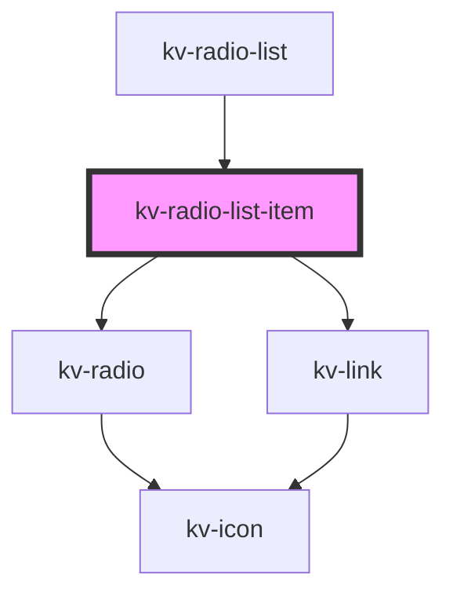

# _<kv-rich-radio>_


<!-- Auto Generated Below -->


## Usage

### React

```tsx

import React from 'react';

import { KvRadioListItem } from '@kelvininc/react-ui-components/client';

export const RadioListItemExample: React.FC = () => (
	{/* Default state */}
	<KvRadioListItem
		optionId="option-1"
		label="Option 1"
		onOptionClick={onOptionClick}
	/>

	{/* Checked state */}
	<KvRadioListItem
		optionId="option-2"
		label="Option 2"
		checked={true}
		onOptionClick={onOptionClick}
	/>

	{/* Disabled state */}
	<KvRadioListItem
		optionId="option-3"
		label="Option 3"
		disabled={true}
		onOptionClick={onOptionClick}
	/>

	{/* With description */}
	<KvRadioListItem
		optionId="option-4"
		label="Option 4"
		description="Description for option 4"
		onOptionClick={onOptionClick}
	/>
)
```


## Properties

| Property                | Attribute     | Description                                                                 | Type                                           | Default                |
| ----------------------- | ------------- | --------------------------------------------------------------------------- | ---------------------------------------------- | ---------------------- |
| `checked`               | `checked`     | (optional) Defines if this option is checked                                | `boolean`                                      | `false`                |
| `description`           | `description` | (optional) The description that can contain links in the [text](url) format | `string`                                       | `undefined`            |
| `disabled`              | `disabled`    | (optional) Defines if this option is disabled                               | `boolean`                                      | `false`                |
| `label`                 | `label`       | (required) The label to display                                             | `string`                                       | `undefined`            |
| `optionId` _(required)_ | `option-id`   | (required) The unique id that serves as a key for this item                 | `number \| string`                             | `undefined`            |
| `size`                  | `size`        | (optional) Button's size                                                    | `EComponentSize.Large \| EComponentSize.Small` | `EComponentSize.Large` |


## Events

| Event         | Description                       | Type                            |
| ------------- | --------------------------------- | ------------------------------- |
| `optionClick` | Emits when this option is clicked | `CustomEvent<number \| string>` |


## CSS Custom Properties

| Name                                           | Description                                            |
| ---------------------------------------------- | ------------------------------------------------------ |
| `--radio-list-item-background`                 | Background color.                                      |
| `--radio-list-item-background-checked`         | Background color when checked.                         |
| `--radio-list-item-background-hover`           | Background color on hover.                             |
| `--radio-list-item-border`                     | Border property (width, style, color).                 |
| `--radio-list-item-border-color-checked`       | Border color when checked.                             |
| `--radio-list-item-border-color-hover`         | Border color on hover.                                 |
| `--radio-list-item-border-radius`              | Border radius.                                         |
| `--radio-list-item-description-color`          | Description text color.                                |
| `--radio-list-item-description-color-disabled` | Description text color when disabled.                  |
| `--radio-list-item-gap-large`                  | Gap between radio and info content when size is large. |
| `--radio-list-item-gap-small`                  | Gap between radio and info content when size is small. |
| `--radio-list-item-label-color`                | Label text color.                                      |
| `--radio-list-item-label-color-checked`        | Label text color when checked.                         |
| `--radio-list-item-label-color-disabled`       | Label text color when disabled.                        |
| `--radio-list-item-label-color-hover`          | Label text color on hover.                             |
| `--radio-list-item-padding-large`              | Content padding when size is large.                    |
| `--radio-list-item-padding-small`              | Content padding when size is small.                    |


## Dependencies

### Used by

 - [kv-radio-list](../radio-list)

### Depends on

- [kv-radio](../radio)
- [kv-link](../link)

### Graph

```mermaid
graph TD;
  kv-radio-list-item --> kv-radio
  kv-radio-list-item --> kv-link
  kv-radio --> kv-icon
  kv-link --> kv-icon
  kv-radio-list --> kv-radio-list-item
  style kv-radio-list-item fill:#f9f,stroke:#333,stroke-width:4px
```

----------------------------------------------


