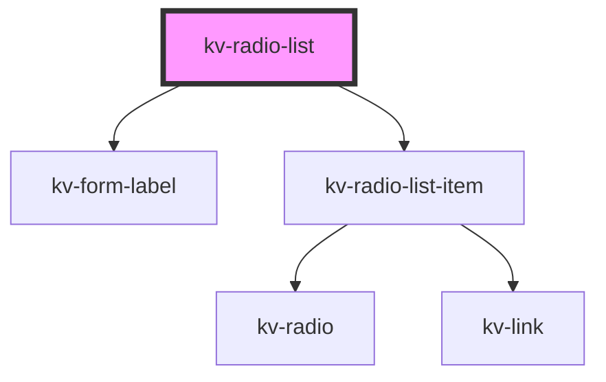

# _<kv-radio-list>_


<!-- Auto Generated Below -->


## Usage

### Angular

```html
<!-- Default -->
<kv-radio-list
	[options]="options"
	(optionSelected)="onOptionSelected($event)" />

<!-- With label -->
<kv-radio-list
	required
	label="Select an option"
	[options]="options"
	(optionSelected)="onOptionSelected($event)" />

<!-- With disabled option -->
<kv-radio-list
	[options]="optionsWithDisabled"
	[disabledOptions]="disabledOptions"
	(optionSelected)="onOptionSelected($event)" />

<!-- With selected option -->
<kv-radio-list
	[options]="options"
	[selectedOption]="option-1"
	(optionSelected)="onOptionSelected($event)" />
```


### React

```tsx
import React from 'react';

import { KvRadioList } from '@kelvininc/react-ui-components';

const RadioListExample: React.FC = () => {
	return (
		<>
			{/* Default */}
			<KvRadioList options={options} onOptionSelected={onOptionSelected} />

			{/* With label */}
			<KvRadioList required label="Select an option" options={options} onOptionSelected={onOptionSelected} />

			{/* With disabled option */}
			<KvRadioList options={optionsWithDisabled} disabledOptions={disabledOptions} onOptionSelected={onOptionSelected} />

			{/* With selected option */}
			<KvRadioList options={options} selectedOption={2} onOptionSelected={onOptionSelected} />
		</>
	);
};

```


## Properties

| Property               | Attribute         | Description                                            | Type                                              | Default     |
| ---------------------- | ----------------- | ------------------------------------------------------ | ------------------------------------------------- | ----------- |
| `disabledOptions`      | --                | (optional) The options to show up as disabled          | `{ [x: string]: boolean; [x: number]: boolean; }` | `undefined` |
| `label`                | `label`           | (optional) Form field label                            | `string`                                          | `undefined` |
| `options` _(required)_ | --                | (required) The configuration for the buttons to render | `IRadioListItem[]`                                | `undefined` |
| `required`             | `required`        | (optional) Form field required                         | `boolean`                                         | `false`     |
| `selectedOption`       | `selected-option` | (optional) The desired selected option                 | `number \| string`                                | `undefined` |


## Events

| Event            | Description                      | Type                            |
| ---------------- | -------------------------------- | ------------------------------- |
| `optionSelected` | Emits when an option is selected | `CustomEvent<number \| string>` |


## Shadow Parts

| Part                | Description                      |
| ------------------- | -------------------------------- |
| `"items-container"` | The container for the list items |


## Dependencies

### Depends on

- [kv-form-label](../form-label)
- [kv-radio-list-item](../radio-list-item)

### Graph


----------------------------------------------


