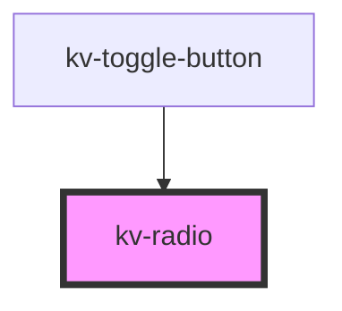

# *<kv-radio>*


<!-- Auto Generated Below -->


## Usage

### Angular

```html
<!-- Default -->
<kv-radio></kv-radio>

<!-- Labeled -->
<kv-radio label="Switch"></kv-radio>

<!-- Disabled -->
<kv-radio disabled></kv-radio>

<!-- Checked -->
<kv-radio checked></kv-radio>
```


### React

```tsx
import React from 'react';

import { KvRadio } from '@kelvininc/react-ui-components';

export const RadioExample: React.FC = () => (
	<>
		{/*-- Default --*/}
		<KvRadio />

		{/*-- Labeled --*/}
		<KvRadio label="Switch" />

		{/*-- Disabled --*/}
		<KvRadio disabled />

		{/*-- Checked --*/}
		<KvRadio checked />
	</>
);
```


## Properties

| Property   | Attribute  | Description                                                                  | Type                                           | Default                |
| ---------- | ---------- | ---------------------------------------------------------------------------- | ---------------------------------------------- | ---------------------- |
| `checked`  | `checked`  | (optional) Sets the button as checked when initializing                      | `boolean`                                      | `false`                |
| `disabled` | `disabled` | (optional) Sets this button styling to be disabled and disables click events | `boolean`                                      | `false`                |
| `label`    | `label`    | (optional) Adds a label aside the button                                     | `string`                                       | `''`                   |
| `size`     | `size`     | (optional) Sets this tab item to a different styling configuration           | `EComponentSize.Large \| EComponentSize.Small` | `EComponentSize.Large` |


## Events

| Event           | Description                                     | Type                   |
| --------------- | ----------------------------------------------- | ---------------------- |
| `checkedChange` | Emits when there's a change in state internally | `CustomEvent<boolean>` |


## CSS Custom Properties

| Name                          | Description                                  |
| ----------------------------- | -------------------------------------------- |
| `--input-height-large`        | Text Field's large height.                   |
| `--input-height-small`        | Text Field's small height.                   |
| `--radio-input-checked-color` | Radio input color when state is checked.     |
| `--radio-input-default-color` | Radio input color when state is not checked. |
| `--radio-label-text-color`    | Radio label color.                           |


## Dependencies

### Used by

 - [kv-toggle-button](../toggle-button)

### Graph


----------------------------------------------


