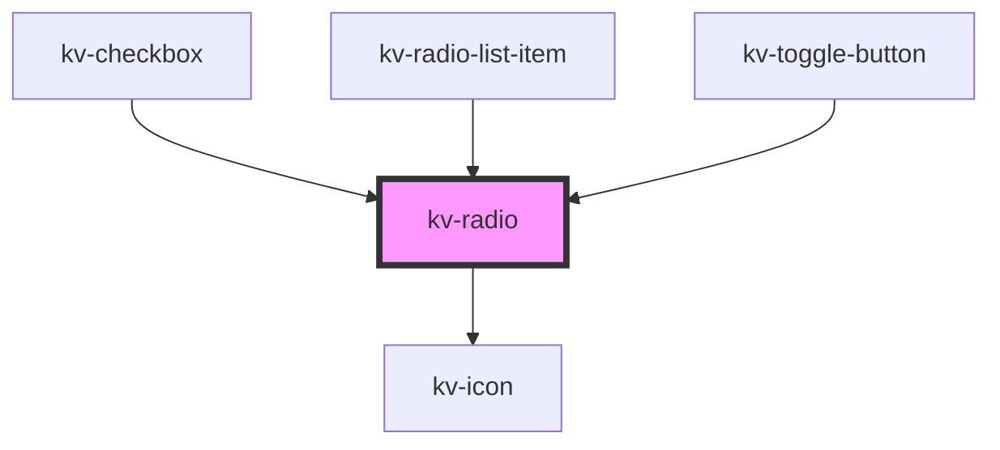

# *<kv-radio>*


<!-- Auto Generated Below -->


## Usage

### React

```tsx
import React from 'react';

import { KvRadio } from '@kelvininc/react-ui-components/client';

export const RadioExample: React.FC = () => (
	<>
		{/*-- Default --*/}
		<KvRadio />

		{/*-- Labeled --*/}
		<KvRadio label="Switch" />

		{/*-- Disabled --*/}
		<KvRadio disabled />

		{/*-- Checked --*/}
		<KvRadio checked />
	</>
);
```


## Properties

| Property   | Attribute  | Description                                                              | Type                                           | Default                |
| ---------- | ---------- | ------------------------------------------------------------------------ | ---------------------------------------------- | ---------------------- |
| `checked`  | `checked`  | (optional) If `true` the radio is with checked state. Default: false     | `boolean`                                      | `false`                |
| `disabled` | `disabled` | (optional) If `true` the radio is with disabled state. Default: false    | `boolean`                                      | `false`                |
| `label`    | `label`    | (optional) The label text for the radio.                                 | `string`                                       | `''`                   |
| `size`     | `size`     | (optional) Sets this component item to a different styling configuration | `EComponentSize.Large \| EComponentSize.Small` | `EComponentSize.Small` |


## Events

| Event           | Description                                  | Type                 |
| --------------- | -------------------------------------------- | -------------------- |
| `checkedChange` | Emitted when the radio checked state changes | `CustomEvent<Event>` |


## Shadow Parts

| Part      | Description        |
| --------- | ------------------ |
| `"icon"`  | The icon element.  |
| `"label"` | The label element. |


## CSS Custom Properties

| Name                                | Description                                           |
| ----------------------------------- | ----------------------------------------------------- |
| `--input-height-large`              | Radio height when size is large.                      |
| `--input-height-small`              | Radio height when size is small.                      |
| `--radio-background-default-color`  | Radio circle background color when state is default.  |
| `--radio-background-disabled-color` | Radio circle background color when state is disabled. |
| `--radio-background-hover-color`    | Radio circle background color when state is hovered.  |
| `--radio-background-pressed-color`  | Radio circle background color when state is pressed.  |
| `--radio-input-default-color`       | Radio icon color when state is default.               |
| `--radio-input-disabled-color`      | Radio icon and label color when state is disabled.    |
| `--radio-input-large`               | Radio icon size when size is large.                   |
| `--radio-input-small`               | Radio icon size when size is small.                   |


## Dependencies

### Used by

 - [kv-checkbox](../checkbox)
 - [kv-radio-list-item](../radio-list-item)
 - [kv-toggle-button](../toggle-button)

### Depends on

- [kv-icon](../icon)

### Graph

```mermaid
graph TD;
  kv-radio --> kv-icon
  kv-checkbox --> kv-radio
  kv-radio-list-item --> kv-radio
  kv-toggle-button --> kv-radio
  style kv-radio fill:#f9f,stroke:#333,stroke-width:4px
```

----------------------------------------------


