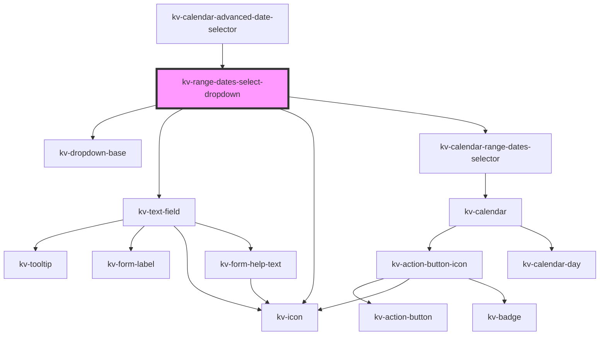

# kv-range-dates-select-dropdown

<!-- Auto Generated Below -->


## Usage

### Angular

```html
<!-- Default -->
<kv-range-dates-select-dropdown></kv-range-dates-select-dropdown>

<!-- With input configs -->
<kv-range-dates-select-dropdown
	[startInputConfig]="{ label: 'From', placeholder: 'Select a start date' }"
	[endInputConfig]="{ label: 'To', placeholder: 'Select an end date date' }"
></kv-range-dates-select-dropdown>
```


### React

```tsx
import React from 'react';

import { KvRangeDatesSelectDropdown } from '@kelvininc/react-ui-components';

export const KvRangeDatesSelectDropdownExample: React.FC = () => (
	<>
		{/*-- Default --*/}
		<KvRangeDatesSelectDropdown />

		{/*-- With input config --*/}
		<KvRangeDatesSelectDropdown
			startInputConfig={{ label: 'From', placeholder: 'Select a start date' }}
			endInputConfig={{ label: 'From', placeholder: 'Select an end date' }}
		/>
	</>
);
```


## Properties

| Property                  | Attribute      | Description                                                                                         | Type                                                                                              | Default                             |
| ------------------------- | -------------- | --------------------------------------------------------------------------------------------------- | ------------------------------------------------------------------------------------------------- | ----------------------------------- |
| `autoClose`               | `auto-close`   | (optional) If `true` the dropdown will be automatically closed after start and end date is selected | `boolean`                                                                                         | `true`                              |
| `disabledDates`           | --             | (options) The disabled dates array                                                                  | `string[]`                                                                                        | `[]`                                |
| `dropdownPositionOptions` | --             | (optional) The dropdown position options                                                            | `{ platform?: Platform; placement?: Placement; strategy?: Strategy; middleware?: Middleware[]; }` | `DEFAULT_DROPDOWN_POSITION_OPTIONS` |
| `endInputConfig`          | --             | (optional) The end date text field input custom configurations                                      | `IInputConfig`                                                                                    | `{}`                                |
| `initialDate`             | `initial-date` | (optional) Initial date                                                                             | `string`                                                                                          | `undefined`                         |
| `isOpen`                  | `is-open`      | (optional) If `true` the calendar is opened                                                         | `boolean`                                                                                         | `false`                             |
| `maxDate`                 | `max-date`     | (optional) Maximum accepted date                                                                    | `string`                                                                                          | `undefined`                         |
| `minDate`                 | `min-date`     | (optional) Minimum accepted date                                                                    | `string`                                                                                          | `undefined`                         |
| `selectedRangeDates`      | --             | (optional) Currently selected range dates                                                           | `[] \| [string, string] \| [string]`                                                              | `undefined`                         |
| `startInputConfig`        | --             | (optional) The start date text field input custom configurations                                    | `IInputConfig`                                                                                    | `{}`                                |


## Events

| Event              | Description                                            | Type                             |
| ------------------ | ------------------------------------------------------ | -------------------------------- |
| `openStateChange`  | Emitted when the calendar selector opens state changes | `CustomEvent<boolean>`           |
| `selectRangeDates` | Emitted when range dates are selected                  | `CustomEvent<ISelectRangeDates>` |


## Shadow Parts

| Part            | Description                      |
| --------------- | -------------------------------- |
| `"end-input"`   | The range end input container.   |
| `"start-input"` | The range start input container. |


## Dependencies

### Used by

 - [kv-calendar-advanced-date-selector](../calendar-advanced-date-selector)

### Depends on

- [kv-dropdown-base](../dropdown-base)
- [kv-text-field](../text-field)
- [kv-icon](../icon)
- [kv-calendar-range-dates-selector](../calendar-range-dates-selector)

### Graph


----------------------------------------------


