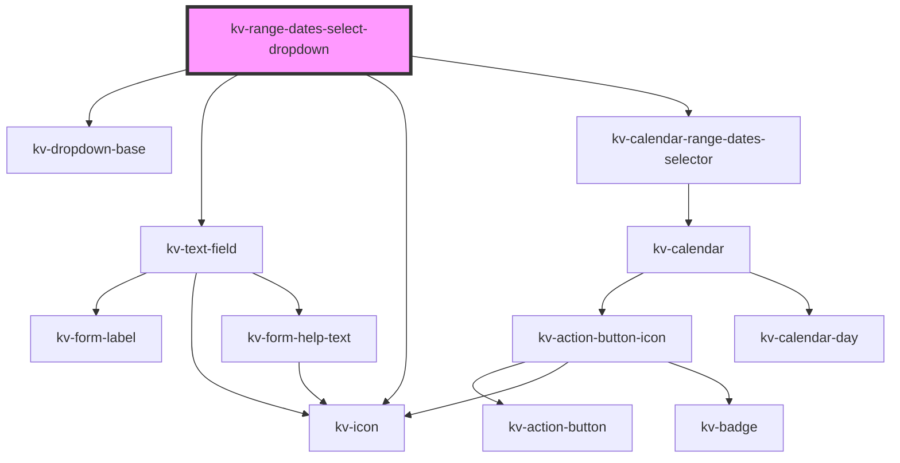

# kv-range-dates-select-dropdown

<!-- Auto Generated Below -->


## Usage

### Angular

```html
<!-- Default -->
<kv-range-dates-select-dropdown></kv-range-dates-select-dropdown>

<!-- With input configs -->
<kv-range-dates-select-dropdown
	[startInputConfig]="{ label: 'From', placeholder: 'Select a start date' }"
	[endInputConfig]="{ label: 'To', placeholder: 'Select an end date date' }"
></kv-range-dates-select-dropdown>
```


### React

```tsx
import React from 'react';

import { KvRangeDatesSelectDropdown } from '@kelvininc/react-ui-components';

export const KvRangeDatesSelectDropdownExample: React.FC = () => (
	<>
		{/*-- Default --*/}
		<KvRangeDatesSelectDropdown />

		{/*-- With input config --*/}
		<KvRangeDatesSelectDropdown
			startInputConfig={{ label: 'From', placeholder: 'Select a start date' }}
			endInputConfig={{ label: 'From', placeholder: 'Select an end date' }}
		/>
	</>
);
```


## Properties

| Property             | Attribute         | Description                                                      | Type                                                                                                                                                                                                                                                                                                                                                                                                                                                                                | Default     |
| -------------------- | ----------------- | ---------------------------------------------------------------- | ----------------------------------------------------------------------------------------------------------------------------------------------------------------------------------------------------------------------------------------------------------------------------------------------------------------------------------------------------------------------------------------------------------------------------------------------------------------------------------- | ----------- |
| `disabledDates`      | --                | (options) The disabled dates array                               | `string[]`                                                                                                                                                                                                                                                                                                                                                                                                                                                                          | `[]`        |
| `endDateMask`        | `end-date-mask`   | (optional) The text field end date format mask                   | `string`                                                                                                                                                                                                                                                                                                                                                                                                                                                                            | `undefined` |
| `endInputConfig`     | --                | (optional) The end date text field input custom configurations   | `{ type?: EInputFieldType; label?: string; icon?: EIconName \| EOtherIconName; inputName?: string; examples?: string[]; placeholder?: string; maxLength?: number; minLength?: number; max?: string \| number; min?: string \| number; step?: string \| number; size?: EComponentSize; disabled?: boolean; required?: boolean; loading?: boolean; state?: EValidationState; helpText?: string \| string[]; value?: string \| number; uneditable?: boolean; forcedFocus?: boolean; }` | `{}`        |
| `initialDate`        | `initial-date`    | (optional) Initial date                                          | `string`                                                                                                                                                                                                                                                                                                                                                                                                                                                                            | `undefined` |
| `isOpen`             | `is-open`         | (optional) If `true` the calendar is opened                      | `boolean`                                                                                                                                                                                                                                                                                                                                                                                                                                                                           | `false`     |
| `maxDate`            | `max-date`        | (optional) Maximum accepted date                                 | `string`                                                                                                                                                                                                                                                                                                                                                                                                                                                                            | `undefined` |
| `minDate`            | `min-date`        | (optional) Minimum accepted date                                 | `string`                                                                                                                                                                                                                                                                                                                                                                                                                                                                            | `undefined` |
| `placement`          | `placement`       | (optional) The dropdown placement relative to the container      | `"bottom" \| "bottom-end" \| "bottom-start" \| "left" \| "left-end" \| "left-start" \| "right" \| "right-end" \| "right-start" \| "top" \| "top-end" \| "top-start"`                                                                                                                                                                                                                                                                                                                | `'bottom'`  |
| `selectedRangeDates` | --                | (optional) Currently selected range dates                        | `[] \| [string, string] \| [string]`                                                                                                                                                                                                                                                                                                                                                                                                                                                | `[]`        |
| `startDateMask`      | `start-date-mask` | (optional) The text field start date format mask                 | `string`                                                                                                                                                                                                                                                                                                                                                                                                                                                                            | `undefined` |
| `startInputConfig`   | --                | (optional) The start date text field input custom configurations | `{ type?: EInputFieldType; label?: string; icon?: EIconName \| EOtherIconName; inputName?: string; examples?: string[]; placeholder?: string; maxLength?: number; minLength?: number; max?: string \| number; min?: string \| number; step?: string \| number; size?: EComponentSize; disabled?: boolean; required?: boolean; loading?: boolean; state?: EValidationState; helpText?: string \| string[]; value?: string \| number; uneditable?: boolean; forcedFocus?: boolean; }` | `{}`        |


## Events

| Event              | Description                                            | Type                             |
| ------------------ | ------------------------------------------------------ | -------------------------------- |
| `openStateChange`  | Emitted when the calendar selector opens state changes | `CustomEvent<boolean>`           |
| `selectRangeDates` | Emitted when range dates are selected                  | `CustomEvent<ISelectRangeDates>` |


## Dependencies

### Depends on

- [kv-dropdown-base](../dropdown-base)
- [kv-text-field](../text-field)
- [kv-icon](../icon)
- [kv-calendar-range-dates-selector](../calendar-range-dates-selector)

### Graph


----------------------------------------------


