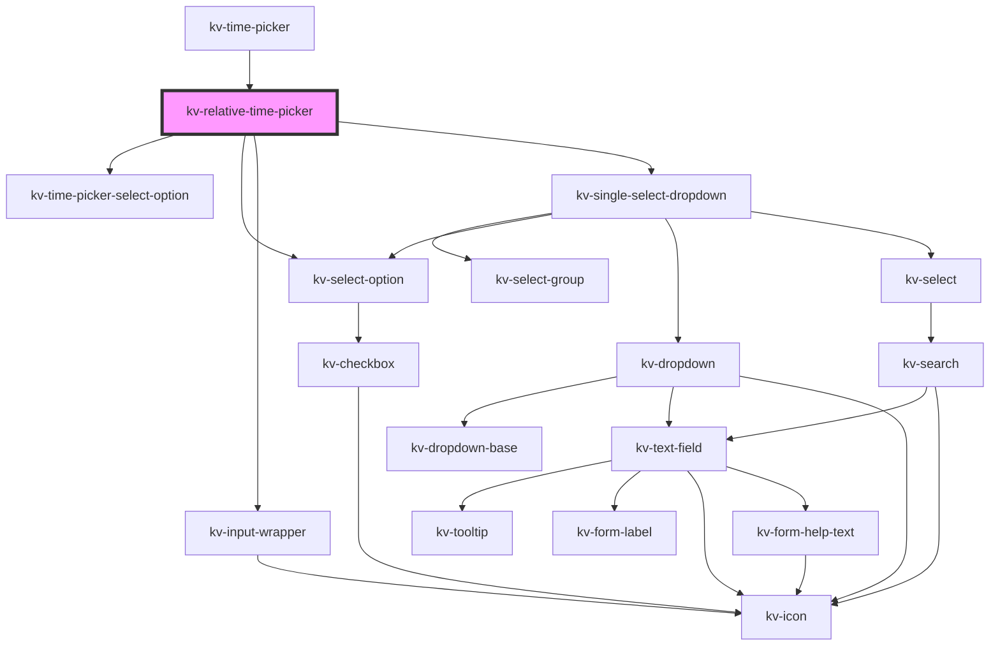

# kv-relative-time-picker


<!-- Auto Generated Below -->


## Usage

### Angular

```html
<!-- Default -->
<kv-relative-time-picker></kv-relative-time-picker>

<!-- With selected time key -->
<kv-relative-time-picker selectedTimeKey="last-24-h"></kv-relative-time-picker>

<!-- With selected timezone time -->
<kv-relative-time-picker selectedTimezone="Europe/Lisbon"></kv-relative-time-picker>
```


### React

```tsx
import React from 'react';

import { KvRelativeTimePicker } from '@kelvininc/react-ui-components';

export const KvRelativeTimePickerExample: React.FC = () => (
	<>
		{/*-- Default --*/}
		<KvRelativeTimePicker />

		{/*-- With selected relative time key --*/}
		<KvRelativeTimePicker selectedTimeKey="last-24-h"/>

		{/*-- With selected timezone --*/}
		<KvRelativeTimePicker selectedTimezone="Europe/Lisbon" />
	</>
);
```


## Properties

| Property                         | Attribute                           | Description                                                             | Type                            | Default                                |
| -------------------------------- | ----------------------------------- | ----------------------------------------------------------------------- | ------------------------------- | -------------------------------------- |
| `customizeIntervalOptionVisible` | `customize-interval-option-visible` | (optional) Defines if the customize interval select option is available | `boolean`                       | `true`                                 |
| `disableTimezoneSelection`       | `disable-timezone-selection`        | (optional) Lets the timezone visible but doens't let the user change it | `boolean`                       | `false`                                |
| `options`                        | --                                  | (optional) Selectable relative time options                             | `IRelativeTimePickerOption[][]` | `DEFAULT_RELATIVE_TIME_OPTIONS_GROUPS` |
| `selectedTimeKey`                | `selected-time-key`                 | (optional) Selected time range key                                      | `string`                        | `undefined`                            |
| `selectedTimezone`               | `selected-timezone`                 | (optional) Currently selected timezone name                             | `string`                        | `undefined`                            |
| `timezoneSelectVisible`          | `timezone-select-visible`           | (optional) Defines if the timezone select option is available           | `boolean`                       | `true`                                 |
| `timezones`                      | --                                  | (optional) List of all selectable timezones                             | `string[]`                      | `getTimezonesNames()`                  |


## Events

| Event                        | Description                                | Type                                                  |
| ---------------------------- | ------------------------------------------ | ----------------------------------------------------- |
| `customizeIntervalClicked`   | Emitted when customize interval is clicked | `CustomEvent<string>`                                 |
| `selectedRelativeTimeChange` | Emitted when the selected time key changes | `CustomEvent<{ key: string; range: SelectedRange; }>` |
| `timezoneChange`             | Emitted when selected timezone changes     | `CustomEvent<{ name: string; offset: number; }>`      |


## CSS Custom Properties

| Name                 | Description       |
| -------------------- | ----------------- |
| `--background-color` | Background color. |


## Dependencies

### Used by

 - [kv-time-picker](../time-picker)

### Depends on

- [kv-time-picker-select-option](../time-picker-select-option)
- [kv-select-option](../select-option)
- [kv-input-wrapper](../input-wrapper)
- [kv-single-select-dropdown](../single-select-dropdown)

### Graph


----------------------------------------------


