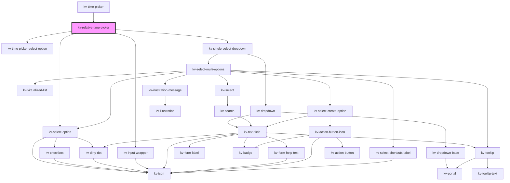

# kv-relative-time-picker


<!-- Auto Generated Below -->


## Usage

### React

```tsx
import React from 'react';

import { KvRelativeTimePicker } from '@kelvininc/react-ui-components';

export const KvRelativeTimePickerExample: React.FC = () => (
	<>
		{/*-- Default --*/}
		<KvRelativeTimePicker />

		{/*-- With selected relative time key --*/}
		<KvRelativeTimePicker selectedTimeKey="last-24-h"/>

		{/*-- With selected timezone --*/}
		<KvRelativeTimePicker selectedTimezone="Europe/Lisbon" />
	</>
);
```


## Properties

| Property                      | Attribute                        | Description                                                                                                                                                                             | Type                                | Default                                      |
| ----------------------------- | -------------------------------- | --------------------------------------------------------------------------------------------------------------------------------------------------------------------------------------- | ----------------------------------- | -------------------------------------------- |
| `customClass`                 | `custom-class`                   | (optional) Additional classes to apply for custom CSS. If multiple classes are provided they should be separated by spaces. It is also valid to provide CssClassMap with boolean logic. | `CssClassMap \| string \| string[]` | `''`                                         |
| `customIntervalOptionEnabled` | `custom-interval-option-enabled` | (optional) Defines if the customize interval select option is available                                                                                                                 | `boolean`                           | `true`                                       |
| `disableTimezoneSelection`    | `disable-timezone-selection`     | (optional) Lets the timezone visible but doens't let the user change it                                                                                                                 | `boolean`                           | `false`                                      |
| `options`                     | --                               | (optional) Selectable relative time options                                                                                                                                             | `IRelativeTimePickerOption[][]`     | `DEFAULT_RELATIVE_TIME_OPTIONS_GROUPS`       |
| `selectedTimeKey`             | `selected-time-key`              | (optional) Selected time range key                                                                                                                                                      | `string`                            | `undefined`                                  |
| `selectedTimezone`            | `selected-timezone`              | (optional) Currently selected timezone name                                                                                                                                             | `string`                            | `undefined`                                  |
| `timezoneContentVisible`      | `timezone-content-visible`       | (optional) Determines if the input wrapper content containing the timezone is visible if true, the dropdown will be visible; if false, the content will display the timezone title      | `boolean`                           | `false`                                      |
| `timezoneSelectionEnabled`    | `timezone-selection-enabled`     | (optional) Defines if the timezone select option is available                                                                                                                           | `boolean`                           | `true`                                       |
| `timezones`                   | --                               | (optional) List of all selectable timezones                                                                                                                                             | `ITimezoneOffset[]`                 | `buildTimezoneByOffset(getTimezonesNames())` |


## Events

| Event                         | Description                                                       | Type                                                      |
| ----------------------------- | ----------------------------------------------------------------- | --------------------------------------------------------- |
| `customizeIntervalClicked`    | Emitted when customize interval is clicked                        | `CustomEvent<string>`                                     |
| `selectedRelativeTimeChange`  | Emitted when the selected time key changes                        | `CustomEvent<{ key: string; range: SelectedTimestamp; }>` |
| `timezoneChange`              | Emitted when selected timezone changes                            | `CustomEvent<{ name: string; offset: number; }>`          |
| `timezoneDropdownStateChange` | Emitted when the timezone dropdown open state changes             | `CustomEvent<boolean>`                                    |
| `timezoneInputClicked`        | Emitted when the input wrapper containing the timezone is clicked | `CustomEvent<boolean>`                                    |


## CSS Custom Properties

| Name                 | Description       |
| -------------------- | ----------------- |
| `--background-color` | Background color. |


## Dependencies

### Used by

 - [kv-time-picker](../time-picker)

### Depends on

- [kv-time-picker-select-option](../time-picker-select-option)
- [kv-select-option](../select-option)
- [kv-input-wrapper](../input-wrapper)
- [kv-single-select-dropdown](../single-select-dropdown)

### Graph


----------------------------------------------


