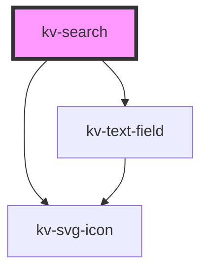

# kv-search


<!-- Auto Generated Below -->


## Usage

### Angular

```html
<!-- Default -->
<kv-search></kv-search>

<!-- Labeled -->
<kv-search label="Text Field"></kv-search>

<!-- Disabled -->
<kv-search disabled></kv-search>
```


### React

```tsx
import React from 'react';

import { KvSearch } from '@kelvininc/react-ui-components';

export const SearchExample: React.FC = () => (
	<>
		{/*-- Default --*/}
		<KvSearch />

		{/*-- With Placeholder --*/}
		<KvSearch placeholder="Search Input" />

		{/*-- Disabled --*/}
		<KvSearch disabled />
	</>
);

```


## Properties

| Property      | Attribute     | Description                                                        | Type                                           | Default                |
| ------------- | ------------- | ------------------------------------------------------------------ | ---------------------------------------------- | ---------------------- |
| `disabled`    | `disabled`    | (optional) Search disabled                                         | `boolean`                                      | `false`                |
| `placeholder` | `placeholder` | (optional) Search place holder                                     | `string`                                       | `"Search"`             |
| `size`        | `size`        | (optional) Sets this tab item to a different styling configuration | `EComponentSize.Large \| EComponentSize.Small` | `EComponentSize.Large` |
| `value`       | `value`       | Search value                                                       | `string`                                       | `undefined`            |


## Events

| Event           | Description                            | Type                  |
| --------------- | -------------------------------------- | --------------------- |
| `textChange`    | Emitted when search text value changes | `CustomEvent<string>` |
| `textFieldBlur` | Emitted when text field lost focus     | `CustomEvent<string>` |


## Dependencies

### Depends on

- [kv-text-field](../text-field)
- [kv-svg-icon](../svg-icon)

### Graph


----------------------------------------------


