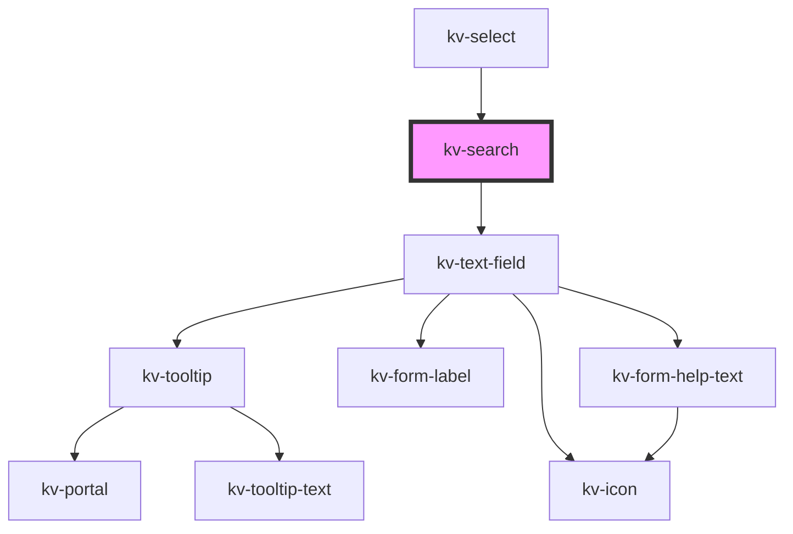

# kv-search


<!-- Auto Generated Below -->


## Usage

### Angular

```html
<!-- Default -->
<kv-search></kv-search>

<!-- Different Placeholder -->
<kv-search placeholder="New Search Placeholder"></kv-search>

<!-- Disabled -->
<kv-search disabled></kv-search>
```


### React

```tsx
import React from 'react';

import { KvSearch } from '@kelvininc/react-ui-components';

export const SearchExample: React.FC = () => (
	<>
		{/*-- Default --*/}
		<KvSearch />

		{/*-- With Placeholder --*/}
		<KvSearch placeholder="New Search Placeholder" />

		{/*-- Disabled --*/}
		<KvSearch disabled />
	</>
);

```


## Properties

| Property         | Attribute          | Description                                                                   | Type                                                                                                                                                                                                                                                                                                                                                                                                                                                                                                                                                                                                                               | Default                 |
| ---------------- | ------------------ | ----------------------------------------------------------------------------- | ---------------------------------------------------------------------------------------------------------------------------------------------------------------------------------------------------------------------------------------------------------------------------------------------------------------------------------------------------------------------------------------------------------------------------------------------------------------------------------------------------------------------------------------------------------------------------------------------------------------------------------- | ----------------------- |
| `disabled`       | `disabled`         | (optional) Text field disabled                                                | `boolean`                                                                                                                                                                                                                                                                                                                                                                                                                                                                                                                                                                                                                          | `false`                 |
| `examples`       | --                 | (optional) Text field example values                                          | `string[]`                                                                                                                                                                                                                                                                                                                                                                                                                                                                                                                                                                                                                         | `undefined`             |
| `forcedFocus`    | `forced-focus`     | (optional) Text field focus state                                             | `boolean`                                                                                                                                                                                                                                                                                                                                                                                                                                                                                                                                                                                                                          | `false`                 |
| `helpText`       | `help-text`        | (optional) Text field help text                                               | `string \| string[]`                                                                                                                                                                                                                                                                                                                                                                                                                                                                                                                                                                                                               | `[]`                    |
| `inputMaskRegex` | `input-mask-regex` | (optional) Input mask regex                                                   | `string`                                                                                                                                                                                                                                                                                                                                                                                                                                                                                                                                                                                                                           | `''`                    |
| `inputName`      | `input-name`       | (optional) Text field input name                                              | `string`                                                                                                                                                                                                                                                                                                                                                                                                                                                                                                                                                                                                                           | `undefined`             |
| `label`          | `label`            | (optional) Text field label                                                   | `string`                                                                                                                                                                                                                                                                                                                                                                                                                                                                                                                                                                                                                           | `undefined`             |
| `loading`        | `loading`          | (optional) Text field loading state                                           | `boolean`                                                                                                                                                                                                                                                                                                                                                                                                                                                                                                                                                                                                                          | `false`                 |
| `max`            | `max`              | (optional) Text field maximum value                                           | `number \| string`                                                                                                                                                                                                                                                                                                                                                                                                                                                                                                                                                                                                                 | `undefined`             |
| `maxLength`      | `max-length`       | (optional) Text field maximum number of characters required                   | `number`                                                                                                                                                                                                                                                                                                                                                                                                                                                                                                                                                                                                                           | `undefined`             |
| `min`            | `min`              | (optional) Text field minimum value                                           | `number \| string`                                                                                                                                                                                                                                                                                                                                                                                                                                                                                                                                                                                                                 | `undefined`             |
| `minLength`      | `min-length`       | (optional) Text field minimum number of characters required                   | `number`                                                                                                                                                                                                                                                                                                                                                                                                                                                                                                                                                                                                                           | `undefined`             |
| `placeholder`    | `placeholder`      | (optional) Text field place holder                                            | `string`                                                                                                                                                                                                                                                                                                                                                                                                                                                                                                                                                                                                                           | `'Search'`              |
| `readonly`       | `readonly`         | (optional) Text field is readonly                                             | `boolean`                                                                                                                                                                                                                                                                                                                                                                                                                                                                                                                                                                                                                          | `false`                 |
| `required`       | `required`         | (optional) Text field required                                                | `boolean`                                                                                                                                                                                                                                                                                                                                                                                                                                                                                                                                                                                                                          | `false`                 |
| `size`           | `size`             | (optional) Sets this tab item to a different styling configuration            | `EComponentSize.Large \| EComponentSize.Small`                                                                                                                                                                                                                                                                                                                                                                                                                                                                                                                                                                                     | `EComponentSize.Large`  |
| `state`          | `state`            | (optional) Text field state                                                   | `EValidationState.Invalid \| EValidationState.None \| EValidationState.Valid`                                                                                                                                                                                                                                                                                                                                                                                                                                                                                                                                                      | `EValidationState.None` |
| `step`           | `step`             | (optional) Text field interval between legal numbers                          | `number \| string`                                                                                                                                                                                                                                                                                                                                                                                                                                                                                                                                                                                                                 | `undefined`             |
| `tooltipConfig`  | --                 | (optional) Text field tooltip configuration                                   | `{ text?: string; position?: ETooltipPosition; allowedPositions?: ETooltipPosition[]; options?: Partial<{ placement?: Placement; strategy?: Strategy; middleware?: (false \| { name: string; options?: any; fn: (state: { x: number; y: number; initialPlacement: Placement; platform: Platform; placement: Placement; strategy: Strategy; middlewareData: MiddlewareData; rects: ElementRects; elements: Elements; }) => Promisable<MiddlewareReturn>; })[]; platform?: Platform; }>; disabled?: boolean; contentElement?: HTMLElement; truncate?: boolean; delay?: number; withArrow?: boolean; customClass?: CustomCssClass; }` | `undefined`             |
| `type`           | `type`             | (optional) Text field type                                                    | `EInputFieldType.Date \| EInputFieldType.DateTime \| EInputFieldType.Email \| EInputFieldType.Number \| EInputFieldType.Password \| EInputFieldType.Radio \| EInputFieldType.Text`                                                                                                                                                                                                                                                                                                                                                                                                                                                 | `EInputFieldType.Text`  |
| `useInputMask`   | `use-input-mask`   | (optional) Use a input mask when the text field type is number (default true) | `boolean`                                                                                                                                                                                                                                                                                                                                                                                                                                                                                                                                                                                                                          | `false`                 |
| `value`          | `value`            | (optional) Text field value                                                   | `number \| string`                                                                                                                                                                                                                                                                                                                                                                                                                                                                                                                                                                                                                 | `''`                    |


## Events

| Event              | Description                              | Type                      |
| ------------------ | ---------------------------------------- | ------------------------- |
| `clickResetButton` | Emitted when the reset buccon is clicked | `CustomEvent<MouseEvent>` |
| `rightActionClick` | Emitted when the right icon is clicked   | `CustomEvent<MouseEvent>` |
| `textChange`       | Emitted when a keyboard input occurred   | `CustomEvent<string>`     |
| `textFieldBlur`    | Emitted when text field lost focus       | `CustomEvent<string>`     |


## Dependencies

### Used by

 - [kv-select](../select)

### Depends on

- [kv-text-field](../text-field)

### Graph


----------------------------------------------


