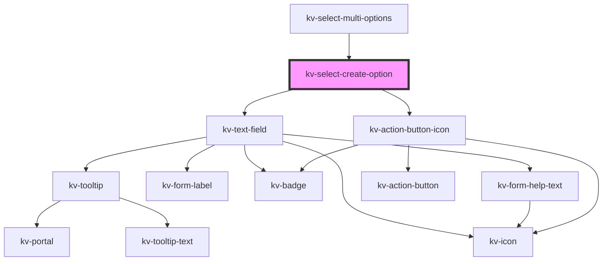

# _<kv-select-create-option>_

<!-- Auto Generated Below -->

## Properties

| Property      | Attribute  | Description                                                                    | Type                                                                                                                                                                                                                                                                                                                                                                                                                                                                                                                                                                                                                                                                                                                  | Default                |
| ------------- | ---------- | ------------------------------------------------------------------------------ | --------------------------------------------------------------------------------------------------------------------------------------------------------------------------------------------------------------------------------------------------------------------------------------------------------------------------------------------------------------------------------------------------------------------------------------------------------------------------------------------------------------------------------------------------------------------------------------------------------------------------------------------------------------------------------------------------------------------- | ---------------------- |
| `disabled`    | `disabled` | (optional) If `true` the input and actions will be disabled. Default: `false`. | `boolean`                                                                                                                                                                                                                                                                                                                                                                                                                                                                                                                                                                                                                                                                                                             | `false`                |
| `inputConfig` | --         | (optional) The text field custom config.                                       | `{ type?: EInputFieldType; label?: string; icon?: EIconName \| EOtherIconName; actionIcon?: EIconName \| EOtherIconName; inputName?: string; examples?: string[]; placeholder?: string; maxLength?: number; minLength?: number; max?: string \| number; min?: string \| number; step?: string \| number; size?: EComponentSize; disabled?: boolean; required?: boolean; loading?: boolean; state?: EValidationState; helpText?: string \| string[]; value?: string \| number; valuePrefix?: string; badge?: string; readonly?: boolean; forcedFocus?: boolean; tooltipConfig?: Partial<ITooltip>; useInputMask?: boolean; inputMaskRegex?: string; fitContent?: boolean; customStyle?: { [key: string]: string; }; }` | `{}`                   |
| `size`        | `size`     | (optional) The input and actions size. Default: `small´                        | `EComponentSize.Large \| EComponentSize.Small`                                                                                                                                                                                                                                                                                                                                                                                                                                                                                                                                                                                                                                                                        | `EComponentSize.Small` |

## Events

| Event          | Description                               | Type                  |
| -------------- | ----------------------------------------- | --------------------- |
| `clickCancel`  | Emitted when the cancel button is pressed | `CustomEvent<void>`   |
| `clickCreate`  | Emitted when the create button is pressed | `CustomEvent<string>` |
| `valueChanged` | Emitted when the value changes            | `CustomEvent<string>` |

## Methods

### `focusInput() => Promise<void>`

Focuses the input

#### Returns

Type: `Promise<void>`

## Shadow Parts

| Part              | Description                       |
| ----------------- | --------------------------------- |
| `"cancel-button"` | The cancel action button element. |
| `"create-button"` | The create action button element. |
| `"text-field"`    | The text field element.           |

## Dependencies

### Used by

 - [kv-select-multi-options](../select-multi-options)

### Depends on

- [kv-text-field](../text-field)
- [kv-action-button-icon](../action-button-icon)

### Graph

----------------------------------------------

