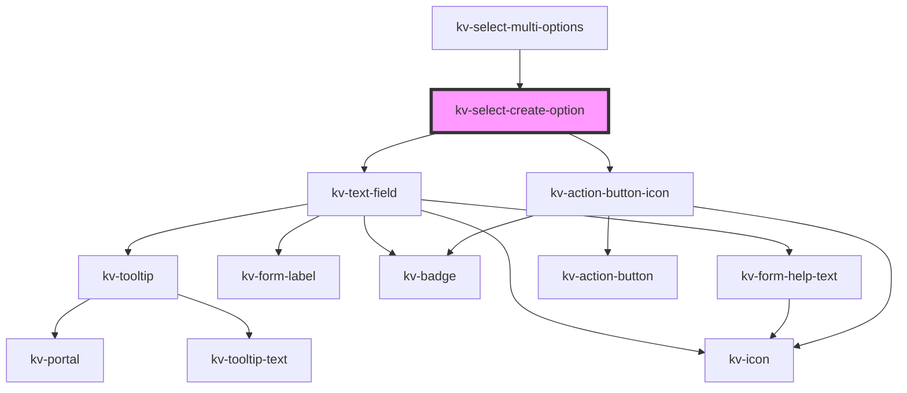

# _<kv-select-create-option>_

<!-- Auto Generated Below -->

## Properties

| Property      | Attribute     | Description                                                                       | Type                                                                          | Default                 |
| ------------- | ------------- | --------------------------------------------------------------------------------- | ----------------------------------------------------------------------------- | ----------------------- |
| `disabled`    | `disabled`    | (optional) If `true` the input and actions will be disabled. Default: `false`.    | `boolean`                                                                     | `false`                 |
| `helpText`    | `help-text`   | (optional) The text field help text                                               | `string \| string[]`                                                          | `[]`                    |
| `placeholder` | `placeholder` | (optional) The placeholder to be passed to the text field. Default: `Option Name` | `string`                                                                      | `DEFAULT_PLACEHOLDER`   |
| `state`       | `state`       | (optional) The text field state                                                   | `EValidationState.Invalid \| EValidationState.None \| EValidationState.Valid` | `EValidationState.None` |

## Events

| Event          | Description                               | Type                  |
| -------------- | ----------------------------------------- | --------------------- |
| `cancel`       | Emitted when the cancel button is pressed | `CustomEvent<void>`   |
| `create`       | Emitted when the create button is pressed | `CustomEvent<string>` |
| `valueChanged` | Emitted when the value changes            | `CustomEvent<string>` |

## Dependencies

### Used by

 - [kv-select-multi-options](../select-multi-options)

### Depends on

- [kv-text-field](../text-field)
- [kv-action-button-icon](../action-button-icon)

### Graph

```mermaid
graph TD;
  kv-select-create-option --> kv-text-field
  kv-select-create-option --> kv-action-button-icon
  kv-text-field --> kv-tooltip
  kv-text-field --> kv-form-label
  kv-text-field --> kv-icon
  kv-text-field --> kv-badge
  kv-text-field --> kv-form-help-text
  kv-tooltip --> kv-portal
  kv-tooltip --> kv-tooltip-text
  kv-form-help-text --> kv-icon
  kv-action-button-icon --> kv-action-button
  kv-action-button-icon --> kv-icon
  kv-action-button-icon --> kv-badge
  kv-select-multi-options --> kv-select-create-option
  style kv-select-create-option fill:#f9f,stroke:#333,stroke-width:4px
```

----------------------------------------------

