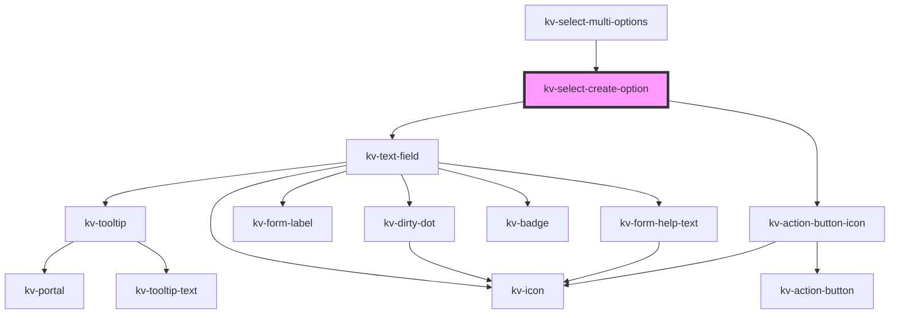

# _<kv-select-create-option>_

<!-- Auto Generated Below -->

## Properties

| Property      | Attribute      | Description                                                                    | Type                                                                                                                                                                                                                                                                                                                                                                                                                                                                                                                                                                                                                                                                                                                                                                                                                                                                                                                                                                                                                                                                                                                                                                             | Default                |
| ------------- | -------------- | ------------------------------------------------------------------------------ | -------------------------------------------------------------------------------------------------------------------------------------------------------------------------------------------------------------------------------------------------------------------------------------------------------------------------------------------------------------------------------------------------------------------------------------------------------------------------------------------------------------------------------------------------------------------------------------------------------------------------------------------------------------------------------------------------------------------------------------------------------------------------------------------------------------------------------------------------------------------------------------------------------------------------------------------------------------------------------------------------------------------------------------------------------------------------------------------------------------------------------------------------------------------------------- | ---------------------- |
| `disabled`    | `disabled`     | (optional) If `true` the input and actions will be disabled. Default: `false`. | `boolean \| undefined`                                                                                                                                                                                                                                                                                                                                                                                                                                                                                                                                                                                                                                                                                                                                                                                                                                                                                                                                                                                                                                                                                                                                                           | `false`                |
| `inputConfig` | `input-config` | (optional) The text field custom config.                                       | `undefined \| { type?: EInputFieldType \| undefined; label?: string \| undefined; icon?: EIconName \| undefined; actionIcon?: EIconName \| undefined; inputName?: string \| undefined; examples?: string[] \| undefined; placeholder?: string \| undefined; maxLength?: number \| undefined; minLength?: number \| undefined; max?: string \| number \| undefined; min?: string \| number \| undefined; step?: string \| number \| undefined; size?: EComponentSize \| undefined; inputDisabled?: boolean \| undefined; inputRequired?: boolean \| undefined; loading?: boolean \| undefined; state?: EValidationState \| undefined; helpText?: string \| string[] \| undefined; value?: string \| number \| null \| undefined; valuePrefix?: string \| undefined; badge?: string \| undefined; inputReadonly?: boolean \| undefined; forcedFocus?: boolean \| undefined; tooltipConfig?: Partial<ITooltip> \| undefined; useInputMask?: boolean \| undefined; inputMaskRegex?: string \| undefined; fitContent?: boolean \| undefined; customStyle?: { [key: string]: string \| undefined; } \| undefined; isDirty?: boolean \| undefined; hideBadge?: boolean \| undefined; }` | `{}`                   |
| `size`        | `size`         | (optional) The input and actions size. Default: `small´                        | `EComponentSize.Large \| EComponentSize.Small \| undefined`                                                                                                                                                                                                                                                                                                                                                                                                                                                                                                                                                                                                                                                                                                                                                                                                                                                                                                                                                                                                                                                                                                                      | `EComponentSize.Small` |
| `value`       | `value`        | (optional) The new option value.                                               | `string \| undefined`                                                                                                                                                                                                                                                                                                                                                                                                                                                                                                                                                                                                                                                                                                                                                                                                                                                                                                                                                                                                                                                                                                                                                            | `''`                   |

## Events

| Event          | Description                               | Type                                       |
| -------------- | ----------------------------------------- | ------------------------------------------ |
| `clickCancel`  | Emitted when the cancel button is pressed | `CustomEvent<MouseEvent>`                  |
| `clickCreate`  | Emitted when the create button is pressed | `CustomEvent<KeyboardEvent \| MouseEvent>` |
| `valueChanged` | Emitted when the value changes            | `CustomEvent<string>`                      |

## Methods

### `blurInput() => Promise<void>`

Blur the input

#### Returns

Type: `Promise<void>`

### `focusInput() => Promise<void>`

Focus the input

#### Returns

Type: `Promise<void>`

## Shadow Parts

| Part              | Description                       |
| ----------------- | --------------------------------- |
| `"cancel-button"` | The cancel action button element. |
| `"create-button"` | The create action button element. |
| `"text-field"`    | The text field element.           |

## Dependencies

### Used by

 - [kv-select-multi-options](../select-multi-options)

### Depends on

- [kv-text-field](../text-field)
- [kv-action-button-icon](../action-button-icon)

### Graph

```mermaid
graph TD;
  kv-select-create-option --> kv-text-field
  kv-select-create-option --> kv-action-button-icon
  kv-text-field --> kv-tooltip
  kv-text-field --> kv-form-label
  kv-text-field --> kv-icon
  kv-text-field --> kv-dirty-dot
  kv-text-field --> kv-badge
  kv-text-field --> kv-form-help-text
  kv-tooltip --> kv-portal
  kv-tooltip --> kv-tooltip-text
  kv-dirty-dot --> kv-icon
  kv-form-help-text --> kv-icon
  kv-action-button-icon --> kv-action-button
  kv-action-button-icon --> kv-icon
  kv-select-multi-options --> kv-select-create-option
  style kv-select-create-option fill:#f9f,stroke:#333,stroke-width:4px
```

----------------------------------------------

