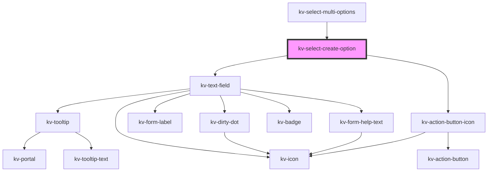

# _<kv-select-create-option>_

<!-- Auto Generated Below -->

## Properties

| Property      | Attribute      | Description                                                                                                                                                                      | Type                                                                                                                                                                                                                                                                                                                                                                                                                                                                                                                                                                                                                                                                                                                                     | Default                |
| ------------- | -------------- | -------------------------------------------------------------------------------------------------------------------------------------------------------------------------------- | ---------------------------------------------------------------------------------------------------------------------------------------------------------------------------------------------------------------------------------------------------------------------------------------------------------------------------------------------------------------------------------------------------------------------------------------------------------------------------------------------------------------------------------------------------------------------------------------------------------------------------------------------------------------------------------------------------------------------------------------- | ---------------------- |
| `disabled`    | `disabled`     | (optional) If `true` the input and the create action are disabled. The cancel action stays available. Default: `false`.                                                          | `boolean`                                                                                                                                                                                                                                                                                                                                                                                                                                                                                                                                                                                                                                                                                                                                | `false`                |
| `inputConfig` | `input-config` | (optional) The text field custom config.                                                                                                                                         | `{ type?: EInputFieldType; label?: string; icon?: EIconName; actionIcon?: EIconName; inputName?: string; examples?: string[]; placeholder?: string; maxLength?: number; minLength?: number; max?: string \| number; min?: string \| number; step?: string \| number; size?: EComponentSize; inputDisabled?: boolean; inputRequired?: boolean; loading?: boolean; state?: EValidationState; helpText?: string \| string[]; value?: string \| number; valuePrefix?: string; badge?: string; inputReadonly?: boolean; forcedFocus?: boolean; tooltipConfig?: Partial<ITooltip>; useInputMask?: boolean; inputMaskRegex?: string; fitContent?: boolean; customStyle?: { [key: string]: string; }; isDirty?: boolean; hideBadge?: boolean; }` | `{}`                   |
| `loading`     | `loading`      | (optional) If `true` the new option is being submitted: the create action shows its loading state, the input is read-only and neither action can be triggered. Default: `false`. | `boolean`                                                                                                                                                                                                                                                                                                                                                                                                                                                                                                                                                                                                                                                                                                                                | `false`                |
| `size`        | `size`         | (optional) The input and actions size. Default: `small´                                                                                                                          | `EComponentSize.Large \| EComponentSize.Small`                                                                                                                                                                                                                                                                                                                                                                                                                                                                                                                                                                                                                                                                                           | `EComponentSize.Small` |
| `value`       | `value`        | (optional) The new option value.                                                                                                                                                 | `string`                                                                                                                                                                                                                                                                                                                                                                                                                                                                                                                                                                                                                                                                                                                                 | `''`                   |

## Events

| Event          | Description                                                      | Type                                       |
| -------------- | ---------------------------------------------------------------- | ------------------------------------------ |
| `clickCancel`  | Emitted when the cancel button is pressed, or Escape in the form | `CustomEvent<KeyboardEvent \| MouseEvent>` |
| `clickCreate`  | Emitted when the create button is pressed, or Enter in the input | `CustomEvent<KeyboardEvent \| MouseEvent>` |
| `valueChanged` | Emitted when the value changes                                   | `CustomEvent<string>`                      |

## Methods

### `blurInput() => Promise<void>`

Blur the input

#### Returns

Type: `Promise<void>`

### `focusInput() => Promise<void>`

Focus the input

#### Returns

Type: `Promise<void>`

## Shadow Parts

| Part              | Description                       |
| ----------------- | --------------------------------- |
| `"cancel-button"` | The cancel action button element. |
| `"create-button"` | The create action button element. |
| `"text-field"`    | The text field element.           |

## Dependencies

### Used by

 - [kv-select-multi-options](../select-multi-options)

### Depends on

- [kv-text-field](../text-field)
- [kv-action-button-icon](../action-button-icon)

### Graph

```mermaid
graph TD;
  kv-select-create-option --> kv-text-field
  kv-select-create-option --> kv-action-button-icon
  kv-text-field --> kv-tooltip
  kv-text-field --> kv-form-label
  kv-text-field --> kv-icon
  kv-text-field --> kv-dirty-dot
  kv-text-field --> kv-badge
  kv-text-field --> kv-form-help-text
  kv-tooltip --> kv-portal
  kv-tooltip --> kv-tooltip-text
  kv-dirty-dot --> kv-icon
  kv-form-help-text --> kv-icon
  kv-action-button-icon --> kv-action-button
  kv-action-button-icon --> kv-icon
  kv-select-multi-options --> kv-select-create-option
  style kv-select-create-option fill:#f9f,stroke:#333,stroke-width:4px
```

----------------------------------------------

