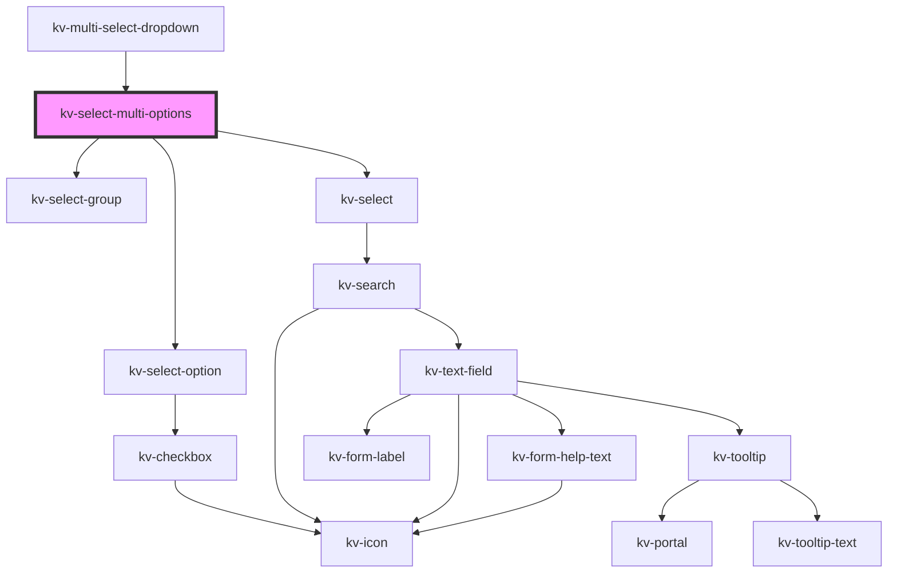

# kv-select-multi-options

<!-- Auto Generated Below -->

## Properties

| Property               | Attribute                 | Description                                                                      | Type                                   | Default                           |
| ---------------------- | ------------------------- | -------------------------------------------------------------------------------- | -------------------------------------- | --------------------------------- |
| `clearSelectionLabel`  | `clear-selection-label`   | (optional) The clear search action text                                          | `string`                               | `undefined`                       |
| `filteredOptions`      | --                        | (optional) The object with the dropdown options filtered                         | `{ [x: string]: ISelectMultiOption; }` | `{}`                              |
| `maxHeight`            | `max-height`              | (optional) The dropdown's max-height                                             | `string`                               | `undefined`                       |
| `minHeight`            | `min-height`              | (optional) The dropdown's min-height                                             | `string`                               | `undefined`                       |
| `noDataAvailableLabel` | `no-data-available-label` | (required) The text to display when there are no options                         | `string`                               | `DEFAULT_NO_DATA_AVAILABLE_LABEL` |
| `options`              | --                        | (optional) The object with the dropdown options                                  | `{ [x: string]: ISelectMultiOption; }` | `{}`                              |
| `searchValue`          | `search-value`            | (optional) The search value to display                                           | `string`                               | `undefined`                       |
| `searchable`           | `searchable`              | (optional) If `true` the dropdown is searchable                                  | `boolean`                              | `undefined`                       |
| `selectedOptions`      | --                        | (optional) The object with indexed by the dropdown labels and its selected value | `{ [x: string]: boolean; }`            | `{}`                              |
| `selectionClearable`   | `selection-clearable`     | (optional) If `true` dropdown items can be cleared                               | `boolean`                              | `undefined`                       |

## Events

| Event              | Description                              | Type                                     |
| ------------------ | ---------------------------------------- | ---------------------------------------- |
| `optionsSelected`  | Emitted when the selected options change | `CustomEvent<{ [x: string]: boolean; }>` |
| `searchChange`     | Emitted when the search term changes     | `CustomEvent<string>`                    |
| `selectionCleared` | Emitted when the selection is cleared    | `CustomEvent<void>`                      |

## CSS Custom Properties

| Name                       | Description                 |
| -------------------------- | --------------------------- |
| `--select-list-max-height` | Select list maximum height. |

## Dependencies

### Used by

 - [kv-multi-select-dropdown](../multi-select-dropdown)

### Depends on

- [kv-select-group](../select-group)
- [kv-select-option](../select-option)
- [kv-select](../select)

### Graph

----------------------------------------------

