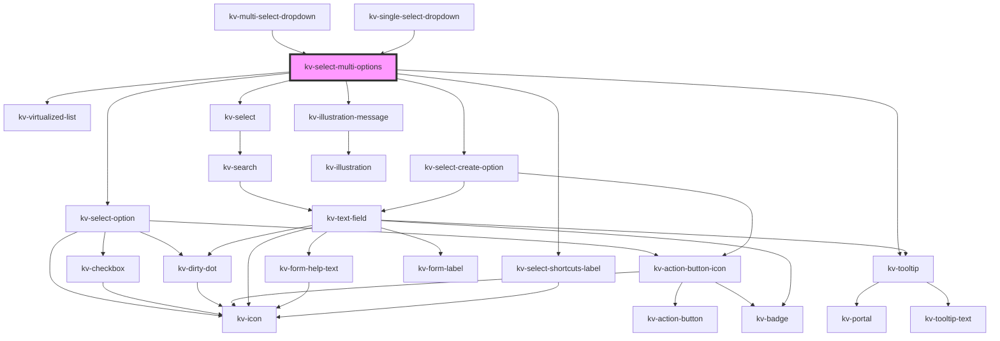

# kv-select-multi-options

<!-- Auto Generated Below -->

## Properties

| Property                  | Attribute                   | Description                                                                                                       | Type                                   | Default                                         |
| ------------------------- | --------------------------- | ----------------------------------------------------------------------------------------------------------------- | -------------------------------------- | ----------------------------------------------- |
| `canAddItems`             | `can-add-items`             | (optional) If `true` an add option will appear at the bottom of options list. Default: `false`                    | `boolean`                              | `false`                                         |
| `clearSelectionLabel`     | `clear-selection-label`     | (optional) The clear selection action text                                                                        | `string`                               | `undefined`                                     |
| `counter`                 | `counter`                   | (optional) If `true` a selection counter is displayed                                                             | `boolean`                              | `undefined`                                     |
| `createInputPlaceholder`  | `create-input-placeholder`  | (optional) The create form input placeholder                                                                      | `string`                               | `undefined`                                     |
| `createOptionPlaceholder` | `create-option-placeholder` | (optional) The create new option placeholder. Default: `Add a new option`                                         | `string`                               | `DEFAULT_ADD_OPTION_PLACEHOLDER`                |
| `filteredOptions`         | --                          | (optional) The object with the dropdown options filtered                                                          | `{ [x: string]: ISelectMultiOption; }` | `undefined`                                     |
| `maxHeight`               | `max-height`                | (optional) The dropdown's max-height                                                                              | `string`                               | `undefined`                                     |
| `maxWidth`                | `max-width`                 | (optional) The dropdown's max-width                                                                               | `string`                               | `undefined`                                     |
| `minHeight`               | `min-height`                | (optional) The dropdown's min-height                                                                              | `string`                               | `undefined`                                     |
| `minSearchOptions`        | `min-search-options`        | (optional) The minimum amount of options required to display the search. Defaults to `15`.                        | `number`                               | `MINIMUM_SEARCHABLE_OPTIONS`                    |
| `minWidth`                | `min-width`                 | (optional) The dropdown's min-width                                                                               | `string`                               | `undefined`                                     |
| `noDataAvailableConfig`   | --                          | (optional) The configuration for the "no data available" empty state illustration                                 | `IIllustrationMessage`                 | `DEFAULT_NO_DATA_AVAILABLE_ILLUSTRATION_CONFIG` |
| `noResultsFoundConfig`    | --                          | (optional) The configuration for the "no results found" empty state illustration                                  | `IIllustrationMessage`                 | `DEFAULT_NO_RESULTS_FOUND_ILLUSTRATION_CONFIG`  |
| `options`                 | --                          | (optional) The object with the dropdown options                                                                   | `{ [x: string]: ISelectMultiOption; }` | `{}`                                            |
| `searchPlaceholder`       | `search-placeholder`        | (optional) The list search text field placeholder                                                                 | `string`                               | `undefined`                                     |
| `searchValue`             | `search-value`              | (optional) The search value to display                                                                            | `string`                               | `undefined`                                     |
| `searchable`              | `searchable`                | (optional) If `false` the dropdown is not searchable. Default `true`                                              | `boolean`                              | `true`                                          |
| `selectAllLabel`          | `select-all-label`          | (optional) The selection all action text                                                                          | `string`                               | `undefined`                                     |
| `selectedOptions`         | --                          | (optional) The object with indexed by the dropdown labels and its selected value                                  | `{ [x: string]: boolean; }`            | `{}`                                            |
| `selectionAll`            | `selection-all`             | (optional) If `true` the list has an action to select all items                                                   | `boolean`                              | `undefined`                                     |
| `selectionClearable`      | `selection-clearable`       | (optional) If `true` dropdown items can be cleared                                                                | `boolean`                              | `undefined`                                     |
| `shortcuts`               | `shortcuts`                 | (optional) If `true` the keyboard shortcuts can be used to navigate between the dropdown results. Default `false` | `boolean`                              | `false`                                         |

## Events

| Event             | Description                                                | Type                                     |
| ----------------- | ---------------------------------------------------------- | ---------------------------------------- |
| `clearSelection`  | Emitted when the user clears the selected items            | `CustomEvent<void>`                      |
| `dismiss`         | Emitted when the 'esc' key is pressed                      | `CustomEvent<void>`                      |
| `optionCreated`   | Emitted when a new option is created                       | `CustomEvent<string>`                    |
| `optionSelected`  | Emitted when an option is selected                         | `CustomEvent<string>`                    |
| `optionsSelected` | Emitted when the selected options change                   | `CustomEvent<{ [x: string]: boolean; }>` |
| `searchChange`    | Emitted when the user interacts with the search text field | `CustomEvent<string>`                    |
| `selectAll`       | Emitted when the user clicks on the all items              | `CustomEvent<void>`                      |

## Methods

### `clearHighlightedOption() => Promise<void>`

Clears the highlighted option state

#### Returns

Type: `Promise<void>`

### `closeCreatePopup() => Promise<void>`

Close create popup

#### Returns

Type: `Promise<void>`

### `focusSearch() => Promise<void>`

Focuses the search text field

#### Returns

Type: `Promise<void>`

## Shadow Parts

| Part       | Description           |
| ---------- | --------------------- |
| `"select"` | The select container. |

## CSS Custom Properties

| Name                       | Description                 |
| -------------------------- | --------------------------- |
| `--select-list-max-height` | Select list maximum height. |
| `--select-list-max-width`  | Select list maximum width.  |
| `--select-list-min-height` | Select list minimum height. |
| `--select-list-min-width`  | Select list minimum width.  |

## Dependencies

### Used by

 - [kv-multi-select-dropdown](../multi-select-dropdown)
 - [kv-single-select-dropdown](../single-select-dropdown)

### Depends on

- [kv-virtualized-list](../virtualized-list)
- [kv-select-option](../select-option)
- [kv-select](../select)
- [kv-tooltip](../tooltip)
- [kv-illustration-message](../illustration-message)
- [kv-select-create-option](../select-create-option)
- [kv-select-shortcuts-label](../select-shortcuts-label)

### Graph

----------------------------------------------

