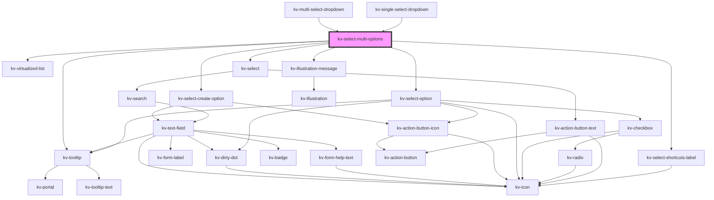

# kv-select-multi-options

<!-- Auto Generated Below -->

## Properties

| Property                  | Attribute                   | Description                                                                                                                                                                                                                                                                                                                                                                                                                                                                                                                                                                                                                                                                                                                                                                                                                                                                                                                                      | Type                                                                                | Default                                         |
| ------------------------- | --------------------------- | ------------------------------------------------------------------------------------------------------------------------------------------------------------------------------------------------------------------------------------------------------------------------------------------------------------------------------------------------------------------------------------------------------------------------------------------------------------------------------------------------------------------------------------------------------------------------------------------------------------------------------------------------------------------------------------------------------------------------------------------------------------------------------------------------------------------------------------------------------------------------------------------------------------------------------------------------ | ----------------------------------------------------------------------------------- | ----------------------------------------------- |
| `canAddItems`             | `can-add-items`             | (optional) If `true` an add option will appear at the bottom of options list. Default: `false`                                                                                                                                                                                                                                                                                                                                                                                                                                                                                                                                                                                                                                                                                                                                                                                                                                                   | `boolean`                                                                           | `false`                                         |
| `clearSelectionLabel`     | `clear-selection-label`     | (optional) The clear selection action text                                                                                                                                                                                                                                                                                                                                                                                                                                                                                                                                                                                                                                                                                                                                                                                                                                                                                                       | `string`                                                                            | `undefined`                                     |
| `counter`                 | `counter`                   | (optional) If `true` a selection counter is displayed                                                                                                                                                                                                                                                                                                                                                                                                                                                                                                                                                                                                                                                                                                                                                                                                                                                                                            | `boolean`                                                                           | `undefined`                                     |
| `createInputPlaceholder`  | `create-input-placeholder`  | (optional) The create form input placeholder                                                                                                                                                                                                                                                                                                                                                                                                                                                                                                                                                                                                                                                                                                                                                                                                                                                                                                     | `string`                                                                            | `undefined`                                     |
| `createOptionConfig`      | `create-option-config`      | (optional) The configuration of the default create form: `disabled` locks its input and create action, `size` sets its size and `inputConfig` its text field. An `inputConfig.placeholder` takes precedence over `createInputPlaceholder`.                                                                                                                                                                                                                                                                                                                                                                                                                                                                                                                                                                                                                                                                                                       | `{ disabled?: boolean; size?: EComponentSize; inputConfig?: Partial<ITextField>; }` | `undefined`                                     |
| `createOptionPlaceholder` | `create-option-placeholder` | (optional) The create new option placeholder. Default: `Add a new option`                                                                                                                                                                                                                                                                                                                                                                                                                                                                                                                                                                                                                                                                                                                                                                                                                                                                        | `string`                                                                            | `DEFAULT_ADD_OPTION_PLACEHOLDER`                |
| `createOptionState`       | `create-option-state`       | (optional) The state of the open create form's latest submit, for an option created asynchronously. When set, a submit only emits `optionCreated` and the form stays open: - `loading`: the form can be neither submitted again nor cancelled. The default form shows its create action loading and makes its input read-only; a slotted form shows this itself, e.g. by passing `loading` to its `kv-select-create-option`. - `error`: the form can be submitted again. The default form shows `error` on its text field until the value is edited. - `success`: `optionSelected` is emitted with `optionKey`, or with the submitted value without one, and the form closes, as a synchronous submit does. Add the option to `options` first.  `success` is read when the status changes to it, so report `loading` while the option is created. Unset, a submit emits `optionCreated` and `optionSelected` with the typed value straight away. | `ICreateOptionState`                                                                | `undefined`                                     |
| `filteredOptions`         | `filtered-options`          | (optional) Externally filtered dropdown options. When defined, these override the default local search results.                                                                                                                                                                                                                                                                                                                                                                                                                                                                                                                                                                                                                                                                                                                                                                                                                                  | `{ [x: string]: ISelectMultiOption; }`                                              | `undefined`                                     |
| `maxHeight`               | `max-height`                | (optional) The dropdown's max-height                                                                                                                                                                                                                                                                                                                                                                                                                                                                                                                                                                                                                                                                                                                                                                                                                                                                                                             | `string`                                                                            | `undefined`                                     |
| `maxSelectable`           | `max-selectable`            | (optional) Maximum number of items that can be selected                                                                                                                                                                                                                                                                                                                                                                                                                                                                                                                                                                                                                                                                                                                                                                                                                                                                                          | `number`                                                                            | `undefined`                                     |
| `maxWidth`                | `max-width`                 | (optional) The dropdown's max-width                                                                                                                                                                                                                                                                                                                                                                                                                                                                                                                                                                                                                                                                                                                                                                                                                                                                                                              | `string`                                                                            | `undefined`                                     |
| `minHeight`               | `min-height`                | (optional) The dropdown's min-height                                                                                                                                                                                                                                                                                                                                                                                                                                                                                                                                                                                                                                                                                                                                                                                                                                                                                                             | `string`                                                                            | `undefined`                                     |
| `minSearchOptions`        | `min-search-options`        | (optional) The minimum amount of options required to display the search. Defaults to `15`.                                                                                                                                                                                                                                                                                                                                                                                                                                                                                                                                                                                                                                                                                                                                                                                                                                                       | `number`                                                                            | `MINIMUM_SEARCHABLE_OPTIONS`                    |
| `minWidth`                | `min-width`                 | (optional) The dropdown's min-width                                                                                                                                                                                                                                                                                                                                                                                                                                                                                                                                                                                                                                                                                                                                                                                                                                                                                                              | `string`                                                                            | `undefined`                                     |
| `noDataAvailableConfig`   | `no-data-available-config`  | (optional) What is shown when there are no options, searching or not: with an `illustration`, the illustration message in the list; without one, only its `header`, in the list header. Default: the "No Data Available" illustration                                                                                                                                                                                                                                                                                                                                                                                                                                                                                                                                                                                                                                                                                                            | `IIllustrationMessage`                                                              | `DEFAULT_NO_DATA_AVAILABLE_ILLUSTRATION_CONFIG` |
| `noResultsFoundConfig`    | `no-results-found-config`   | (optional) What is shown when the search matches no option: with an `illustration`, the illustration message in the list; without one, only its `header`, in the list header. Default: `No results found`, in the list header                                                                                                                                                                                                                                                                                                                                                                                                                                                                                                                                                                                                                                                                                                                    | `IIllustrationMessage`                                                              | `DEFAULT_NO_RESULTS_FOUND_CONFIG`               |
| `options`                 | `options`                   | (optional) The object with the dropdown options                                                                                                                                                                                                                                                                                                                                                                                                                                                                                                                                                                                                                                                                                                                                                                                                                                                                                                  | `{ [x: string]: ISelectMultiOption; }`                                              | `{}`                                            |
| `rangeSelection`          | `range-selection`           | (optional) If `true` a contiguous range can be selected by shift-clicking or by holding shift while navigating. Default `true`                                                                                                                                                                                                                                                                                                                                                                                                                                                                                                                                                                                                                                                                                                                                                                                                                   | `boolean`                                                                           | `true`                                          |
| `searchDebounce`          | `search-debounce`           | (optional) The debounce, in milliseconds, applied to the search value before the options are filtered locally. Set to `0` to filter on every keystroke. Defaults to `300`.                                                                                                                                                                                                                                                                                                                                                                                                                                                                                                                                                                                                                                                                                                                                                                       | `number`                                                                            | `DEFAULT_SEARCH_DEBOUNCE_IN_MS`                 |
| `searchPlaceholder`       | `search-placeholder`        | (optional) The list search text field placeholder                                                                                                                                                                                                                                                                                                                                                                                                                                                                                                                                                                                                                                                                                                                                                                                                                                                                                                | `string`                                                                            | `undefined`                                     |
| `searchValue`             | `search-value`              | (optional) The search value to display                                                                                                                                                                                                                                                                                                                                                                                                                                                                                                                                                                                                                                                                                                                                                                                                                                                                                                           | `string`                                                                            | `undefined`                                     |
| `searchable`              | `searchable`                | (optional) If `false` the dropdown is not searchable. Default `true`                                                                                                                                                                                                                                                                                                                                                                                                                                                                                                                                                                                                                                                                                                                                                                                                                                                                             | `boolean`                                                                           | `true`                                          |
| `selectAllLabel`          | `select-all-label`          | (optional) The selection all action text                                                                                                                                                                                                                                                                                                                                                                                                                                                                                                                                                                                                                                                                                                                                                                                                                                                                                                         | `string`                                                                            | `undefined`                                     |
| `selectedOptions`         | `selected-options`          | (optional) The object with indexed by the dropdown labels and its selected value                                                                                                                                                                                                                                                                                                                                                                                                                                                                                                                                                                                                                                                                                                                                                                                                                                                                 | `{ [x: string]: boolean; }`                                                         | `{}`                                            |
| `selectionAll`            | `selection-all`             | (optional) If `true` the list has an action to select all items                                                                                                                                                                                                                                                                                                                                                                                                                                                                                                                                                                                                                                                                                                                                                                                                                                                                                  | `boolean`                                                                           | `undefined`                                     |
| `selectionClearable`      | `selection-clearable`       | (optional) If `true` dropdown items can be cleared                                                                                                                                                                                                                                                                                                                                                                                                                                                                                                                                                                                                                                                                                                                                                                                                                                                                                               | `boolean`                                                                           | `undefined`                                     |
| `shortcuts`               | `shortcuts`                 | (optional) If `true` the keyboard shortcuts can be used to navigate between the dropdown results. Default `false`                                                                                                                                                                                                                                                                                                                                                                                                                                                                                                                                                                                                                                                                                                                                                                                                                                | `boolean`                                                                           | `false`                                         |
| `showShortcuts`           | `show-shortcuts`            |                                                                                                                                                                                                                                                                                                                                                                                                                                                                                                                                                                                                                                                                                                                                                                                                                                                                                                                                                  | `boolean`                                                                           | `false`                                         |

## Events

| Event              | Description                                                                                    | Type                                     |
| ------------------ | ---------------------------------------------------------------------------------------------- | ---------------------------------------- |
| `clearSelection`   | Emitted when the user clears the selected items                                                | `CustomEvent<void>`                      |
| `createFormToggle` | Emitted when the create form opens (`true`), once it is rendered, and when it closes (`false`) | `CustomEvent<boolean>`                   |
| `dismiss`          | Emitted when the 'esc' key is pressed                                                          | `CustomEvent<void>`                      |
| `optionCreated`    | Emitted when a new option is created                                                           | `CustomEvent<string>`                    |
| `optionSelected`   | Emitted when an option is selected                                                             | `CustomEvent<string>`                    |
| `optionsSelected`  | Emitted when the selected options change                                                       | `CustomEvent<{ [x: string]: boolean; }>` |
| `searchChange`     | Emitted when the user interacts with the search text field                                     | `CustomEvent<string>`                    |
| `selectAll`        | Emitted when the user clicks on the all items                                                  | `CustomEvent<void>`                      |

## Methods

### `clearHighlightedOption() => Promise<void>`

Clears the highlighted option state

#### Returns

Type: `Promise<void>`

### `closeCreatePopup() => Promise<void>`

Closes the create form

#### Returns

Type: `Promise<void>`

### `focusSearch() => Promise<void>`

Focuses the search text field

#### Returns

Type: `Promise<void>`

## Shadow Parts

| Part       | Description           |
| ---------- | --------------------- |
| `"select"` | The select container. |

## CSS Custom Properties

| Name                       | Description                 |
| -------------------------- | --------------------------- |
| `--select-list-max-height` | Select list maximum height. |
| `--select-list-max-width`  | Select list maximum width.  |
| `--select-list-min-height` | Select list minimum height. |
| `--select-list-min-width`  | Select list minimum width.  |

## Dependencies

### Used by

 - [kv-multi-select-dropdown](../multi-select-dropdown)
 - [kv-single-select-dropdown](../single-select-dropdown)

### Depends on

- [kv-select-create-option](../select-create-option)
- [kv-virtualized-list](../virtualized-list)
- [kv-select-option](../select-option)
- [kv-select](../select)
- [kv-tooltip](../tooltip)
- [kv-illustration-message](../illustration-message)
- [kv-select-shortcuts-label](../select-shortcuts-label)

### Graph

```mermaid
graph TD;
  kv-select-multi-options --> kv-select-create-option
  kv-select-multi-options --> kv-virtualized-list
  kv-select-multi-options --> kv-select-option
  kv-select-multi-options --> kv-select
  kv-select-multi-options --> kv-tooltip
  kv-select-multi-options --> kv-illustration-message
  kv-select-multi-options --> kv-select-shortcuts-label
  kv-select-create-option --> kv-text-field
  kv-select-create-option --> kv-action-button-icon
  kv-text-field --> kv-tooltip
  kv-text-field --> kv-form-label
  kv-text-field --> kv-icon
  kv-text-field --> kv-dirty-dot
  kv-text-field --> kv-badge
  kv-text-field --> kv-form-help-text
  kv-tooltip --> kv-portal
  kv-tooltip --> kv-tooltip-text
  kv-dirty-dot --> kv-icon
  kv-form-help-text --> kv-icon
  kv-action-button-icon --> kv-action-button
  kv-action-button-icon --> kv-icon
  kv-select-option --> kv-checkbox
  kv-select-option --> kv-tooltip
  kv-select-option --> kv-icon
  kv-select-option --> kv-dirty-dot
  kv-select-option --> kv-action-button-icon
  kv-checkbox --> kv-radio
  kv-checkbox --> kv-icon
  kv-radio --> kv-icon
  kv-select --> kv-search
  kv-select --> kv-action-button-text
  kv-search --> kv-text-field
  kv-action-button-text --> kv-action-button
  kv-action-button-text --> kv-icon
  kv-illustration-message --> kv-illustration
  kv-select-shortcuts-label --> kv-icon
  kv-multi-select-dropdown --> kv-select-multi-options
  kv-single-select-dropdown --> kv-select-multi-options
  style kv-select-multi-options fill:#f9f,stroke:#333,stroke-width:4px
```

----------------------------------------------

